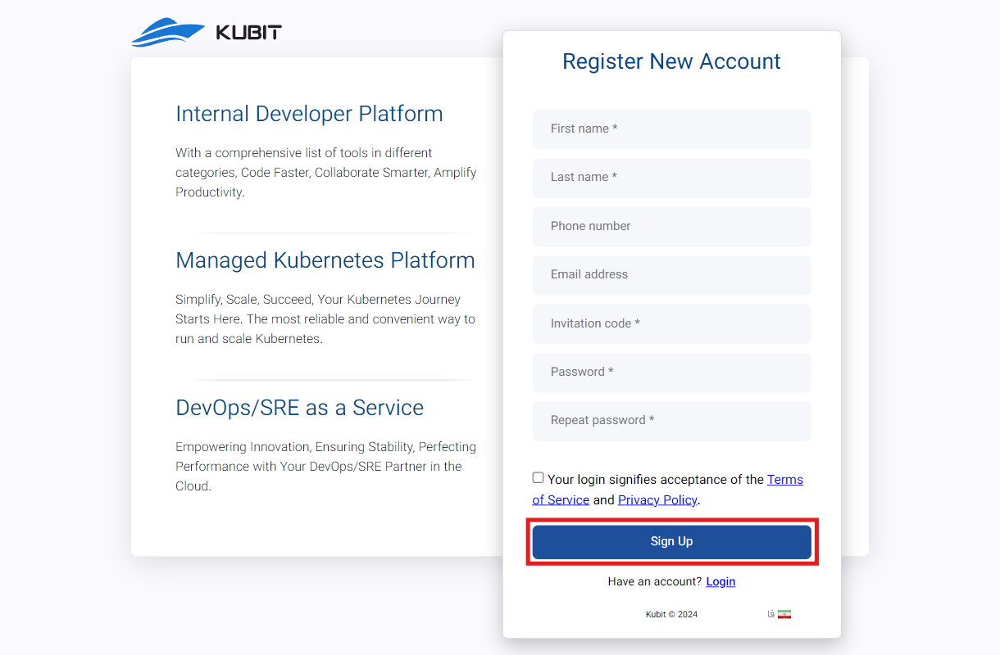

# إنشاء منظمة

هناك ثلاث طرق لإنشاء منظمة: أثناء إنشاء الحساب، بعد إنشاء الحساب، ومن خلال لوحة كوبيت.

## الطريقة الأولى: أثناء إنشاء الحساب

بعد تأكيد التسجيل في كوبيت بواسطة رمز التحقق المرسل إليك وقبل الدخول إلى اللوحة، سيتم توجيهك إلى نموذج إنشاء المنظمة.

أدخل المعلومات المطلوبة في نموذج إنشاء المنظمة، بما في ذلك **اسم المنظمة** و**مفتاح المنظمة**، وانقر على **Create**.

أخيراً، ستدخل إلى لوحة كوبيت تحت المنظمة التي تم إنشاؤها:

## الطريقة الثانية: بعد إنشاء الحساب{#after-register}

إذا لم تقم بإنشاء منظمتك بعد التسجيل في كوبيت، ستواجه الرسالة التالية عند الدخول إلى اللوحة:

كما ذكر في [شرح مفهوم المنظمة](../#organization)، للوصول إلى ميزات اللوحة، يجب أن تكون هناك منظمة مرتبطة بحساب المستخدم. للقيام بذلك، انقر على زر **Create Organization**:

أدخل المعلومات المطلوبة في نموذج إنشاء المنظمة، بما في ذلك **اسم المنظمة** و**مفتاح المنظمة**، وانقر على **Create**:

في النهاية، ستدخل إلى اللوحة تحت المنظمة التي تم إنشاؤها.

:::info[اختيار مفتاح مناسب للمنظمة]
يرجى ملاحظة أنه بالنسبة **لمفتاح المنظمة**، يجب اختيار سلاج صالح يتكون من أحرف وأرقام وشرطات سفلية أو شرطات.
:::

## الطريقة الثالثة: من خلال لوحة كوبيت

إذا كنت قد دخلت اللوحة تحت منظمة أخرى سابقاً وترغب في إنشاء منظمتك الخاصة، انقر أولاً على الملف الشخصي، ثم من القائمة المنبثقة، اختر خيار **Create Your Own Organization**:

ثم سيتم توجيهك إلى صفحة إنشاء الحساب. أدخل التفاصيل المطلوبة للمستخدم وانقر على **Sign Up**:

ثم يجب عليك إدخال الرمز المكون من 6 أرقام المرسل إلى بريدك الإلكتروني أو رقم هاتفك للتحقق والتأكيد على التسجيل، ثم انقر على **Submit**:

في النهاية، بعد إرسال رمز التحقق، سيتم إكمال عملية التسجيل الخاصة بك وإنشاء حسابك في كوبيت.

بعد ذلك، سيتم توجيهك إلى نموذج إنشاء المنظمة المرتبطة بحساب المستخدم الخاص بك. كما ذكر في [شرح مفهوم المنظمة](../#organization)، للوصول إلى ميزات اللوحة، يجب أن تكون هناك منظمة مرتبطة بحساب المستخدم. من خلال إدخال المعلومات المطلوبة (اسم المنظمة ومفتاح المنظمة)، يمكنك إنشاء منظمتك الخاصة:

:::info[تنبيه!]
إذا كنت لا ترغب في إنشاء منظمة، يمكنك النقر على "لاحقًا" واستخدام [الطريقة الثانية: بعد إنشاء الحساب](./#after-register) لإنشاء منظمة.
:::

في النهاية، ستدخل إلى اللوحة وستتمكن من الوصول إلى لوحة منظمتك الشخصية.
