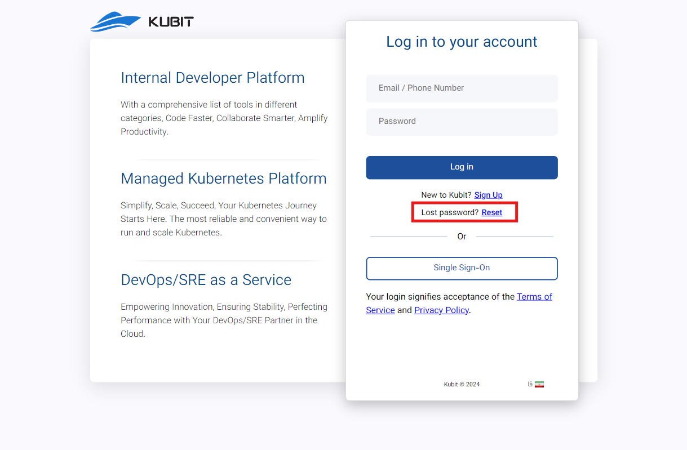
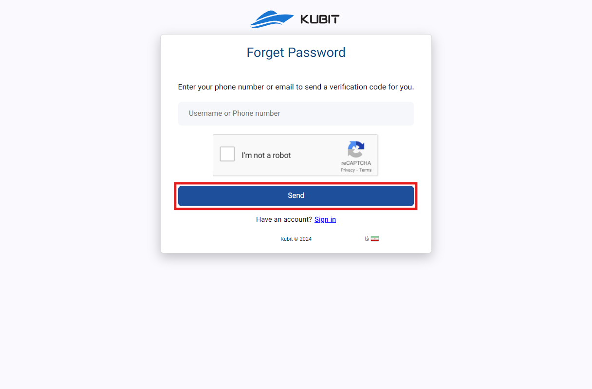
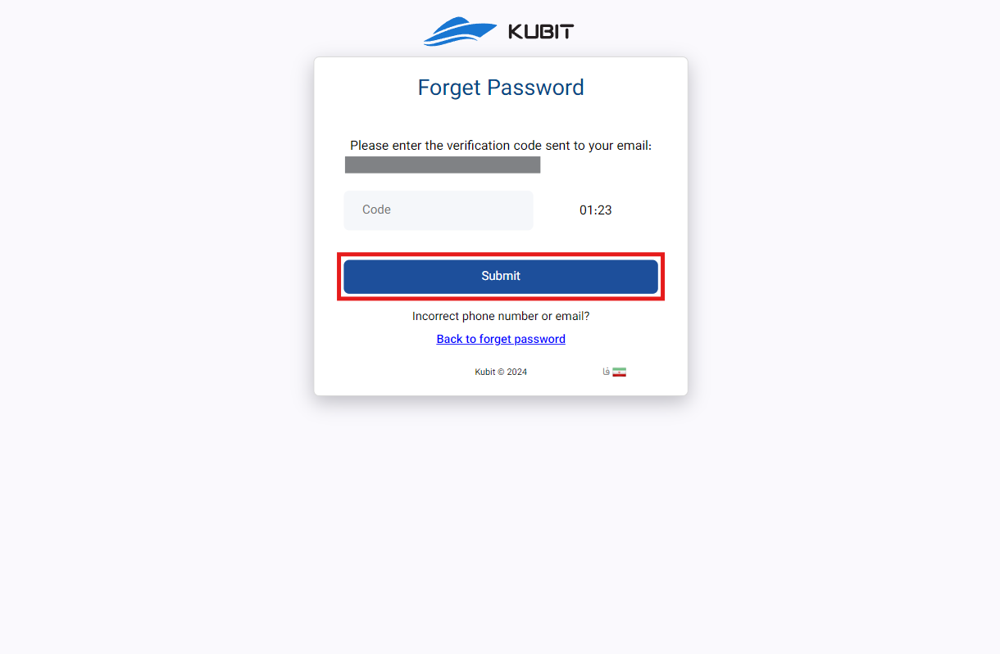
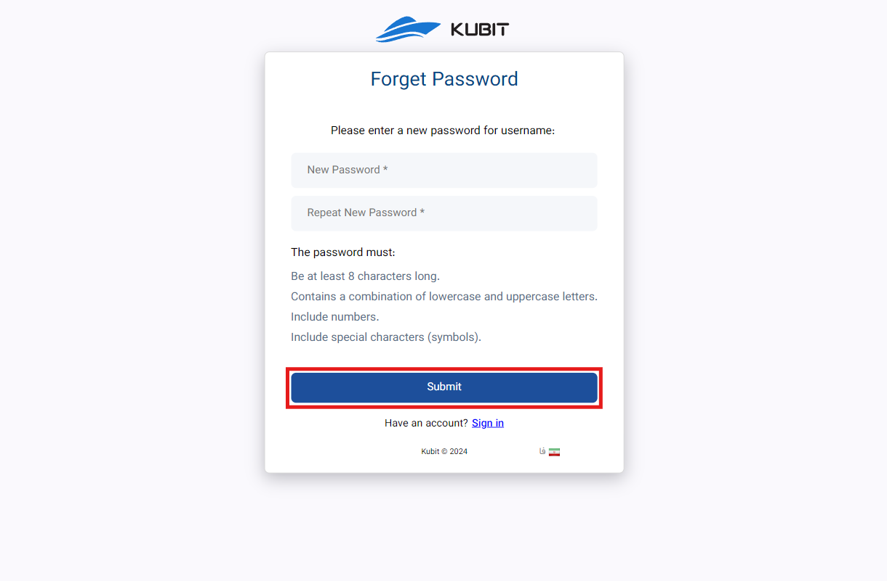

# نسيت كلمة المرور

إذا نسيت كلمة المرور الخاصة بك، يمكنك اتباع الخطوات أدناه لتغيير كلمة المرور من خلال [صفحة تسجيل الدخول](https://panel.kubit.ir/en/login/) عن طريق اختيار خيار **نسيت كلمة المرور**.

أولاً، انقر على **Reset**:

أدخل رقم الجوال أو البريد الإلكتروني لحسابك وانقر على **Send**:

أدخل رمز التحقق المرسل إليك لإكمال عملية التحقق:

أخيراً، أدخل كلمة المرور الجديدة الخاصة بك وانقر على **Submit**:

بعد تغيير وتأكيد كلمة المرور الجديدة، سيتم توجيهك إلى لوحة مستخدم كوبيت.
