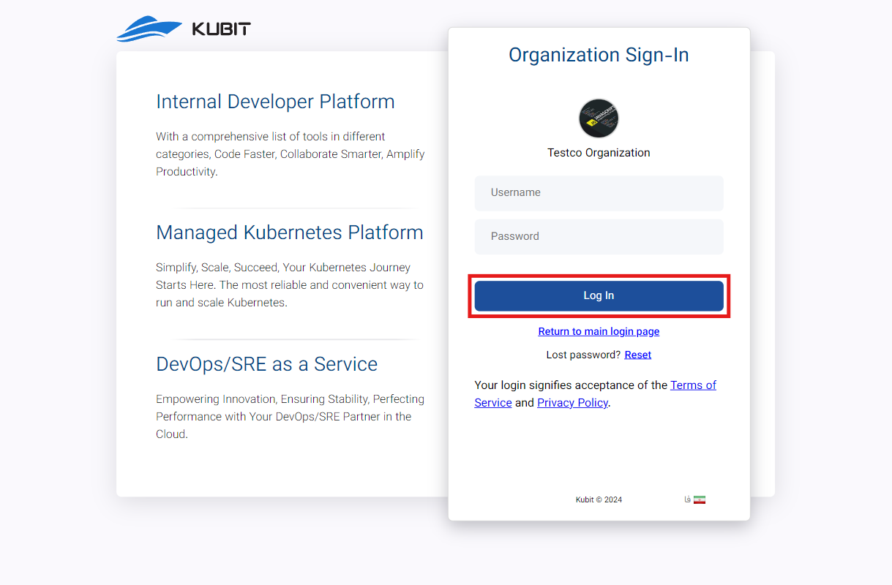

# تسجيل الدخول إلى حساب المستخدم

نظرًا لإمكانية إدارة عدة منظمات بحساب واحد في كوبيت، هناك طريقتان لتسجيل الدخول إلى حساب المستخدم الخاص بك: تسجيل الدخول باستخدام البريد الإلكتروني/رقم الهاتف وتسجيل الدخول التنظيمي. يمكن الوصول إلى كلا الطريقتين من خلال [صفحة تسجيل الدخول](https://panel.kubit.ir/en/login/). أدناه، سنشرح كل من هاتين الطريقتين.

## الطريقة الأولى: تسجيل الدخول باستخدام البريد الإلكتروني/رقم الهاتف

- أولاً، أدخل بريدك الإلكتروني أو رقم هاتفك المسجل مع كلمة المرور الخاصة بك.
- ثم، انقر على زر **Login** للوصول إلى حساب المستخدم الخاص بك.
  

## الطريقة الثانية: تسجيل الدخول التنظيمي

إذا كنت بحاجة إلى الوصول إلى لوحة كوبيت الخاصة بالمنظمة التي أنت عضو فيها، انقر أولاً على خيار **Single Sign-On** على [صفحة تسجيل الدخول](https://panel.kubit.ir/en/login/):

في هذه المرحلة، أدخل اسم المنظمة المعنية وانقر على زر **Continue**:

أخيرًا، أدخل اسم المستخدم وكلمة المرور الخاصة بك، ثم انقر على زر **Login**:

باتباع هذه الخطوات، يمكنك تسجيل الدخول إلى لوحة كوبيت.

## تسجيل الدخول إلى منظمة تمت دعوتك إليها

إذا تمت دعوتك إلى منظمة، يمكنك استخدام إحدى الطرق التالية للوصول إلى لوحة المنظمة:

### رابط الدعوة (مستخدم كوبيت)

إذا كان نوع عضويتك هو مستخدم كوبيت، يمكنك تسجيل الدخول بالنقر على الرابط المرسل إلى بريدك الإلكتروني أو رقم هاتفك.

إذا لم يكن لديك حساب مسبقًا، فسيتم توجيهك إلى [صفحة التسجيل](https://panel.kubit.ir/en/register/). [بإنشاء حساب مستخدم](../register)، ستنضم إلى المنظمة المعنية.

إذا كان لديك حساب مستخدم بالفعل وقمت بتسجيل الدخول إلى اللوحة، فسيتم توجيهك مباشرة إلى لوحة المنظمة المعنية.

### مستخدم LDAP

إذا تمت إضافتك إلى المنظمة كمستخدم LDAP، تحتاج إلى الانتقال إلى [صفحة تسجيل الدخول](https://panel.kubit.ir/en/login/) واستخدام خيار **Forgot Password** لتعيين كلمة مرور جديدة.

في صفحة تسجيل الدخول، انقر على **Single Sing-On**:

في هذه الخطوة، أدخل اسم المنظمة المعنية وانقر على زر **Continue**:

ثم انقر على **Reset**:

للاطلاع على الخطوات المتبقية لاستعادة كلمة المرور، راجع مستند [استعادة كلمة المرور](../forgot-password).
