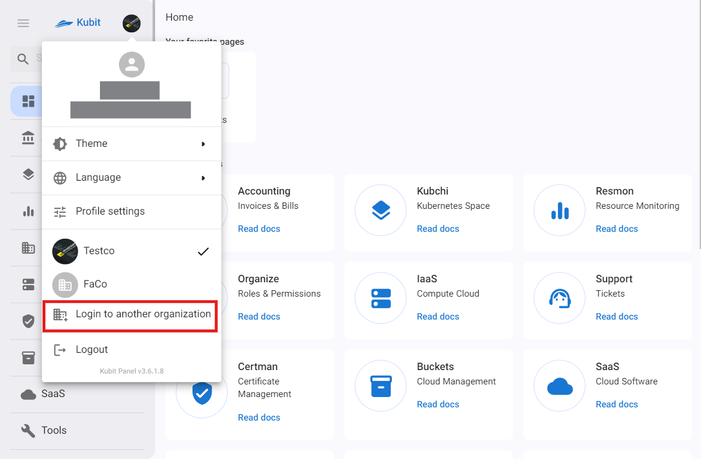

# لوحة تحكم کوبیت

عند [تسجيل الدخول إلى لوحة تحكم مستخدم کوبیت](https://panel.kubit.ir/en/login)، يمكنك الوصول إلى جميع الخدمات المتاحة وإعدادات المستخدم والنظام. تتيح لك هذه اللوحة إدارة وعرض تفاصيل الخدمة الكاملة، بما في ذلك إدارة المستخدمين والمشاريع، مما يمكنك من استخدام جميع الإعدادات والميزات المتاحة بسهولة.

:::caution[تنبيه]
جميع الإعدادات وإدارة الأقسام المختلفة يمكن الوصول إليها تحت العناوين ذات الصلة في مستند حساب المستخدم.
:::

الصفحة الرئيسية للوحة التحكم تشمل الوصول إلى الملف الشخصي، القائمة الجانبية اليمنى، الصفحات المفضلة، خدمات کوبیت، الأحداث الأخيرة والتذاكر. فيما يلي نظرة عامة سريعة على هذه الأقسام.

## القائمة الجانبية اليمنى

يوفر الوصول السريع إلى قائمة الخدمات المتاحة في اللوحة والملف الشخصي للمستخدم من خلال القائمة الجانبية اليمنى. يمكنك أيضًا استخدام ميزة البحث في کوبیت للبحث بين الخدمات:

## إعدادات الملف الشخصي

جميع الإعدادات المتعلقة بالملف الشخصي وحساب المستخدم يمكن الوصول إليها من قسم الملف الشخصي في لوحة تحكم کوبیت. يوضح مستند [إعدادات الملف الشخصي](../profile-settings) تفاصيل إعدادات الملف الشخصي.

## تغيير القالب

لتغيير قالب لوحة المستخدم، قم أولاً بالنقر على الملف الشخصي. ثم، من القائمة المنسدلة، اختر خيار **Theme** واختر القالب المفضل لديك من الخيارات المتاحة:

## تغيير اللغة

لتغيير لغة لوحة المستخدم، قم أولاً بالنقر على الملف الشخصي. ثم، من القائمة المنسدلة، اختر خيار **Language** واختر اللغة المفضلة لديك من الخيارات المتاحة:

## إنشاء حساب شخصي

إذا كنت قد حصلت على الوصول إلى اللوحة تحت منظمة أخرى وترغب الآن في إنشاء حسابك الشخصي (كوبتي)، أولاً انقر على الملف الشخصي، ثم من القائمة المنسدلة، اختر **Create Your Account**:

سيتم توجيهك إلى صفحة إنشاء الحساب. قم بإدخال التفاصيل المطلوبة واضغط على **Sign Up**:

ثم يجب عليك إدخال الرمز المرسل إلى بريدك الإلكتروني أو رقم هاتفك والذي يتكون من 6 أرقام من أجل التحقق وتأكيد التسجيل، ثم النقر على **Submit**:

أخيراً، بعد إرسال رمز التحقق، ستكتمل عملية التسجيل الخاصة بك وسيتم إنشاء حسابك في کوبیت.

بعد ذلك، ستتم توجيهك إلى نموذج إنشاء المنظمة المرتبط بحسابك. كما ذُكر في [شرح مفهوم المنظمة](../#organization)، للوصول إلى ميزات اللوحة، يجب أن يكون هناك منظمة مرتبطة بحسابك. من خلال إدخال المعلومات المطلوبة (اسم المنظمة والمفتاح)، يمكنك إنشاء منظمتك:

أخيراً، ستتمكن من تسجيل الدخول إلى اللوحة والوصول إلى لوحة المنظمة الشخصية الخاصة بك.

:::info[إنشاء منظمة في اللوحة]
إذا كنت قد اخترت عدم إنشاء منظمة بعد التسجيل (من خلال اختيار خيار "لاحقاً" في الصورة أعلاه)، يمكنك إنشاء المنظمة المرتبطة بحسابك من خلال لوحة كوبت. يمكنك الوصول إلى دليل خطوة بخطوة لإنشاء منظمة من مستند [إنشاء المنظمة](../create-organization).
:::

## تبديل بين المنظمات

لإدارة منظمات متعددة في لوحة المستخدم، أولاً انقر على ملفك الشخصي ثم اختر خيار **Login to another organization**.

ادخل اسم المنظمة المطلوبة ثم انقر على **Continue**.

ثم، سجّل الدخول باستخدام اسم المستخدم الخاص بك في تلك المنظمة.

من خلال القيام بذلك، يمكنك إضافة المنظمات الأخرى التي أنت عضو فيها إلى لوحتك والتبديل بين المنظمات عن طريق النقر على اسم المنظمة فقط.

## الصفحات المفضلة

يوفر قسم الصفحات المفضلة في الصفحة الرئيسية للوحة الوصول السريع إلى الخدمات المفضلة لدى المستخدمين.

:::tip[إضافة خدمة إلى قائمة المفضلة]
يمكنك إضافة الخدمة التي تريدها إلى المفضلة بالنقر على أيقونة النجمة في الشريط العلوي لكل صفحة خدمة.

:::

## خدمات كوبيت

بالإضافة إلى قائمة الجانب الأيمن من اللوحة، يمكنك أيضًا الوصول إلى قائمة خدمات كوبيت من الصفحة الرئيسية للوحة.

## الأحداث والتذاكر الأخيرة

### الأحداث

من خلال قسم **Recent events**، يمكنك الوصول إلى إعلانات كوبيت. في هذا القسم، تكون الإعلانات التنظيمية (مفصولة حسب كل منظمة) والإعلانات العامة مرئية.

### التذاكر

يمكن الوصول إلى أحدث التذاكر المقدمة في خدمة الدعم من خلال قسم **Recent tickets**.

