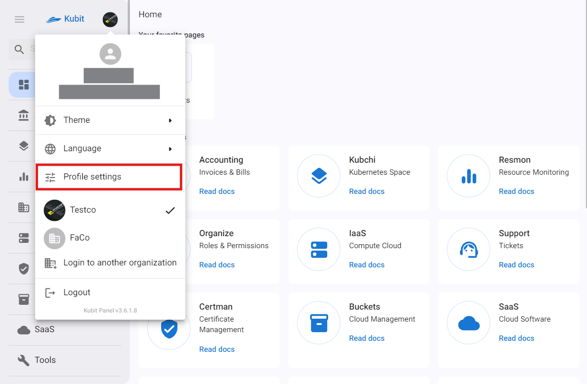
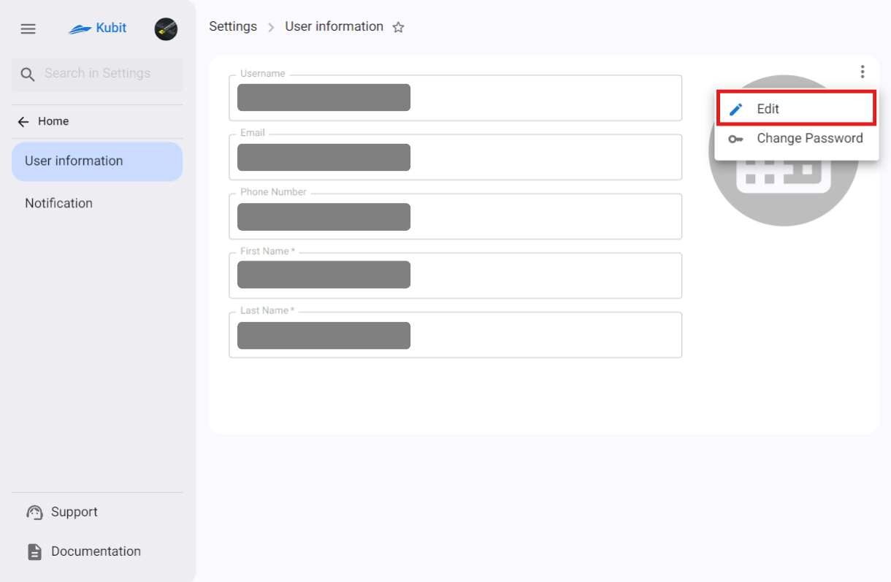
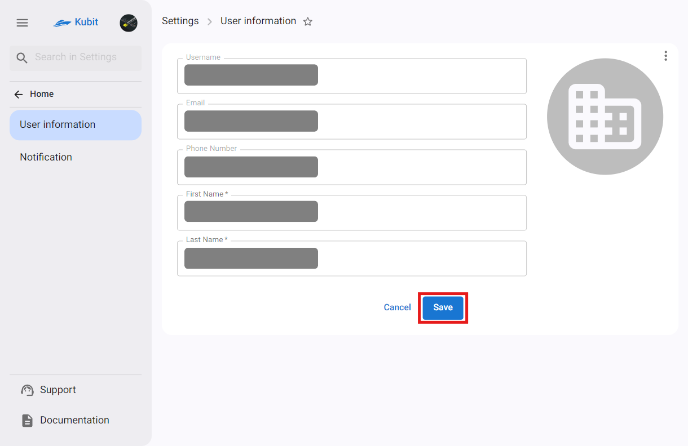
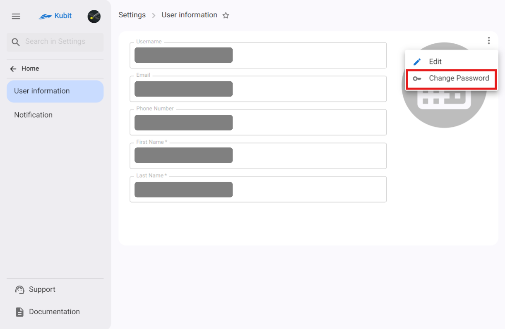
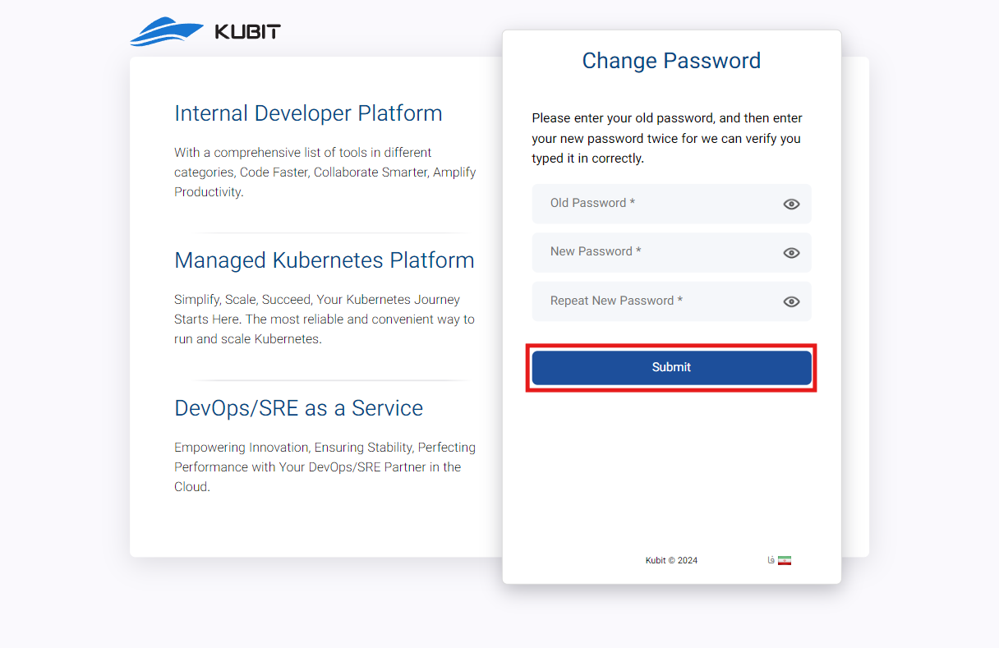

# إعدادات الملف الشخصي

لتغيير معلومات المستخدم بما في ذلك البريد الإلكتروني ورقم الهاتف والاسم الأول واسم العائلة وصورة الملف الشخصي، وكذلك لتغيير كلمة المرور وتحرير قنوات الإخطار، يمكنك استخدام قسم **Profile settings**.

## تحرير معلومات المستخدم

انتقل إلى قسم **User information** في **Profile settings**، وانقر على النقاط الثلاث على الجانب الأيسر من جدول معلومات المستخدم، واختر خيار **Edit**.

يمكنك أيضًا اختيار وتغيير صورة الملف الشخصي من هذا القسم. بعد إدخال المعلومات الجديدة، **Save** التغييرات الخاصة بك.

:::caution[تنبيه!]
**يرجى ملاحظة أن اسم المستخدم** و**البريد الإلكتروني** و**رقم الهاتف** غير قابلين للتغيير.
:::

## تغيير كلمة المرور

:::caution[تنبيه!]
إذا كنت تلعب دور مدير النظام في المنظمة الحالية على لوحة كوبيت، يمكنك **تغيير كلمة المرور** الخاصة بك باستخدام خيار تغيير كلمة المرور. خلاف ذلك، لن يكون لديك حق الوصول لتغيير كلمة المرور وسيتعين عليك الاتصال بمدير المنظمة.
:::

انتقل إلى قسم **User information** في **Profile settings**، وانقر على النقاط الثلاث على الجانب الأيسر من جدول معلومات المستخدم، واختر خيار **Change password**.

ثم أدخل كلمة المرور القديمة وكلمة المرور الجديدة في نموذج تغيير كلمة المرور وانقر على زر **Submit**.

## تحرير قنوات الإخطار

في قسم **Notification**، تتوفر قائمة بالقنوات المختلفة لتلقي إعلانات خدمات كوبيت. لكل خدمة تم تكوين نظام الإخطار لها، يمكنك عرض القنوات ذات الصلة وتفعيلها أو تعطيلها بشكل فردي.

