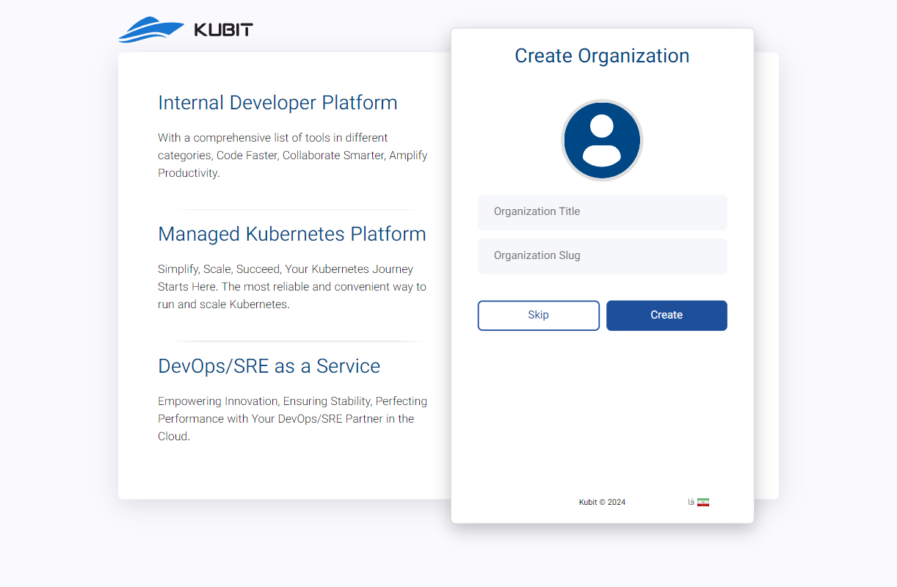
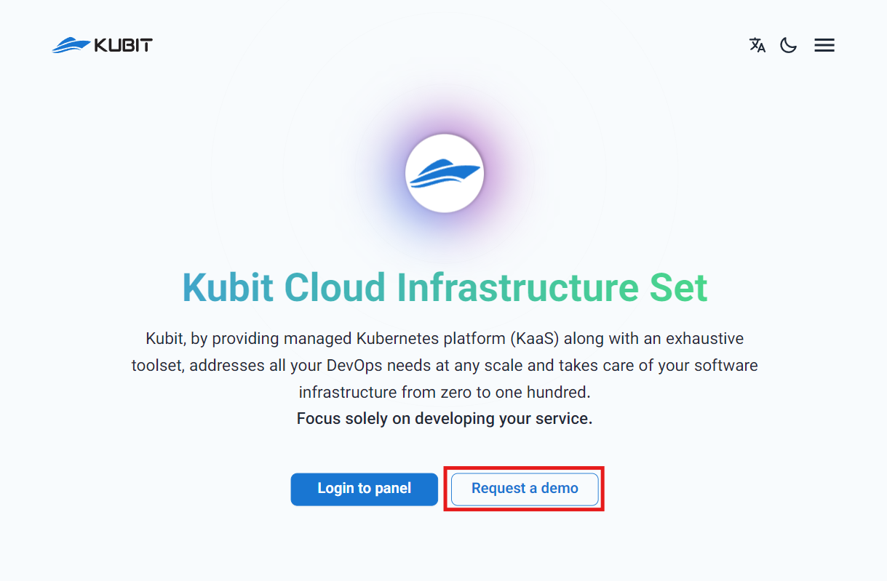
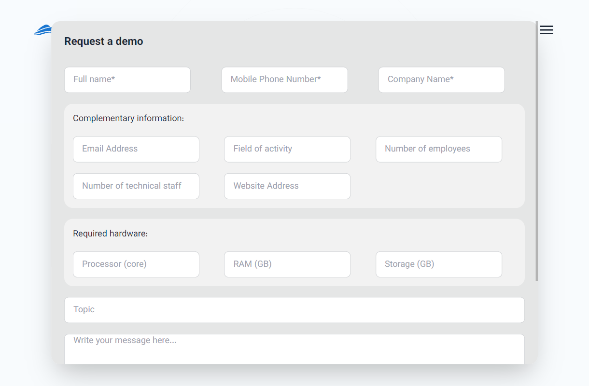
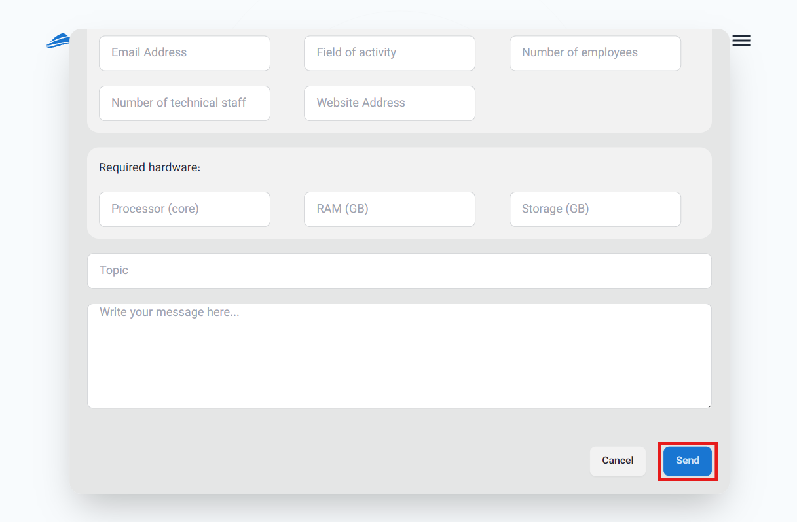

# إنشاء حساب مستخدم والتسجيل

لاستخدام أي من منتجات كوبيت، تحتاج أولاً إلى حساب مستخدم. إذا كنت قد سجلت مسبقًا، يمكنك استخدام دليل [تسجيل الدخول للوصول إلى حسابك](../login). إذا لم تقم بالتسجيل بعد، ستوجهك هذه الإرشادات خطوة بخطوة خلال عملية التسجيل.

## التسجيل

- أولاً، انتقل إلى صفحة [التسجيل](https://panel.kubit.ir/en/register).
- ثم، أدخل معلوماتك في الحقول المخصصة وابتكر كلمة مرور قوية وفقًا للتعليمات المقدمة.
  

:::caution[تنبیه!]
يرجى التأكد من إدخال **رقم هاتف** أو **عنوان بريد إلكتروني**، حيث أنه إلزامي لإنشاء الحساب وإرسال رمز التحقق.
:::

ثم، أدخل رمز التحقق المكون من 6 أرقام المرسل إلى بريدك الإلكتروني أو رقم هاتفك لتوثيق وتأكيد التسجيل، ثم اضغط على **Submit**.

أخيرًا، بعد إرسال رمز التحقق، ستكتمل عملية التسجيل الخاصة بك وسيتم إنشاء حسابك في كوبيت.

بعد ذلك، سيتم توجيهك إلى نموذج إنشاء منظمة مرتبطة بحساب المستخدم الخاص بك. كما ذُكر في [شرح مفهوم المنظمة](../#organization)، للوصول إلى ميزات اللوحة، يجب أن تكون هناك منظمة مرتبطة بحسابك. من خلال إدخال المعلومات المطلوبة (اسم المنظمة ومفتاحها)، يمكنك إنشاء منظمتك:

في النهاية، ستقوم بتسجيل الدخول إلى حساب المستخدم الخاص بك وستتمكن من الوصول إلى لوحة المنظمة.

:::info[إنشاء منظمة في اللوحة]
إذا اخترت عدم إنشاء منظمة فور التسجيل (باختيار خيار **Skip** في الصورة أعلاه)، يمكنك أيضًا إنشاء منظمة مرتبطة بحساب المستخدم الخاص بك من خلال لوحة كوبيت. يمكنك الوصول إلى دليل خطوة بخطوة لإنشاء منظمة في مستند [إنشاء المنظمة](../panel#create-organization).
:::

## استلام رمز الدعوة

لتلقي رمز دعوة لإنشاء حساب مستخدم، انتقل أولاً إلى [موقع ويب كوبيت](https://kubit.ir/en/) وانقر على خيار **Request a demo**:

أكمل المعلومات المطلوبة في نموذج **Request a demo**:

أخيرًا، انقر على زر **Send** لإرسال طلبك:

بعد مراجعة طلبك من قبل فريق دعم كوبيت، سيتم إرسال رمز دعوة إليك. يمكنك استخدام هذا الرمز لإنشاء حساب المستخدم الخاص بك.

## تسجيل الدخول إلى حسابك

بمجرد تسجيل الدخول إلى اللوحة، ستتمكن من الوصول إلى جميع الخدمات والميزات المقدمة من كوبيت. كل قسم من اللوحة يحتوي على أدلة شاملة لمساعدة المستخدمين على الاستفادة القصوى من الميزات المتاحة.
