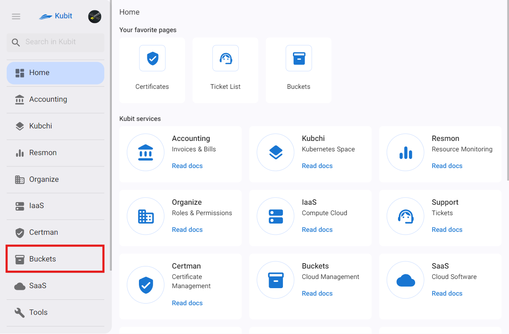

# الدلاء (مساحة التخزين السحابية)

التخزين السحابي هو خدمة لتخزين وإدارة البيانات في بيئة سحابية. توفر هذه الخدمة تخزينًا آمنًا لأنواع مختلفة من الملفات. باستخدام هذه الخدمة، يمكن للمستخدمين تخزين بياناتهم في سحابة Kubit والوصول إليها في أي وقت ومن أي مكان.

## المفاهيم الأساسية

### الموقع

مركز البيانات الذي يتم تخزين بيانات المستخدمين فيه وصيانته يعادل مفهوم الموقع.

### باكت

الباكيتات هي الوحدات الأساسية لتنظيم البيانات في التخزين السحابي. يمكن لكل باكت أن يحتوي على مجموعة من الملفات والمجلدات، مما يسمح بتخزين البيانات وإدارتها بشكل منظم. تُعرَف الباكيتات ضمن فضا.

### الفضاء

الفضاء هو مجموعة من الباكيتات المعزولة ضمن موقع معين. يُعرَف مفهوم الفضاء لتقسيم وإدارة الوصول. لاستخدام خدمة الباكيت، يجب أن يكون هناك فضاء ضمن موقع متصل بمشروع.

### حساب الخدمة

حساب الخدمة هو مفهوم وهوية تُستخدم لتحديد مجموعات الوصول إلى الفضاءات والباكيتات. على سبيل المثال، لتخصيص وصول مقيد (للقراءة فقط) للأفراد، يتم استخدام حساب الخدمة. يتم تعريف حساب خدمة للباكيت المطلوب وفقًا للوصول المطلوب، ويتم تحديد نطاق الوصول في سياسة الباكيت. من خلال منح توكن حساب الخدمة للأفراد، يمكنهم الحصول على وصول مقيد إلى ملفات الباكيت.

### التاج

في خدمة التخزين، التاج هو زوج من المفتاح والقيمة يُخصص للباكت لتصنيف وتحديد وإدارة الوصول.

### دورة الحياة

دورة الحياة هي مجموعة من القواعد التي تدير الكائنات تلقائيًا. تقوم هذه القواعد بنقل الكائنات بين فئات التخزين المختلفة ثم حذفها بعد فترة معينة. يساعد هذا في توفير التكاليف وإدارة البيانات بشكل أفضل.

### الإصدارات

يتيح الإصدار إمكانية تخزين واسترجاع واستعادة الإصدارات المختلفة لملف داخل حاوية. بمجرد تفعيل هذه الميزة، تحتفظ الحاوية بجميع إصدارات الملف حتى بعد إعادة الكتابة أو الحذف. توفر هذه الميزة إمكانية الوصول إلى الإصدارات القديمة واستعادتها عند الحاجة، مما يحمي البيانات من الحذف أو التعديل غير المقصود. بالإضافة إلى ذلك، تدعم استعادة البيانات وتتبع التغييرات.
