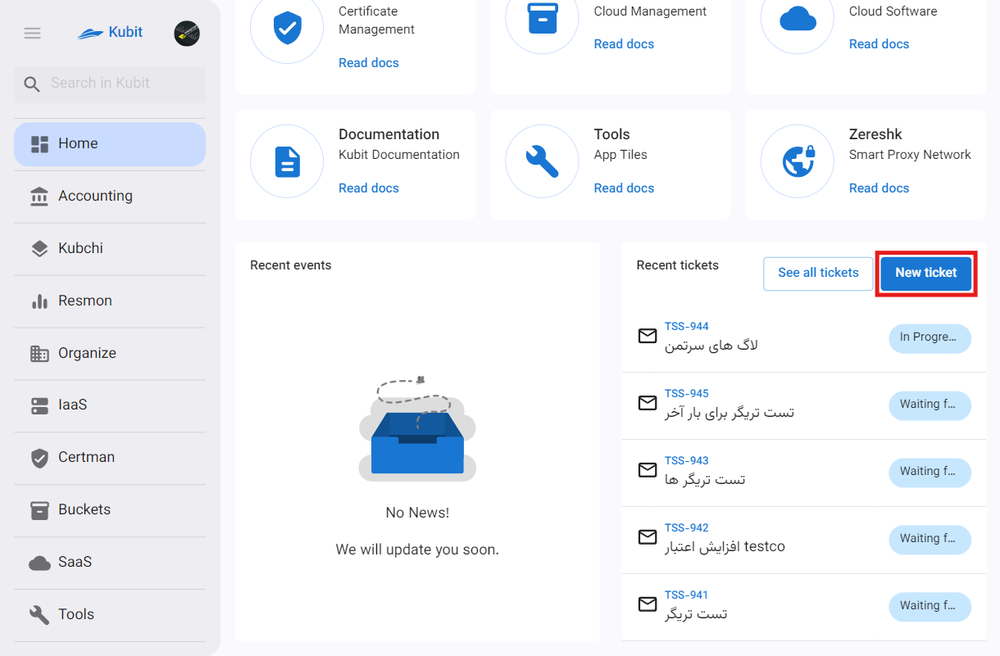
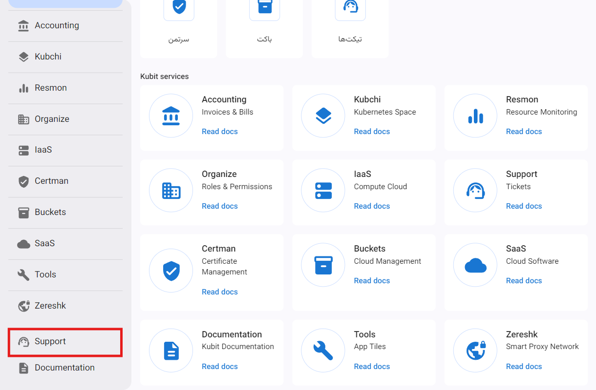
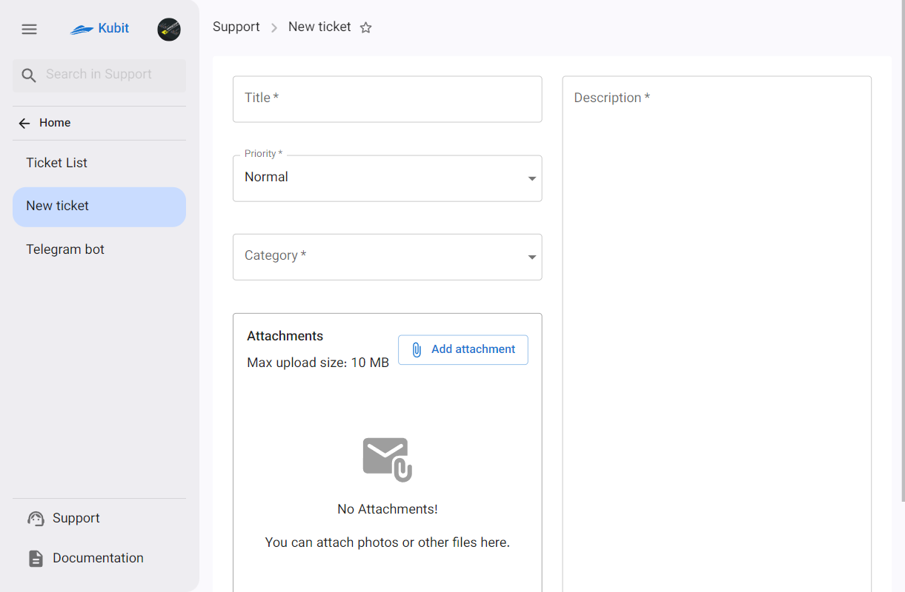
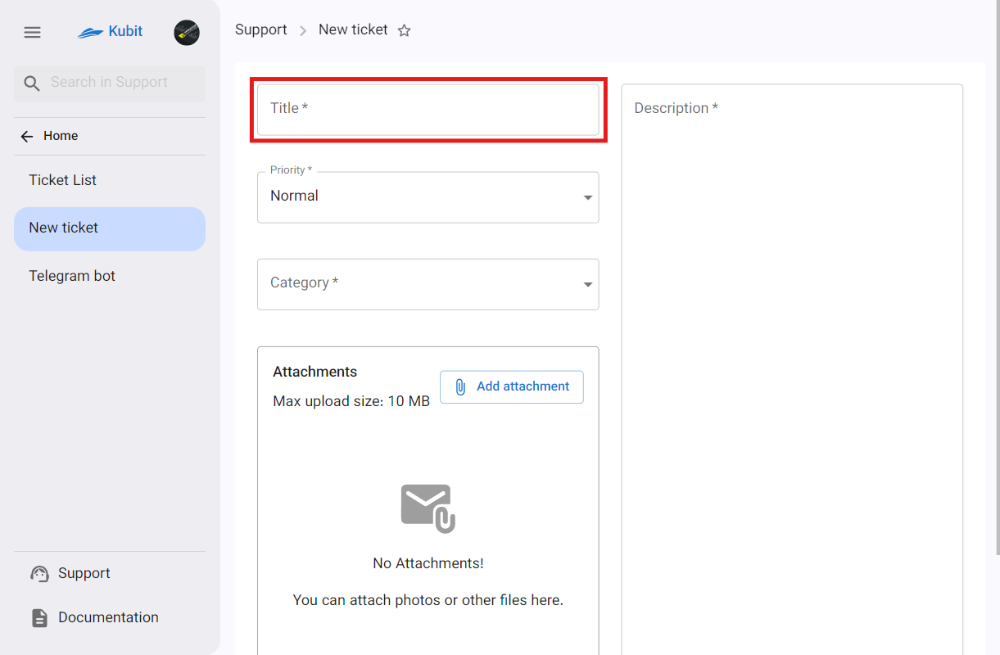
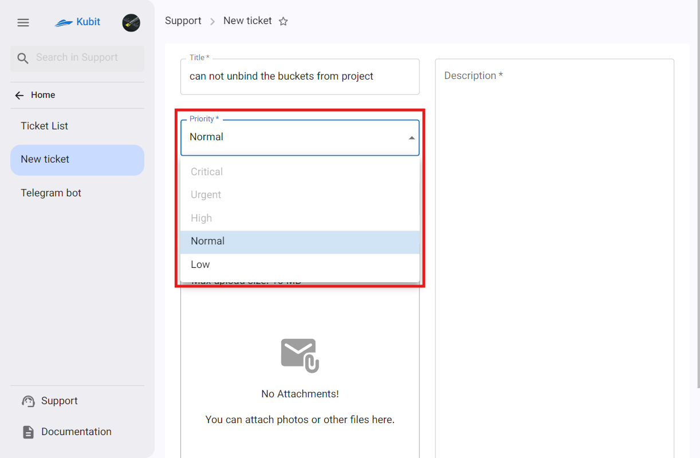
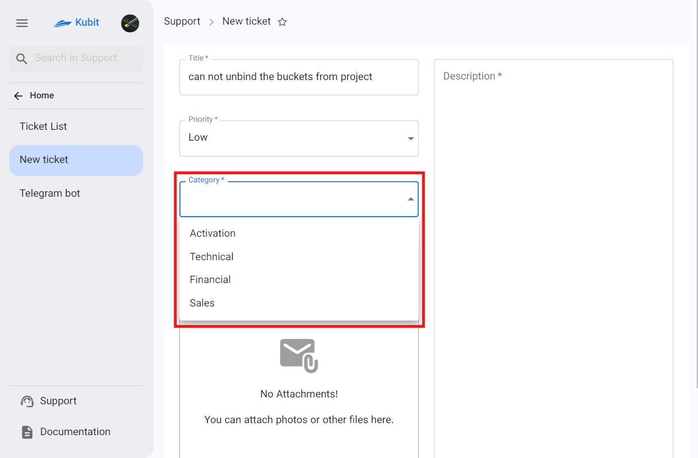
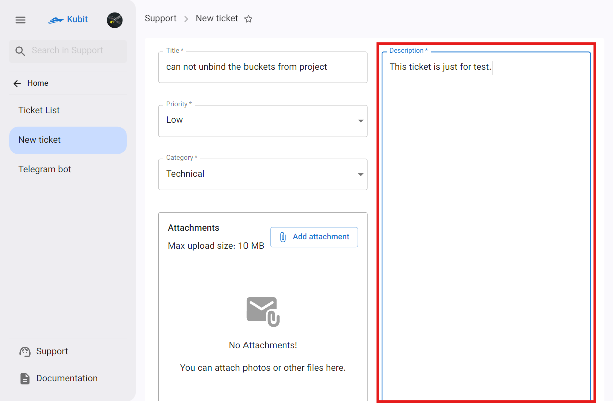
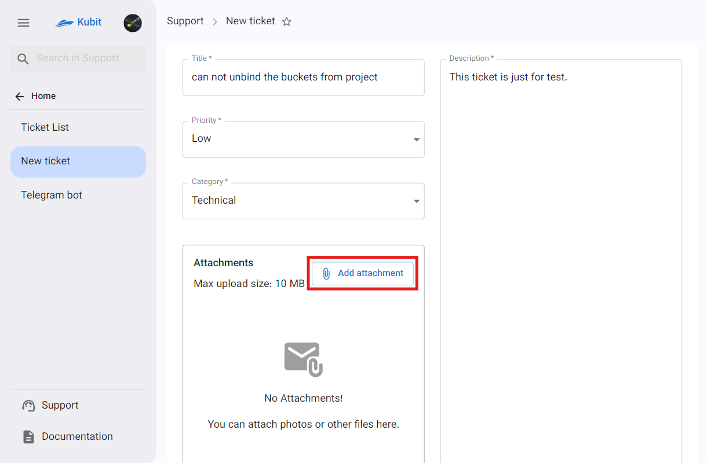
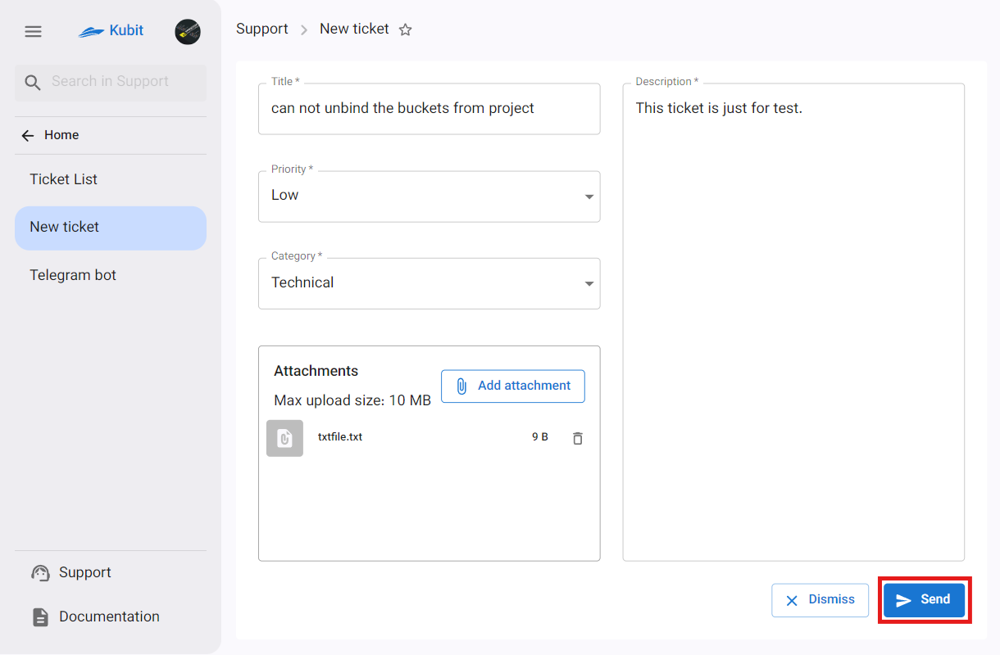
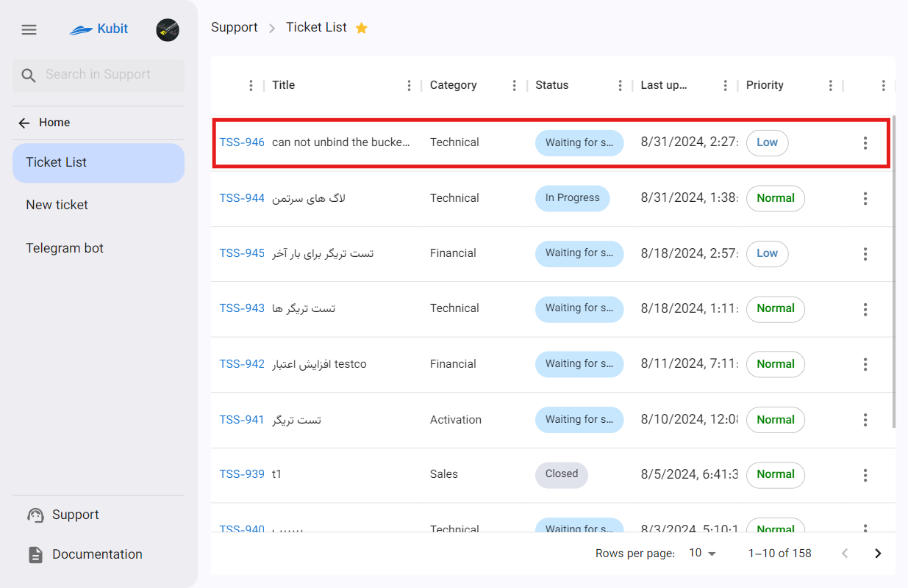

# إنشاء تذكرة جديدة

للوصول إلى إنشاء تذكرة، تم إنشاء نقطتي وصول:

- قسم **التذاكر الأخيرة** في الصفحة الرئيسية للوحة
- قسم **تذكرة جديدة** في صفحة خدمة الدعم

:::tip[نموذج إنشاء تذكرة]
الوصول الأساسي الوحيد إلى خيار إنشاء التذكرة مختلف، وعند استخدام أي من المسارين، سيتم توجيهك مباشرة إلى نموذج إنشاء التذكرة.
:::

## المسار الأول: الصفحة الرئيسية للوحة

من الصفحة الرئيسية للوحة، انقر على زر **New Ticket** ليتم توجيهك إلى نموذج إنشاء التذكرة:

## المسار الثاني: صفحة خدمة الدعم

من صفحة خدمة الدعم، قم أولاً بالدخول إلى خدمة الدعم من خلال لوحة کوبیت:

ثم انقر على زر **New Ticket** ليتم توجيهك إلى نموذج إنشاء التذكرة:

### نموذج إنشاء تذكرة

إذا كنت تستخدم أي من المسارات المذكورة، سيتم توجيهك إلى نموذج إنشاء التذكرة:

ثم، أدخل عنوان التذكرة:

اختر الأولوية والفئة من القائمة:

:::info[الأولوية الافتراضية]
عند إنشاء تذكرة، يتم تعيين الأولوية الافتراضية إلى عادية، ويمكنك تغييرها.
:::

أيضًا، أدخل وصف التذكرة الخاصة بك:

إذا كنت بحاجة إلى تحميل ملف، في قسم **Attachments**، انقر على زر **Add Attachment** واختر الملف الذي تريد تحميله:

في النهاية، انقر على زر **Send** لإرسال تذكرتك:

بعد من إنشاء التذكرة، سيتم توجيهك إلى صفحة **قائمة التذاكر**، حيث يمكنك عرض التذكرة الجديدة:

