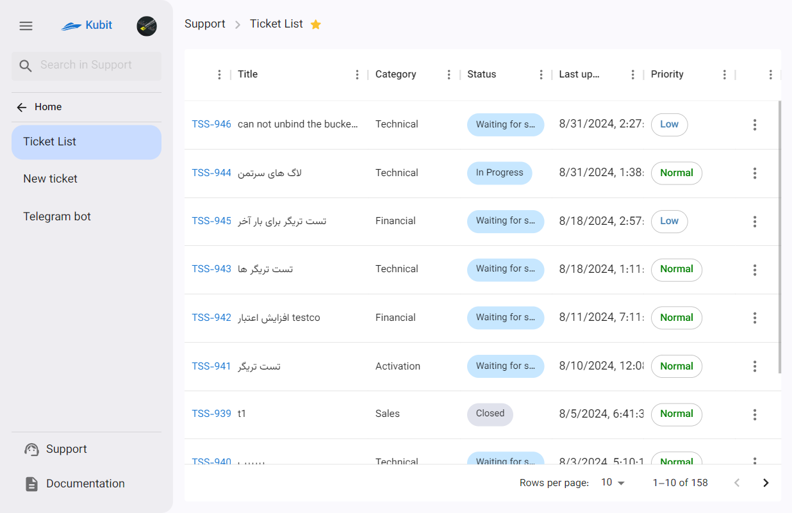
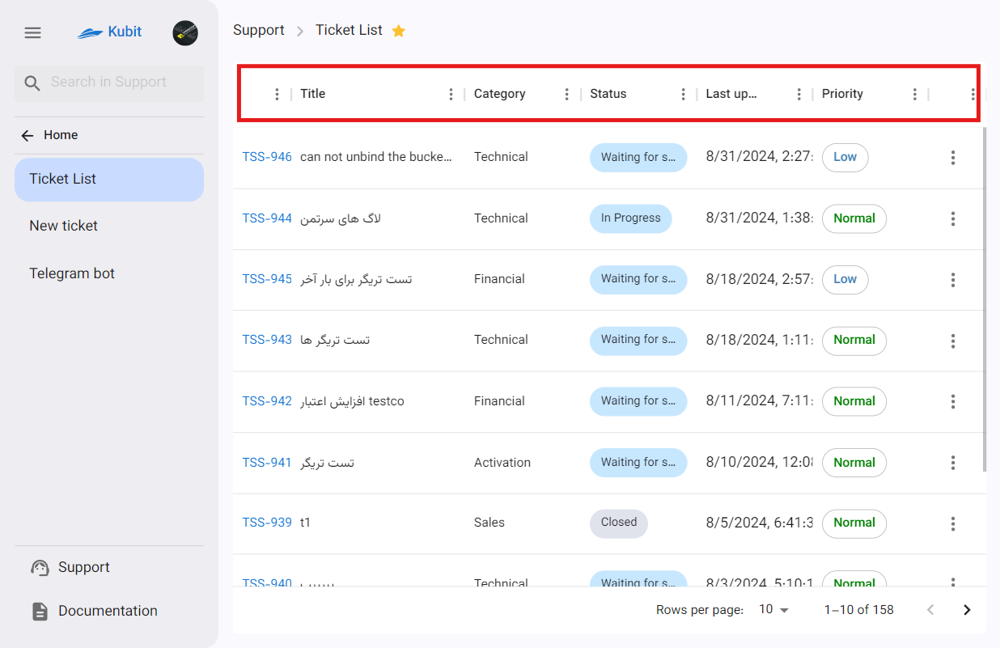
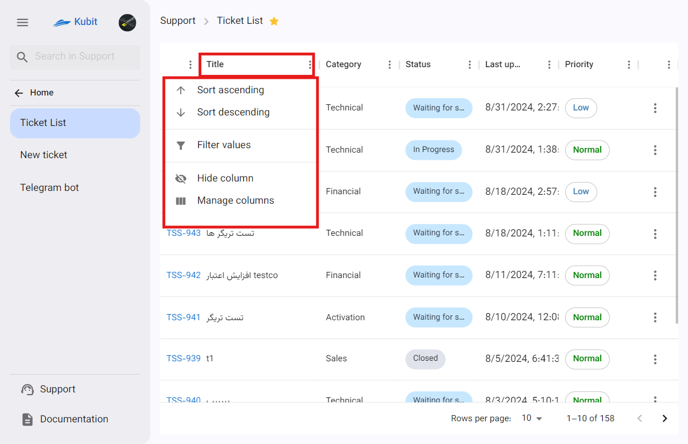
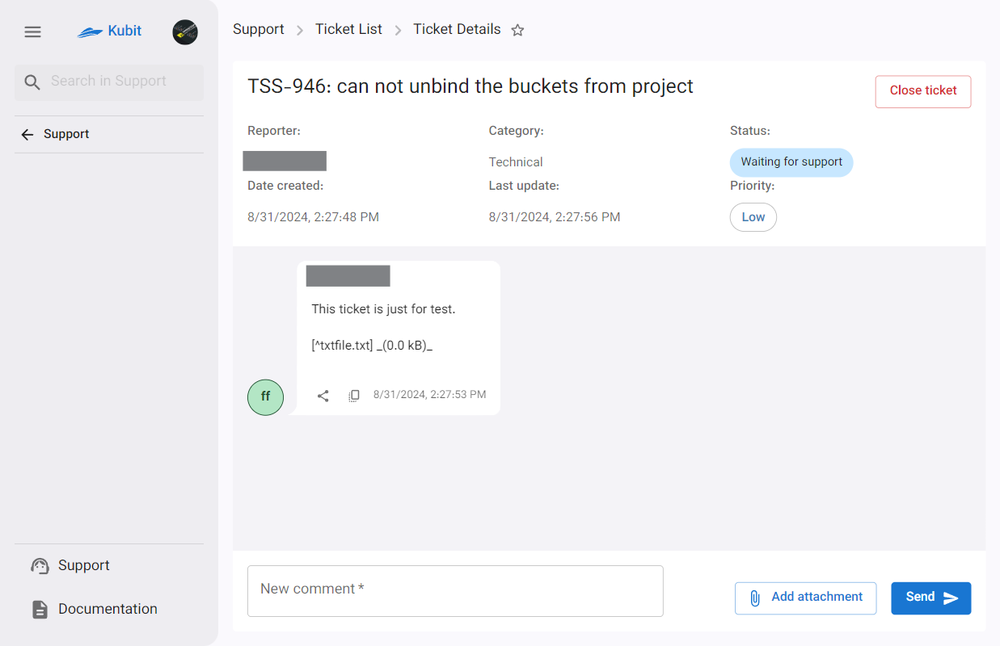
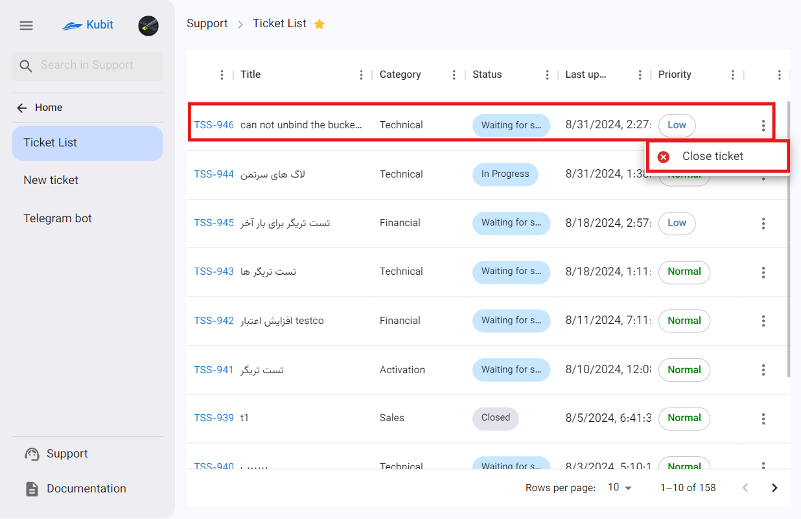
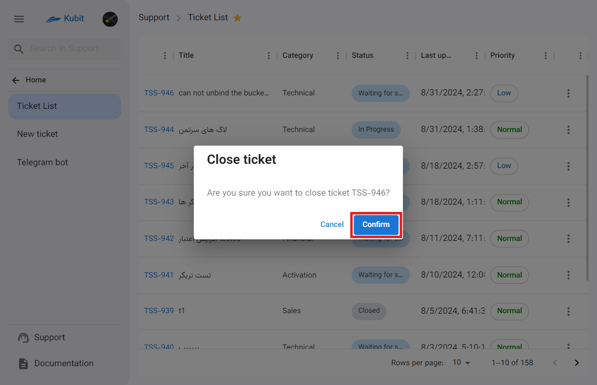
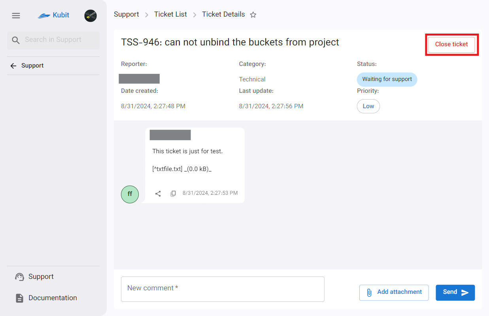
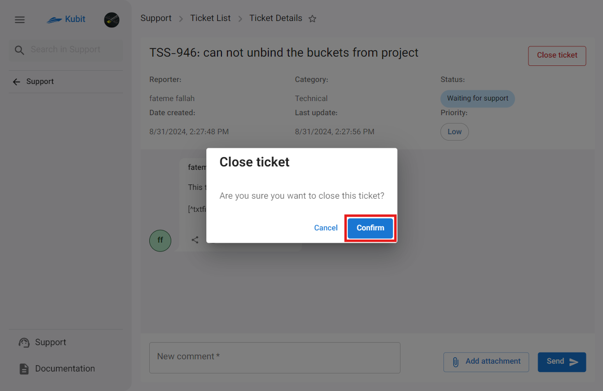
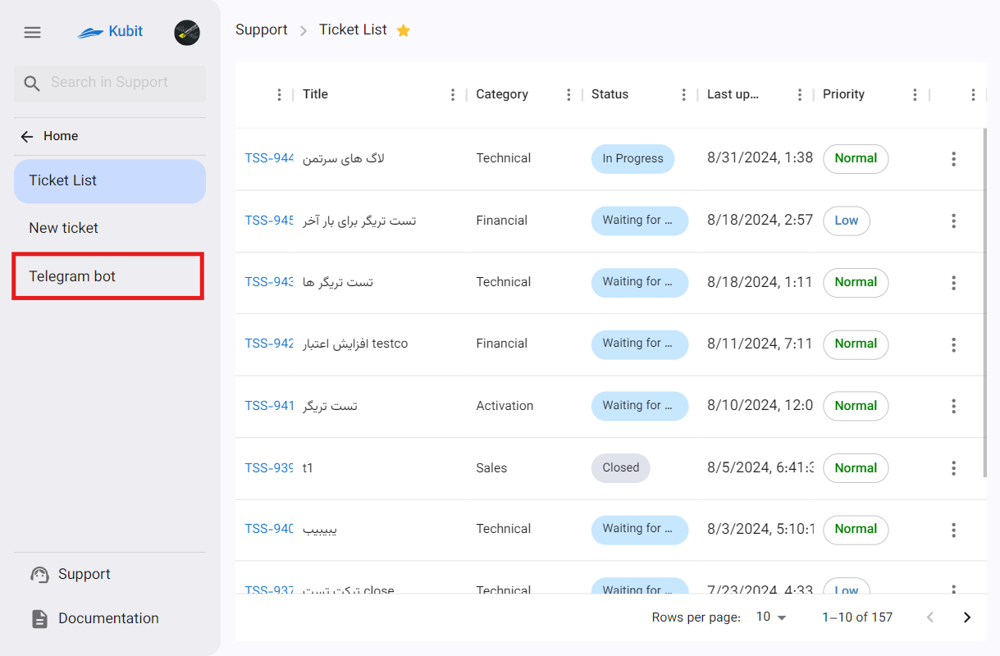
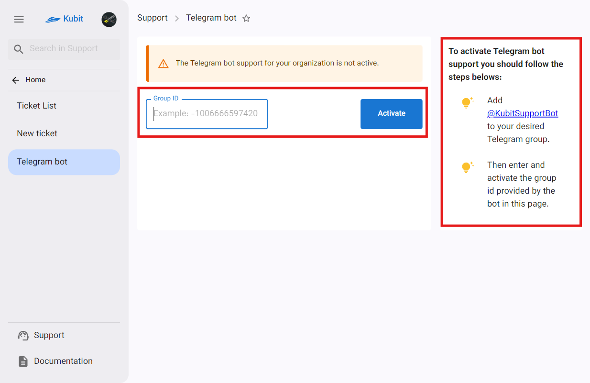

# إدارة خدمة الدعم

في قسم الدعم في لوحة کوبیت، يمكنك الوصول إلى **قائمة التذاكر**، وإمكانية **إنشاء تذكرة جديدة**، و **روبوت تيليجرام**.

أولاً، ادخل إلى **خدمة الدعم** من لوحة کوبیت:

في الصفحة الرئيسية لخدمة الدعم، سيكون لديك الوصول إلى قائمة التذاكر:

من خلال الشريط العلوي للقائمة، يمكنك ترتيب أو تصفية أو إخفاء قائمة التذاكر بناءً على كل عمود وفقًا لاحتياجاتك:

لعرض الخيارات، انقر على زر النقاط الثلاث بجانب اسم كل عمود:

بالإضافة إلى ذلك، يمكنك عرض تفاصيل التذكرة بالنقر على التذكرة:

## إغلاق التذكرة بواسطة المستخدم

إذا تم حل مشكلة المستخدم ولم تكن هناك حاجة لمتابعة من الدعم، يمكن للمستخدم تغيير حالة التذكرة الخاصة به إلى **مغلقة**. يمكن القيام بذلك بطريقتين: خيار إغلاق التذكرة من **قائمة التذاكر** وزر إغلاق التذكرة في **صفحة تفاصيل التذكرة**.

### الطريقة الأولى: قائمة التذاكر

### الطريقة الثانية: تفاصيل التذكرة

:::tip[إشعار حالة التذكرة عبر الرسائل القصيرة]
في كل مرحلة من مراحل تغيير حالة التذكرة، يتم إرسال رسالة تحتوي على التغيير إلى رقم هاتف العميل المحمول (منشئ التذكرة).
:::

## روبوت تيليجرام

عن طريق توصيل روبوت تيليجرام بلوحة کوبیت، يمكنك الوصول إلى خدمة الدعم عبر تيليجرام واستخدام الروبوت لإرسال التذاكر وتتبع تذاكرك.
لعرض إعدادات روبوت تيليجرام، اختر خيار **Telegram Bot** من صفحة الدعم:

- اتبع الخطوات المذكورة لإضافة روبوت تيليجرام، [@KubitSupportBot](https://t.me/KubitSupportBot)، إلى مجموعة تيليجرام التي ترغب بها.
- ثم أدخل **Group ID** الذي تلقيته من الروبوت في قسم معرف المجموعة واختر **Activate**:
  

لذا، من خلال المجموعة المعنية، يمكنك إجراء عمليات مثل **إنشاء تذكرة**، **حذف معرف تيليجرام**، **وإلغاء عملية إنشاء التذكرة**.
