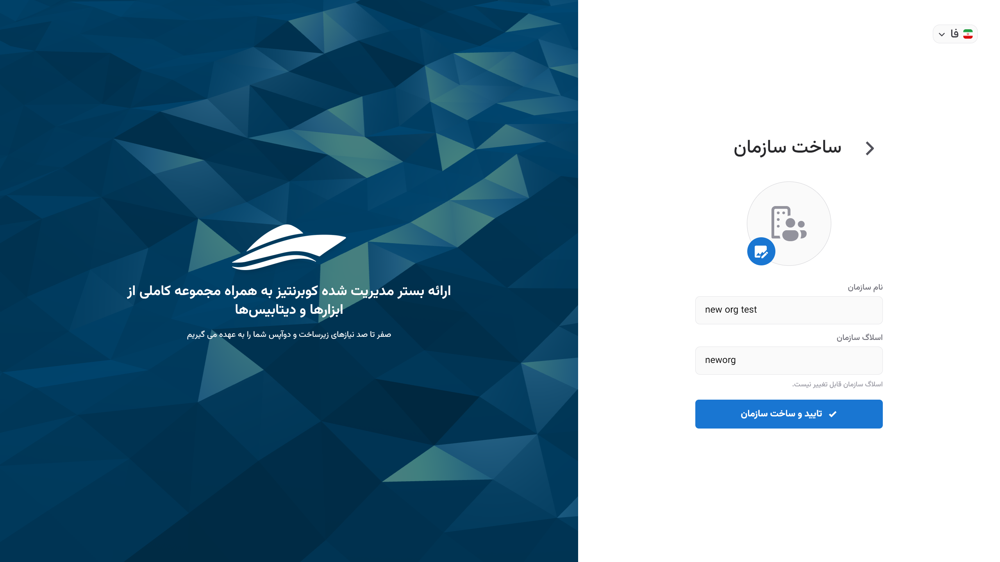
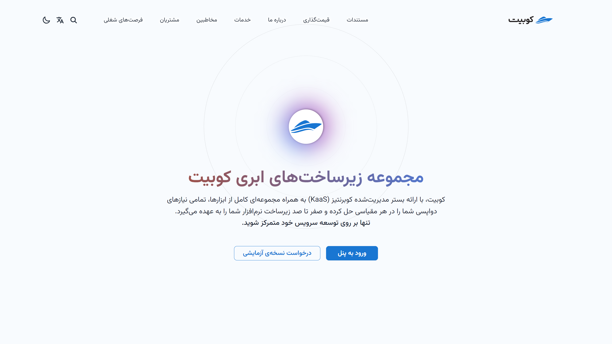

# Create User Account and Registration

To use any of Kubit's products, you first need to have a user account. If you have already registered, you can refer to the [login document](../login) to access your account. If you haven’t registered yet, this guide will walk you through the registration process step by step.

## Registration

- First, go to the [registration page](https://panel.kubit.ir/fa/register).
- Then, enter your information in the relevant fields and set a strong password according to the provided guidelines.

:::caution[Note]
Please note that entering either a **phone number** or **email address** is mandatory for creating an account and sending the authentication verification code.
:::

Next, you need to enter the 6-digit code sent to your email or phone number for authentication and registration confirmation, then click **Submit**:

Finally, after submitting the verification code, your registration process is complete, and your Kubit user account is created.

After this, you will be directed to the organization creation form associated with your user account. As mentioned in the explanation of the [organization concept](../..#organization), to access the panel's features, an organization associated with the user account must exist.
By entering the required information (organization name and key), you can create your organization:

Finally, you will log into your account and gain access to the organization panel.

:::info[Creating an Organization in the Panel]
If you choose not to create an organization after registration (by selecting the **Later** option in the image above), you can still create an organization associated with your user account through the Kubit panel. You can access a step-by-step guide for creating an organization in the [Create Organization document](../panel#create-organization).
:::

## Obtaining an Invitation Code

To receive an invitation code for creating a user account, first visit the [Kubit website page](https://kubit.ir/fa/) and click on the **Request a Trial Version** option:

Complete the information requested in the **Request a Trial Version** form:

Finally, click the **Submit** button to send your request:

After your request is reviewed by the Kubit support team, an invitation code will be sent to you, which you can use to create your user account.

## Logging into the User Account

After logging into the panel, you will have access to all services and features provided by Kubit. Comprehensive guides are available in each section of the panel to assist users in making better use of the available features.
