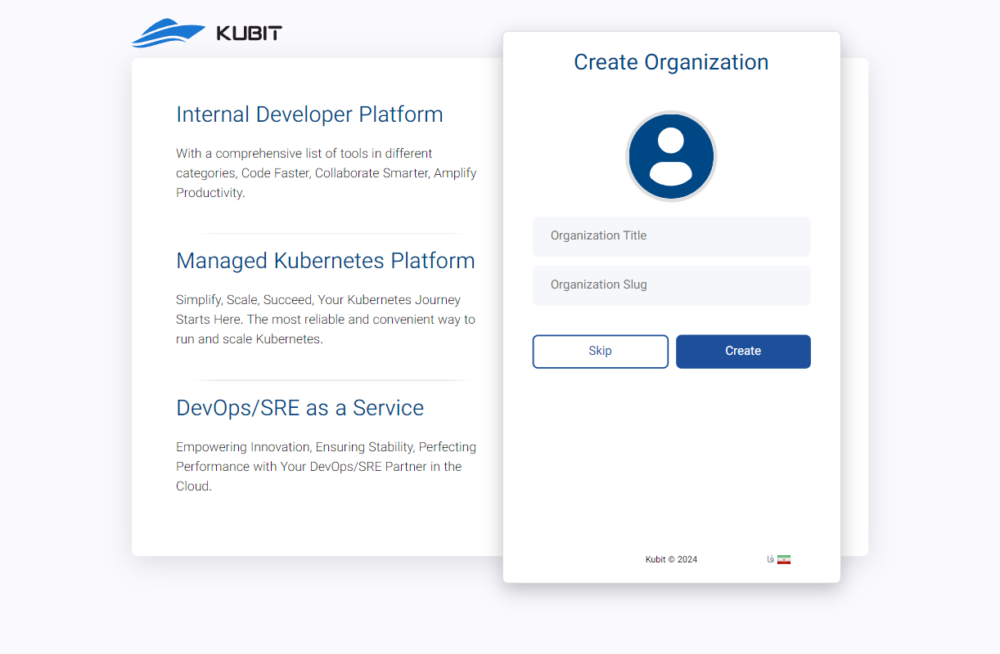
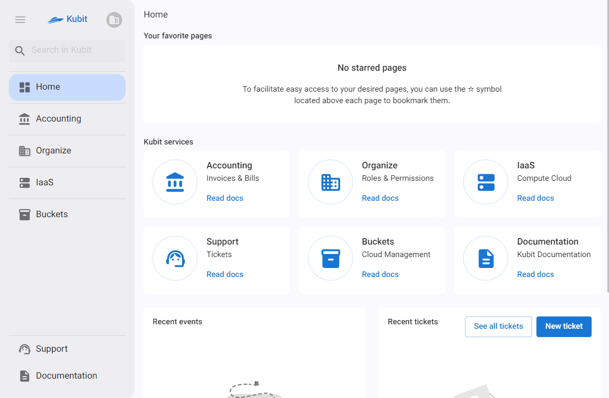
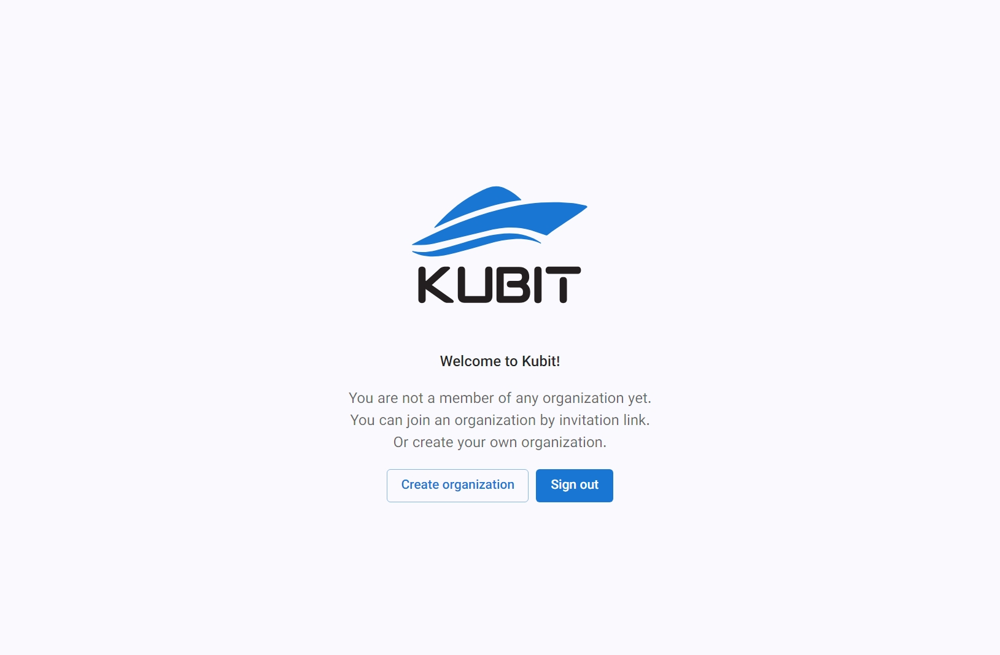
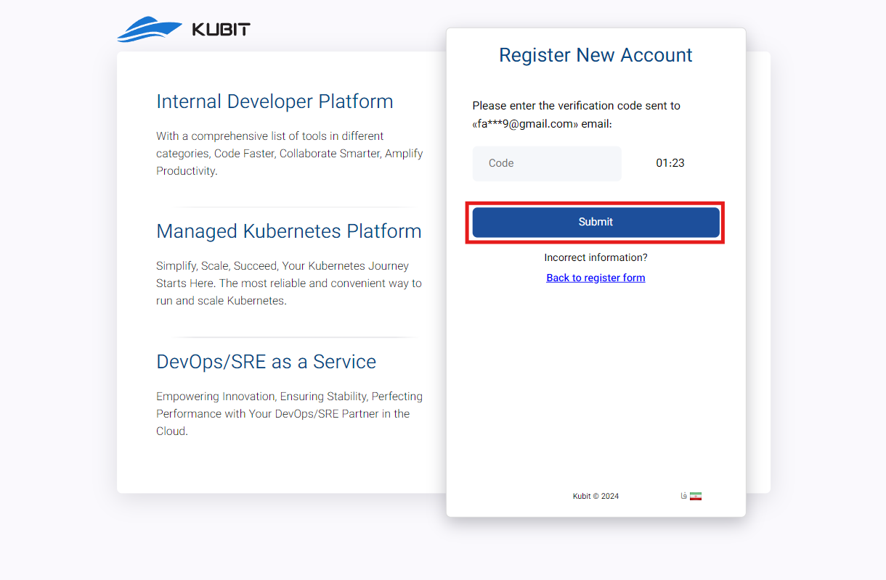

# Create an Organization

There are three ways to create an organization: during account creation, after account creation, and through the Kubit panel.

## Method 1: During Account Creation

After confirming your [registration](https://panel.kubit.ir/en/register) on Kubit with the verification code sent to you and before entering the panel, you will be directed to the organization creation form.

Enter the required information in the organization creation form, including the **Organization Title** and **Organization Slug**, and click **Create**.

Finally, you will enter the Kubit panel under the created organization:

## Method 2: After Account Creation{#after-register}

If you did not create your organization after registering on Kubit, you will encounter the following message when entering the panel:

As mentioned in the [organization concept explanation](../#organization), to access the panel features, there must be an organization associated with the user account. To do this, click on the **Create Organization** button:

Enter the required information in the organization creation form, including the **Organization Title** and **Organization Slug**, and click **Create**:

Finally, you will enter the panel under the created organization.

:::info[Choosing an Appropriate Organization Slug]
Please note that for the **organization slug**, you should select a valid slug consisting of letters, numbers, underscores, or hyphens.
:::

## Method 3: Through the Kubit Panel

If you have previously accessed the panel under another organization and want to create your own organization, first click on the profile, and then from the opened menu, select the **Create Your Own Organization** option:

You will then be directed to the **account creation page**. Enter the required user details and click **Sign Up**:

You will then need to enter the 6-digit code sent to your email or phone number for authentication and registration confirmation, and click **Submit**:

Finally, after submitting the verification code, your registration process will be completed, and your Kubit account will be created.

After this, you will be directed to the organization creation form associated with your user account. As mentioned in the [explanation of the organization concept](../#organization), to access the panel features, there must be an organization associated with the user account. By entering the required information (organization name and organization key), you can create your organization:

:::info[Note!]
If you do not wish to create an organization, you can click on **Skip** and use [Method 2: After Account Creation](./#after-register) to create an organization.
:::

Finally, you will enter the panel and have access to your personal organization panel.
