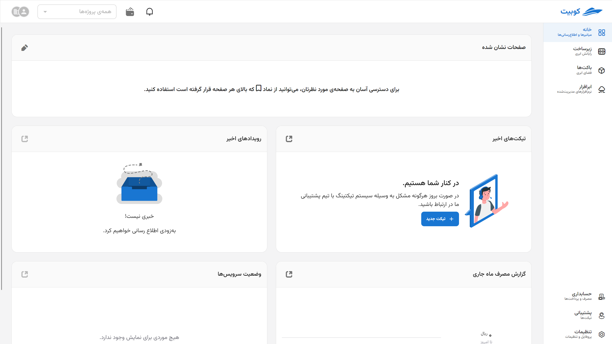
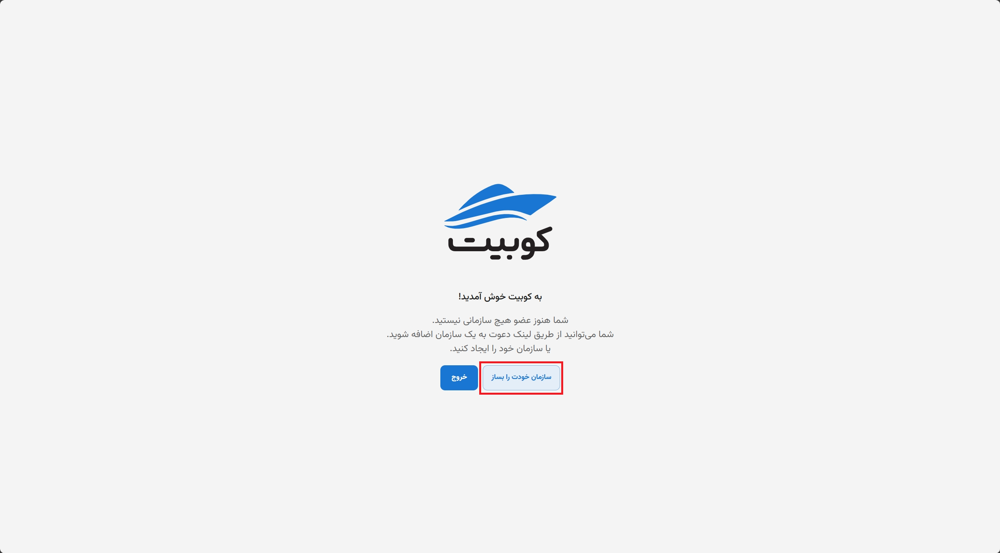
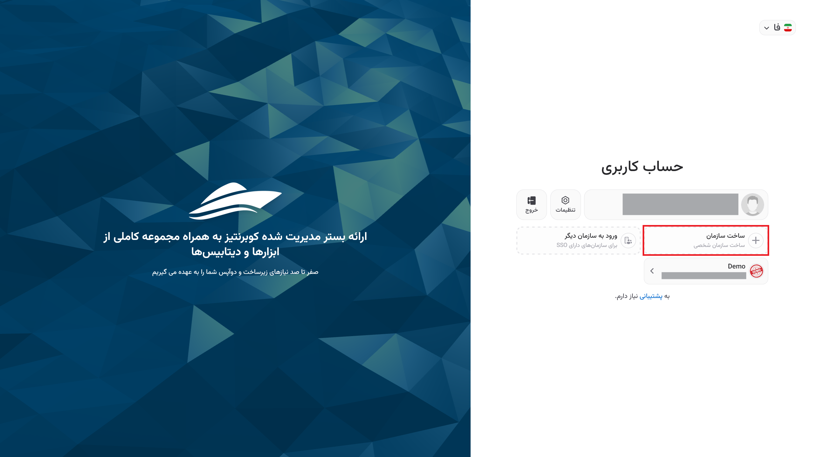

# Create Organization

To create an organization, there are three methods and scenarios: during account creation, after account creation, and through the Kubit panel.

## Method 1: During Account Creation

After confirming [registration](../register) in Kubit with the sent verification code and before entering the panel, you will be directed to the organization creation form.

Enter the required information in the organization creation form, including **organization name** and **organization key**, and click **Create**:

Finally, you will enter the Kubit panel under the created organization:

## Method 2: After Account Creation{#after-register}

If you did not create an organization after registering with Kubit, upon entering the panel, you will encounter the following message:

As mentioned in the explanation of the [organization concept](../..#organization), to access the panel's features, an organization associated with the user account must exist. To do this, click the **Create Your Organization** button:

Enter the required information in the organization creation form, including **organization name** and **organization key**, and click **Create**:

Finally, you will enter the panel under the created organization.

:::info[Choosing an Appropriate Organization Key]
Note that for the **organization key**, you must choose a valid slug consisting of letters, numbers, underscores, or hyphens.
:::

## Method 3: Through the Kubit Panel

If you previously had access to the panel under another organization and want to create your own organization, first click on your profile, then select **Switch to Another Organization** from the dropdown menu:

Then, you will be directed to the **User Account** page. Click on create a new organization.

After this, you will be directed to the organization creation form associated with your user account. As mentioned in the explanation of the [organization concept](../#organization), to access the panel's features, an organization associated with the user account must exist.
By entering the required information (organization name and key), you can create your organization:

:::info[Note]
If you do not wish to create an organization, you can click **Later** and use [Method 2: After Account Creation](./#after-register) to create an organization.
:::

Finally, you will enter the panel and have access to your personal organization's panel.
