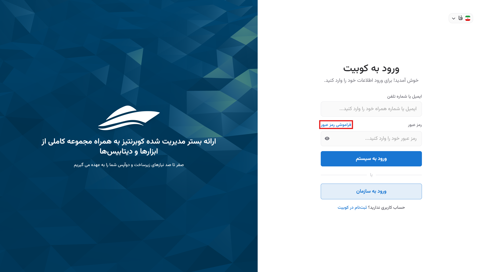
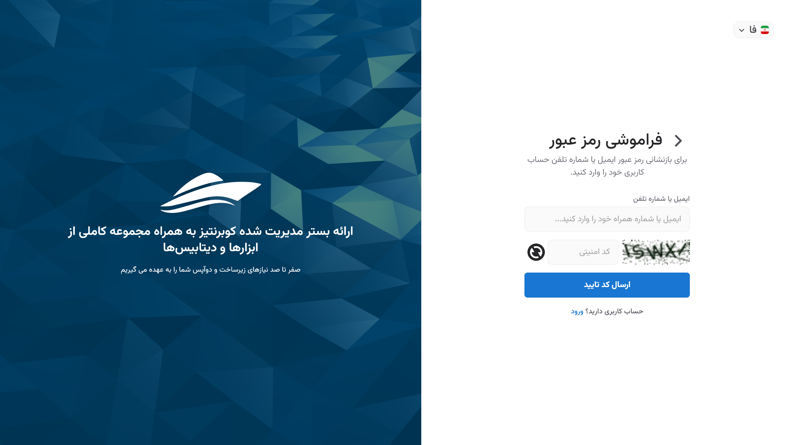

# Password Recovery

If you have forgotten your password, you can follow the steps below to change your password through the [login page](https://panel.kubit.ir/fa/login/) by selecting the **Forgot Password** option.

First, click on **Recover**:

Enter your mobile number or email address associated with your account and click **Submit**:

Enter the verification code sent to you to complete the authentication process:

Finally, enter your new password and click **Submit**:

After changing and confirming the new password, you will be redirected to the Kubit user panel.
