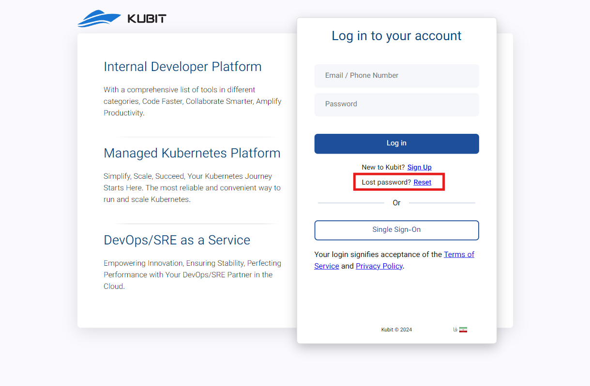

# Forgot Password

If you have forgotten your password, you can follow the steps below to change your password through the login page by selecting the **forgot password** option.

First, click on **Reset**:

Enter your account's mobile number or email and click **Submit**:

Enter the verification code sent to you to complete the authentication process:

Finally, enter your new password and click **Submit**:

After changing and confirming your new password, you will be redirected to the Kubit user panel.
