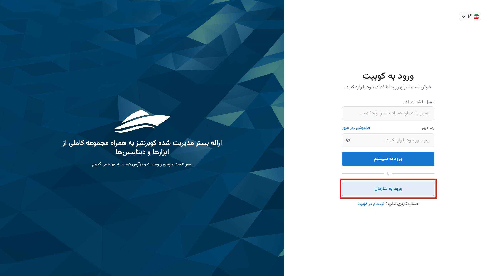

# Logging into the Account

Given the ability to manage multiple organizations with a single account in Kubit, two methods for logging into the account are provided: logging in with email/phone number and organizational login.
Both methods are accessible through the [Login Page](https://auth.kubit.cloud/fa/login/). Below, we explain each of these methods.

## Method One: Logging in with Email/Phone Number

- First, enter your registered email or phone number along with your password.
- Then, click the **Login** button to access your account.
  

## Method Two: Organizational Login

If you need to access the Kubit panel for an organization you are a member of, first click on the **Organizational Login** option on the [Login Page](https://panel.kubit.ir/fa/login/):

At this stage, enter the name of the relevant organization and click **Continue**:

Finally, enter your username and password, then click **Login**:

By following these steps, you can log into the Kubit panel.

## Logging into an Invited Organization

If you have been invited to an organization, you can use one of the two methods below to log into the organization’s panel:

### Invitation Link (Kubit User)

If your membership type is **Kubit User**, you can click on the link sent to your email or phone number to access the panel.

If you did not have an account previously, you will be directed to the [Registration Page](https://panel.kubit.ir/fa/register/) and can join the relevant organization by [creating an account](../register).

If you already have an account and are logged into the panel, you will be directly redirected to the relevant organization’s panel.

### LDAP User

If you have been added to the organization as an LDAP user, you must visit the [Login Page](https://panel.kubit.ir/fa/login/) and use the **Password Recovery** option to set a new password.

On the account login page, click **Organizational Login**:

At this stage, enter the name of the relevant organization and click **Continue**:

Then, click **Recover**:

For the continuation of the password recovery steps, refer to the [Password Recovery](../forgot-password) document.
