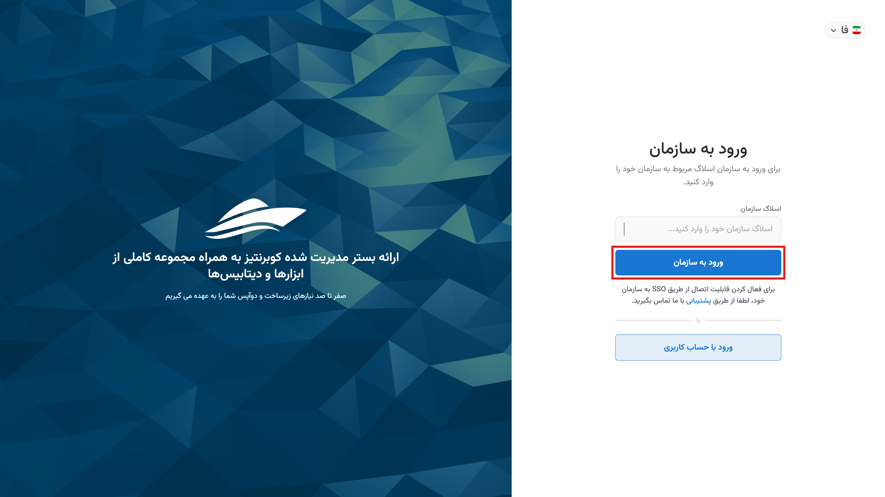

# Login to user account

Given the ability to manage multiple organizations with a single account in Kubit, there are two methods for logging into your user account: Email/Phone Login and Organizational Login. Both methods are accessible via the [login page](https://panel.kubit.ir/en/login/). Below, we will explain each of these methods.

## Method 1: Email/Phone Login

- First, enter your registered email or phone number along with your password.
- Then, click the **Login** button to access your user account.
  

## Method 2: Organizational Login (SSO)

If you need access to the Kubit panel of the organization you are a member of, first click on the **Single Sign-On** option on the [login page](https://panel.kubit.ir/en/login/):

At this stage, enter the title of the relevant organization and click the **Continue** button:

Finally, enter your username and password and click the **Login** button:

By following these steps, you can log into the Kubit panel.

## Logging into an Invited Organization

If you have been invited to an organization, you can use one of the following methods to access the organization's panel:

### Invitation Link (Kubit User)

If your membership type is **Kubit User**, you can log in by clicking the link sent to your email or phone number.

If you did not previously have an account, you will be directed to the [registration page](https://panel.kubit.ir/en/register/). By [creating a user account](../register), you will join the relevant organization.

If you already have a user account and have logged into the panel, you will be directly redirected to the relevant organization's panel.

### LDAP User

If you have been added to the organization as an LDAP user, you need to go to the [login page](https://panel.kubit.ir/en/login/) and use the **Forgot Password** option to set a new password.
On the login page, click on **Single Sing-On**:

In this step, enter the title of the relevant organization and click the **Continue** button:

Then in the Lost Password, click on **Reset**:

To read the remaining steps for password recovery, refer to the [Forgot Password](../forgot-password) document.
