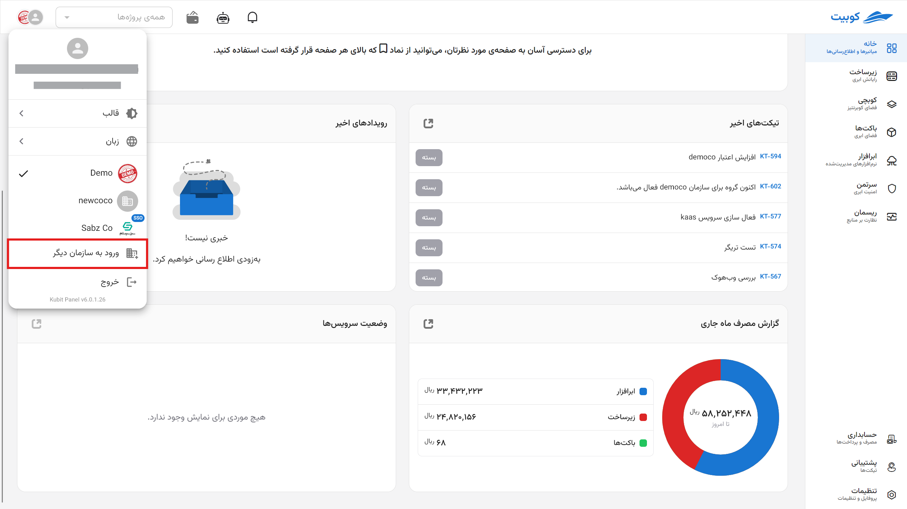

# Kubit Panel

By [logging into the Kubit user panel](https://auth.kubit.cloud/fa/login/), you can access all available services and user and system settings. This panel enables the management and viewing of detailed service information, including user and project management, allowing you to easily utilize all available settings and features.

:::info[Note]
All settings and management of various sections are accessible under the relevant titles in the account documentation subcategories.
:::

The main panel page includes access to the profile, right-side menu, favorite pages, Kubit services, events, and recent tickets. Below, we provide a brief overview of these components.

## Right-Side Menu

Quick access to the list of available services in the panel and the user profile is provided through the right-side menu. You can also use Kubit's search feature to search among services:

## Profile Settings

All settings related to the profile and user account are accessible from the profile section in the Kubit panel. The [User Profile Settings](../../organization/profile) document explains profile settings in detail.

## Change Theme

To change the user panel theme, first click on the profile. Then, from the opened menu, select the **Theme** option and choose your desired theme from the available options:

## Change Language

To change the user panel language, first click on the profile. Then, from the opened menu, select the **Language** option and choose your preferred language from the available languages:

## Create Personal Account {#create-organization}

If you previously accessed the panel under another organization and now want to create your personal (Kubit) account, first click on the profile and then select the **Create Your Own Account** option from the opened menu:

You will be directed to the **Create Account** page. Enter the required user information and click **Register**:

Then, enter the 6-digit code sent to your email or phone number for identity verification and registration confirmation, and click **Submit**:

Finally, after submitting the verification code, your registration process is complete, and your Kubit account will be created.

After this, you will be directed to the form for creating an organization associated with your account. As mentioned in the [Organization Concept](../..#organization) explanation, to access the panel’s features, an organization associated with the account must exist.
By entering the requested information (organization name and key), you can create your organization:

In the end, you will be logged into the panel and gain access to your personal organization panel.

:::info[Creating an Organization in the Panel]
If you choose not to create an organization after registration (by selecting the **Later** option in the image above), you can create an organization associated with your account through the Kubit panel. You can access a step-by-step guide to creating an organization in the [Create Organization](../create-organization) document.
:::

## Switching Between Organizations

To manage multiple different organizations in the user panel, first click on the profile and then select the **Log into Another Organization** option:

Enter the name of the desired organization and click **Continue**:

Then, log in with your username in that organization:

This way, you can add other organizations you are a member of to your panel and switch between organizations by simply clicking on the organization name:

## Your Favorite Pages

The favorite pages section on the main panel page provides quick access to users’ favorite services:

:::tip[Adding a Service to Favorites]
By clicking on the star icon in the top bar of any service page, you can add the desired service to your favorites with a custom name:

:::

## At a Glance

### Events

Through the **Recent Events** section, you can access Kubit notifications. This section displays organizational notifications (separated by each organization) and general notifications:

### Tickets

The latest tickets registered in the [Support Service](../../ticketing) are accessible through the **Recent Tickets** section:

### Current Month Usage Report

A concise and up-to-date overview of resource usage for the current month, broken down by services. This information is extracted from the **Accounting Dashboard** and is provided here for a quick review of usage, costs, and service usage trends.

### Service Status

In this section, you can view the real-time performance and availability status of Kubit’s various services. This information helps you ensure the health of the infrastructure you are using or quickly identify the cause of any issues.
