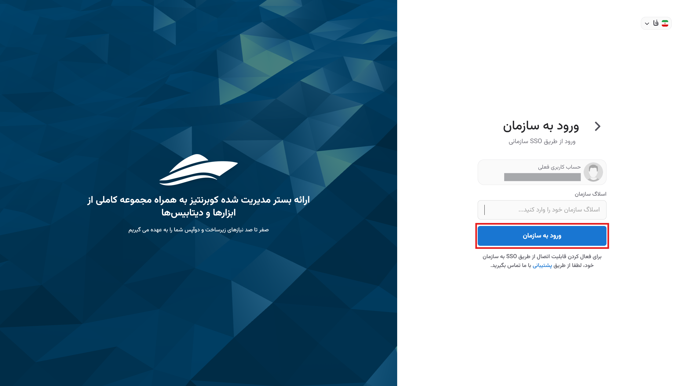

# Kubit Panel

By [logging into the Kubit user panel](https://panel.kubit.ir/en/login), you can access all available services and user and system settings. This panel allows you to manage and view complete service details, including user and project management, enabling you to easily utilize all available settings and features.

:::info[Note]
All settings and management of different sections are accessible under the related titles in the user account document.
:::

The main page of the panel includes access to the profile, the right-side menu, favorite pages, Kubit services, recent events, and tickets. Below is a brief overview of these sections.

## Right-Side Menu

Quick access to the list of available services in the panel and the user profile is provided through the right-side menu. You can also use the search feature in Kubit to search among the services:

## Profile Settings

All settings related to the profile and user account can be accessed from the profile section in the Kubit panel. The [user profile settings](../profile-settings) document details the profile settings.

## Change Theme

To change the theme of the user panel, first click on the profile. Then, from the dropdown menu, select the **Theme** option and choose your preferred theme from the available options:

## Change Language

To change the language of the user panel, first click on the profile. Then, from the dropdown menu, select the **Language** option and choose your preferred language from the available options:

## Create Personal Account{#create-organization}

If you have previously accessed the panel under another organization and now wish to create your personal (Kubit) account, first click on the profile, then from the dropdown menu, select **Create Your Account**:

You will be directed to the account creation page. Enter the required user details and click **Sign Up**:

Then you need to enter the 6-digit code sent to your email or phone number for verification and confirmation of registration, and click **Submit**:

Finally, after sending the verification code, your registration process will be complete, and your Kubit account will be created.

After this, you will be directed to the organization creation form related to your account. As mentioned in the [organization concept explanation](../#organization), to access the panel's features, there must be an organization associated with your account. By entering the required information (organization title and slug), you can create your organization:

Finally, you will be logged into the panel and will have access to your personal organization's panel.

:::info[Create an Organization in the Panel]
If you chose not to create an organization after registration (by selecting the **Skip** option in the image above), you can still create the organization related to your account through the Kubit panel. You can access the step-by-step guide for creating an organization from the [Create an Organization](../create-organization) document.
:::

## Switching Between Organizations

To manage multiple organizations in the user panel, first click on your profile and then select the option **Login to another organization**.

Enter the title of the desired organization and click **Continue**.

Then, log in with your username for that organization.

By doing this, you can add other organizations you are a member of to your panel and switch between organizations by simply clicking on the organization's title.

## Favorite Pages

The Favorite Pages section on the main panel page provides quick access to users' favorite services.

:::tip[Adding a Service to the Favorites List]
By clicking on the star icon on the top bar of each service page, you can add the desired service to your favorites with the desired name:

:::

## Kubit Services

In addition to the right-side menu of the panel, you can also access the list of Kubit services from the main panel page.

## Recent Events and Tickets

### Events

Through the **Recent events** section, you can access Kubit's announcements. In this section, organizational announcements (separated by each organization) and public announcements are visible.

### Tickets

The latest tickets submitted in the support service can be accessed through the **Recent tickets** section.

