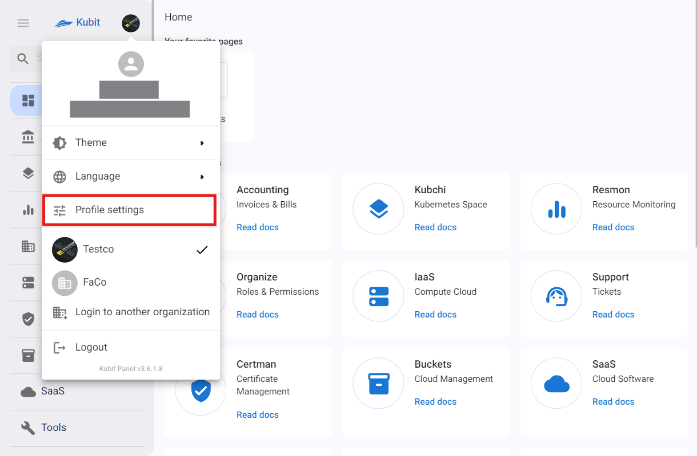
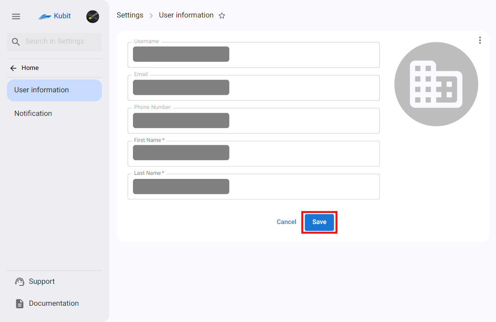

# User Profile Settings

To change user information, including email, phone number, first and last name, profile picture, as well as to change the password and edit notification channels, you can use the **Profile settings** section.

## Edit User Information

Go to the **User information** section in **Profile settings**, click on the three dots on the left side of the user information table, and select the **Edit** option.

You can also select and change your profile picture from this section. After entering the new information, **Save** your changes.

:::caution[Note!]
Please note that the **username**, **email**, and **phone number** cannot be changed.
:::

## Change Password

:::caution[Note!]
If you have the role of system administrator in the current organization on the Kubit panel, you can change your password using the **change password** option. Otherwise, you will not have access to change the password and will need to contact the organization’s administrator.
:::

Go to the **user information** section in **profile settings**, click on the three dots on the left side of the user information table, and select the **Change password** option.

Then enter the old password and the new password in the change password form and click the **Submit** button.

## Edit Notification Channels

In the **Notification** section, a list of various channels for receiving Kubit service announcements is available. For each service with a configured notification system, you can view the related channels and individually enable or disable them.

