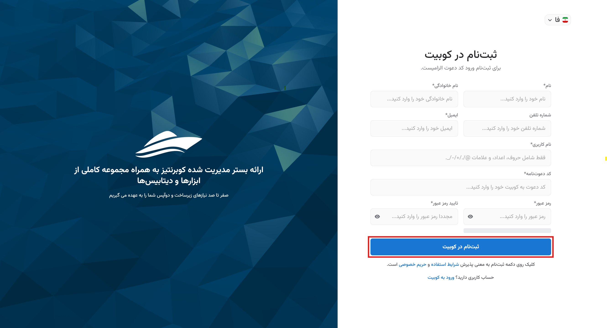

# Creating an Account and Registration

To use any of Kubit's products, you must first have an account. If you have already registered, you can use the [Login to Account](../login) document to sign in. If you haven’t registered yet, this guide will walk you through the registration process step by step.

## Registration

- First, go to the [Registration](https://auth.kubit.cloud/fa/register/) page.
- Then, enter your information in the relevant fields and set a strong password according to the provided guidelines.

:::caution[Note]
Note that entering either a **phone number** or **email address** is mandatory for creating an account and sending the verification code.
:::

Next, you must enter the 6-digit code sent to your email or phone number for identity verification and registration confirmation, then click **Submit**:

Finally, after submitting the verification code, your registration process is complete, and your Kubit account will be created.

After this, you will be directed to the form for creating an organization associated with your account. As mentioned in the [Organization Concept](../#organization) explanation, to access the panel’s features, an organization associated with the account must exist.
By entering the requested information (organization name and key), you can create your organization:

In the end, you will be logged into your account and gain access to the organization panel.

:::info[Creating an Organization in the Panel]
If you choose not to create an organization after registration (by selecting the **Later** option in the image above), you can create an organization associated with your account through the Kubit panel. You can access a step-by-step guide to creating an organization in the [Create Organization](../panel#create-organization) document.
:::

## Obtaining an Invitation Code

To receive an invitation code for creating an account, first go to the [Kubit website](https://kubit.ir/fa/) and click on the **Request a Trial Version** option:

Complete the information requested in the **Request a Trial Version** form. Finally, click the **Submit** button to send your request:

After your request is reviewed by the Kubit support team, an invitation code will be sent to you, which you can use to create your account.

## Logging into the Account

After logging into the panel, you will have access to all the services and features provided by Kubit. Comprehensive guides are available in each section of the panel to assist users in making better use of the available features.
