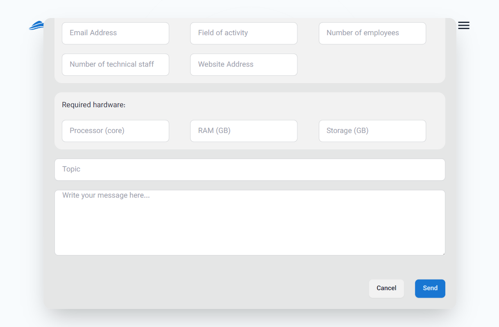

# Create User Account and Register

To use any of Kubit's products, you first need a user account. If you have already registered, you can use [login to user account](../login) document. If you have not registered yet, this guide will walk you through the registration process step by step.

## Registration

- First, go to the [registration page](https://auth.kubit.ir/en/register).
- Then, enter your information into the relevant fields and create a strong password according to the provided instructions.
  

:::caution[Attention!]
Please ensure that you provide either a **phone number** or an **email address**, as it is mandatory for account creation and sending the verification code.
:::

Then, enter the 6-digit code sent to your email or phone number for authentication and to confirm your registration, and click **Submit**.

Finally, after submitting the verification code, your registration process will be completed and your Kubit account will be created.

After this, you will be directed to the form for creating an organization associated with your user account. As mentioned in the explanation of the [concept of an organization](../#organization), to access the panel's features, an organization must be linked to your account. By entering the requested information (organization title and slug), you can create your organization:

At the end, you will be logged into your user account and will have access to the organization panel.

:::info[Creating an Organization in the Panel]
If you choose not to create an organization immediately after registration (by selecting the **Skip** option in the image above), you can still create an organization related to your user account through the Kubit panel. You can access a step-by-step guide for creating an organization in the [Organization creation](../panel#create-organization) document.
:::

## Receiving an Invitation Code

To receive an invitation code for creating a user account, first go to the [Kubit website](https://kubit.ir/en/) and click on the **Request a demo** option:

Complete the requested information in the **Request a demo** form:

Finally, click the **Send** button to send your request:

After your request has been reviewed by the Kubit support team, an invitation code will be sent to you. You can use this code to create your user account.

## Logging into Your User Account

Once logged into the panel, you will have access to all the services and features provided by Kubit. Each section of the panel includes comprehensive guides to help users make the most of the available features.
