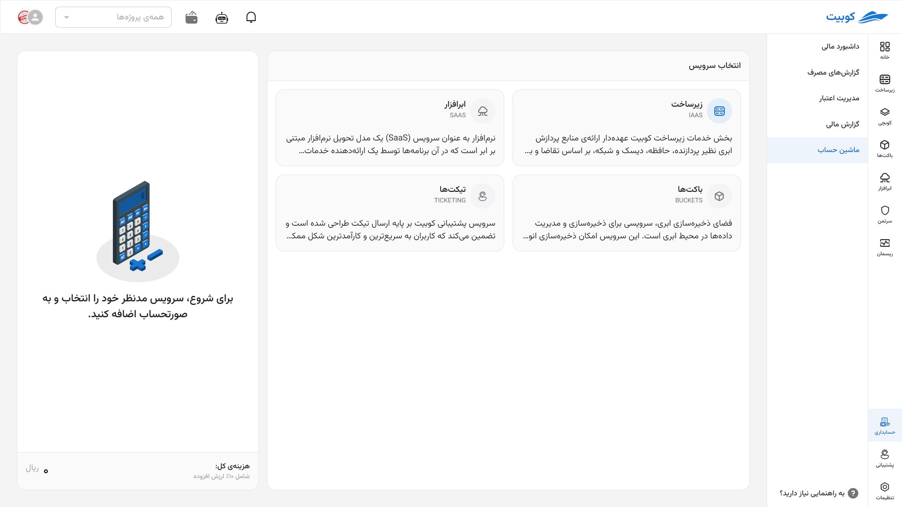
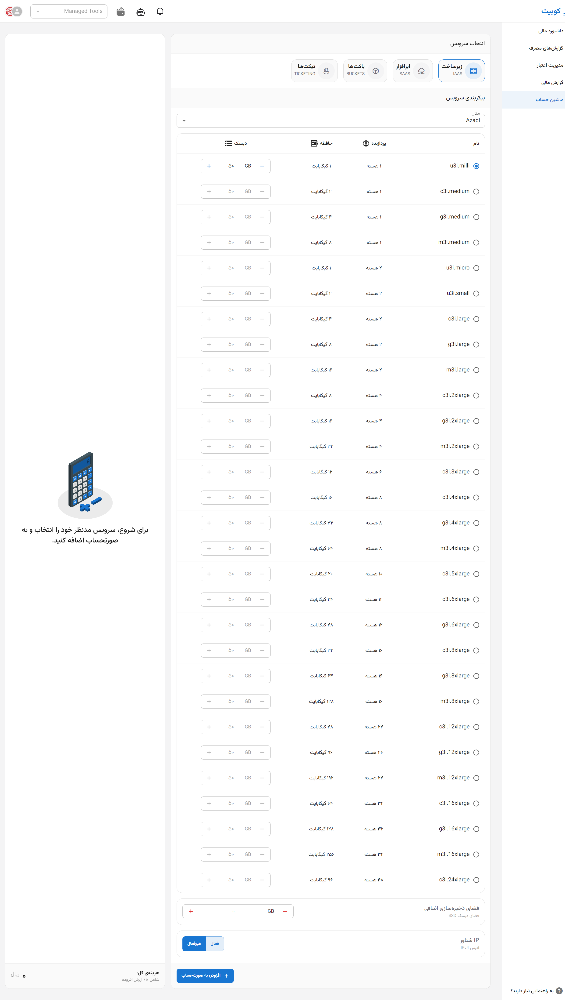

# Calculator

In this section, you can select and customize services offered by **Kubit** based on your project's needs and obtain a pre-invoice. Currently, cost calculations for Kubit services are available in the following four main categories:

:::tip[Final Amount with Details]
To view the final price of the service, use the **[Pre-Invoice](#proforma-invoice)** section after configuration.
:::

## Cloud Infrastructure (IaaS)

The **Infrastructure as a Service (IaaS)** service enables you to dynamically provision computing resources such as CPU, RAM, disk, and network based on actual consumption.

Through this section, users can create and manage virtual machines with desired specifications within various projects.

### Configurable Features:

- **Machine Deployment Location** (datacenter location)
- **Machine Type**: Standard, memory-optimized, or CPU-optimized
- **CPU**: Select the number of cores using a slider
- **Memory (RAM)**: Specify the required RAM using a slider
- **Primary Disk**: Choose type (SSD / HDD), capacity, and number of disks
- **Additional Disk**: For separate storage needs like backups or temporary data
- **Floating IP**: Enable a public IPv4 address for internet access
- **Security Settings**: Register SSH keys for secure access

---

## Cloud Software (SaaS)

In the **Software as a Service (SaaS)** service, you can access a range of web-based applications without the need for installation, configuration, or maintenance. These applications are developed and supported by the Kubit team.

Benefits of this service:

- Quick and easy access through a browser
- Automatic updates without user intervention
- Cost-effective for personal or organizational use
- Scalable, adjustable based on needs

---

## Storage (Buckets)

The **Kubit Cloud Storage** service is designed for storing, managing, and sharing various types of files and data in a cloud environment.

Features:

- Secure and encrypted storage
- Access to files from anywhere, anytime
- Suitable for backups, storing media files, logs, and application data
- Compatible with standard APIs like S3

---

## Support (Ticketing)

Kubit's support service is based on **ticket submission** and is designed to provide quick and organized responses to users' questions or technical issues.

Benefits:

- Ability to submit support requests 24/7
- Track ticket status and receive responses in the user dashboard
- Attach documents or images related to errors
- Categorization of topics to expedite response times

---

## Pre-Invoice and Billing {#proforma-invoice}

After selecting and adding the desired services to the invoice, you can view the final cost in this section.

Displayed information:

- Price of each service based on duration and resource amount
- **10% Value-Added Tax** listed separately
- Total payable amount broken down by category

> If you need further guidance in selecting a service, you can submit a [ticket](../../ticketing) to benefit from consultation with Kubit experts.
