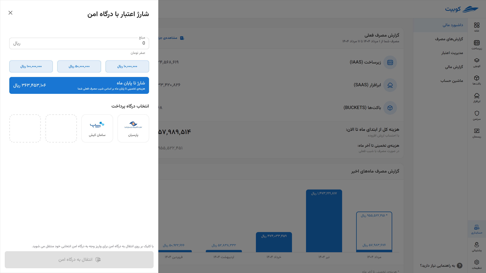
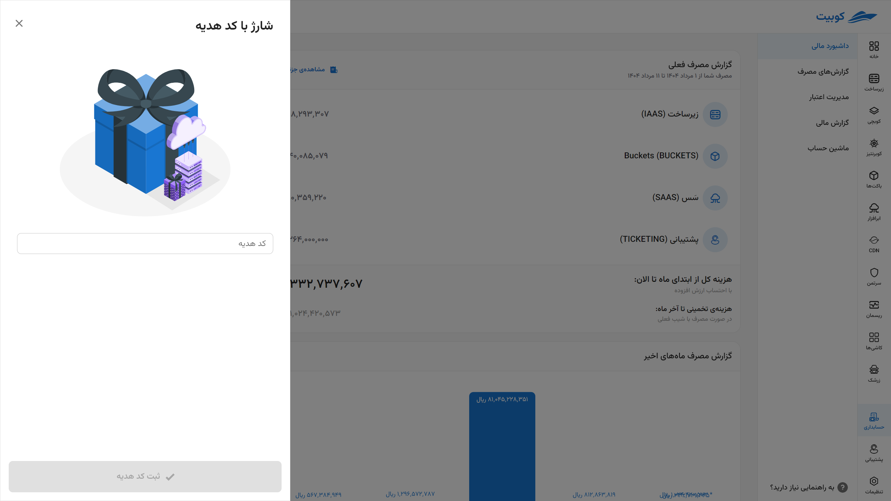

# Credit Management

The Credit Management section allows you to **view and control the exact status of active credits, account balance, and methods to increase credit** in a comprehensive and real-time manner.

## Active Credits

In this section, all your current credits that have not yet been consumed are listed, broken down by type and their characteristics.

**Each credit includes the following information:**

- **Credit Type**:
  - Gift
  - Cash
  - Paid via ticket
- **Type of Service Using the Credit**:  
  For example, infrastructure, cloud software, or buckets
- **Credit Start Date**
- **Percentage Consumed So Far**
- **Initial Credit Amount**

> This section helps you understand how each active credit was added to your account, how much of it has been consumed, and which service categories it relates to.

## Current Credit Balance

The **remaining credit balance in your user account** is displayed in real-time, so you are always aware of your financial status in Kubit. This amount represents the total of your active credits (cash or gift) that have not yet been consumed.
Additionally, to **increase credit**, several diverse and secure methods are available to you:

- **Direct Top-Up via Secure Payment Gateway**  
  Fast and online payment with Shatab cards
  
- **Using a Gift Code**  
  Enter the code to receive gift credit
  
- **Submitting a Ticket for Indirect Payments**  
  Includes methods such as card-to-card transfer, bank account transfer, or other specific agreed-upon methods
  

## Estimated Time Remaining Until Credit Depletion

Based on **your current consumption trend**, the system automatically provides an estimate of how many days your current credit will last to meet your needs.

> This forecast helps you **top up your credit in a timely manner** and prevent service interruptions or access restrictions.
