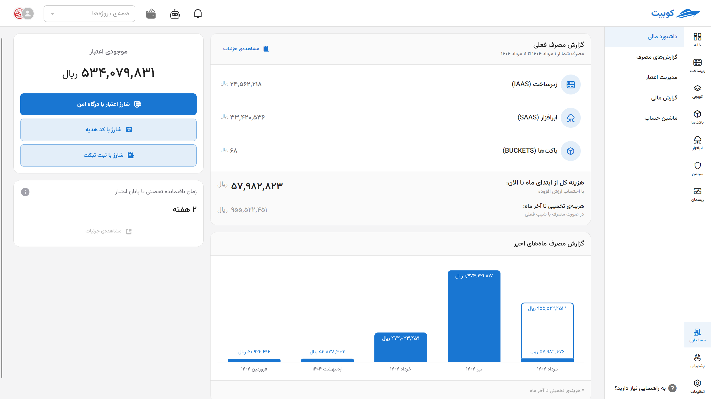
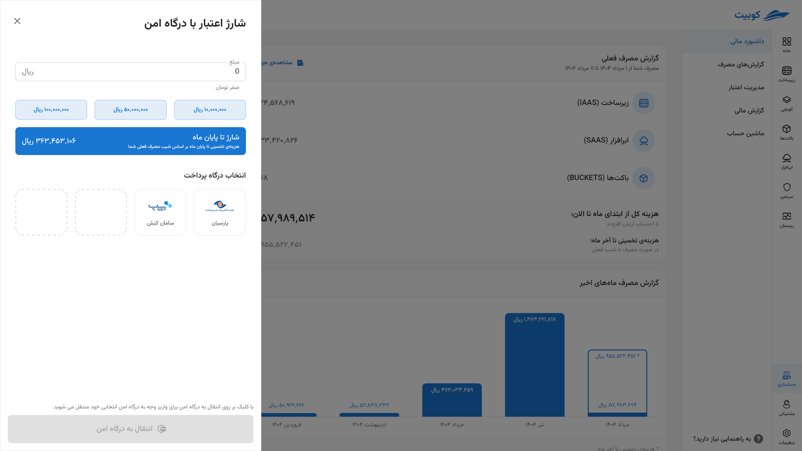
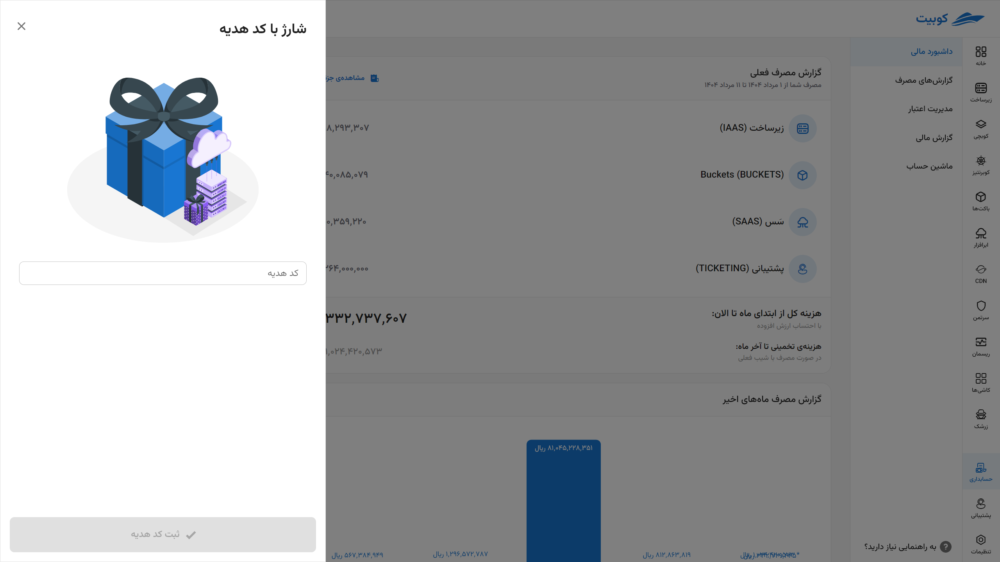
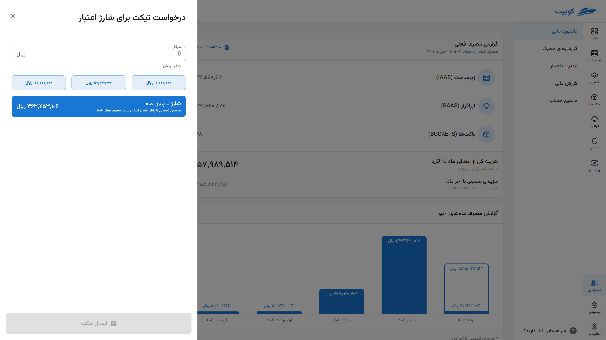

# Financial Dashboard

The **Financial Dashboard** is designed to allow you to **monitor your financial status at a glance** and gain a clear understanding of the amount and manner of your credit consumption.

## Current Consumption Report

- Time period from the beginning of the month to the present
- Breakdown of costs by service categories:

|                                          Service Type |                                                                                  Service Description |
| ----------------------------------------------------: | ---------------------------------------------------------------------------------------------------: |
|               [Kubchi](../../kubchi) (Cloud Platform) |                                                   Managed Kubernetes environment by the Kubit system |
|        [Infrastructure](../../iaas) (Cloud Computing) |                             Service providing cloud resources such as CPU, memory, disk, and network |
|   [Buckets](../../buckets) (Cloud Storage Management) |                                                                          Data storage and management |
| [Cloud Software](../../saas) (Managed Cloud Software) | Cloud service aimed at facilitating, accelerating, and securing developers' access to software tools |
|          [Resmon](../../resmon) (Resource Management) |                                   Monitoring resource usage (CPU/RAM/Disk) across the entire cluster |
|             [Certman](../../certman) (Cloud Security) |     Centralized system for consolidating the management of required protective and security features |
|                      [Zereshk](../../zereshk) (Proxy) |                                                                        Anti-sanction and smart proxy |
|                 [Resan](../../resan) (Message Center) |                                    Central messaging service and provision of various messaging APIs |

- Calculation of total costs from the beginning of the month, including value-added tax
- Based on the current consumption trend, the system provides an estimate of the total cost until the end of the month to help you better manage your budget.

## Recent Months' Consumption Report

Ability to view the cost trend for previous months for better analysis and review of consumption changes. The current month's report is displayed along with an estimate.

## Current Credit Balance

In this section, the **remaining credit balance** in your user account is displayed in real-time.
Additionally, to **increase credit**, several diverse and secure methods are available to you:

- **Direct Top-Up via Secure Payment Gateway**
  Fast and online payment with Shatab cards
  
- **Using a Gift Code**
  Enter the code to receive gift credit
  
- **Submitting a Ticket for Indirect Payments**
  Includes methods such as card-to-card transfer, bank account transfer, or other specific agreed-upon methods
  

## Estimated Time Remaining Until Credit Depletion

Based on **your current consumption trend**, the system automatically provides an estimate of how many days your current credit will last to meet your needs.
