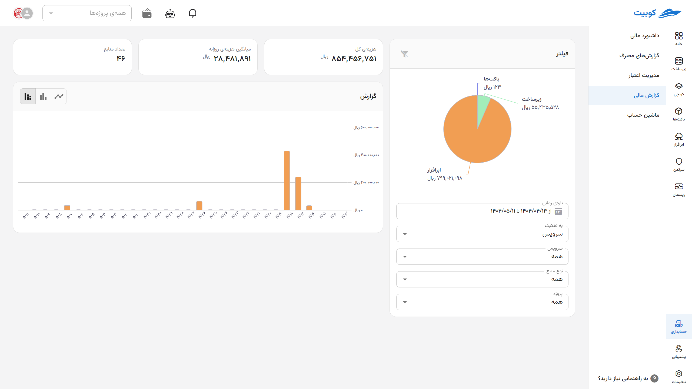
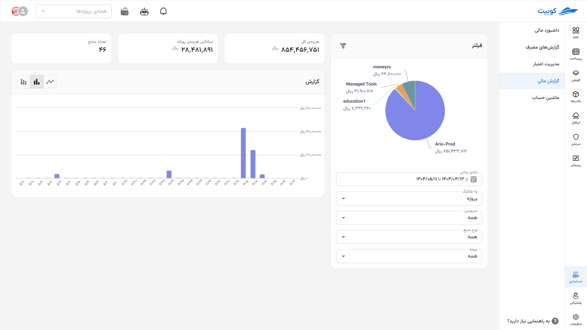
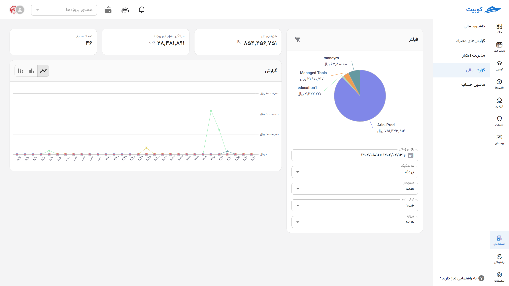

# Financial Report

## Filters

To view more detailed consumption and cost information, you can use the following filters (clicking the funnel button (green box in the image) resets to the default state):

- **Time Range:**
  Select a specific period for cost analysis (e.g., current week, last month, or a custom range)
- **Breakdown By:**
  Option to choose how reports are categorized based on two main criteria:

  1. **Service:** View cost and consumption details based on service type, such as infrastructure, cloud storage, Kubchi, and other services
  2. **Project:** Review consumption and costs separately for different projects

- **Service Type:**
  Select a specific service to focus on a particular type of consumption (e.g., only virtual machine or cloud storage services)
- **Resource Type:**
  Depending on the selected service, you can filter related resources (e.g., floating IP, VM, disk volume, etc.)
- **Project:**
  Display data broken down by projects defined in your account

---

## Cost/Consumption Report

This section provides a summary of consumption and cost status based on the selected filters:

- **Total Cost:**
  Total costs within the filtered period and conditions
- **Daily Average:**
  Average daily resource consumption within the selected period
- **Number of Resources:**  
  Total number of resources in use during the specified period

---

## Charts

### Time-Based Chart

Visualization of consumption and cost trends over time with three display modes:

- **Stacked Bar Chart by Breakdown:**  
  Displays detailed consumption or costs based on selected filters, in daily, weekly, or monthly time intervals.
  
- **Aggregated Bar Chart:**  
  Shows the total consumption or costs for each time interval, without breakdown by resources or services, based on projects.
  
- **Line Chart by Breakdown:**  
  Presents the trend of consumption and cost changes over time in a linear format, with the option to break down by selected filters.
  

### Pie Chart

- Displays the **composition of consumed resources** in the specified period
- Breaks down element types (e.g., VM, IP, traffic, disk volume, etc.)
- Visually represents the **percentage and amount spent** for each resource type
