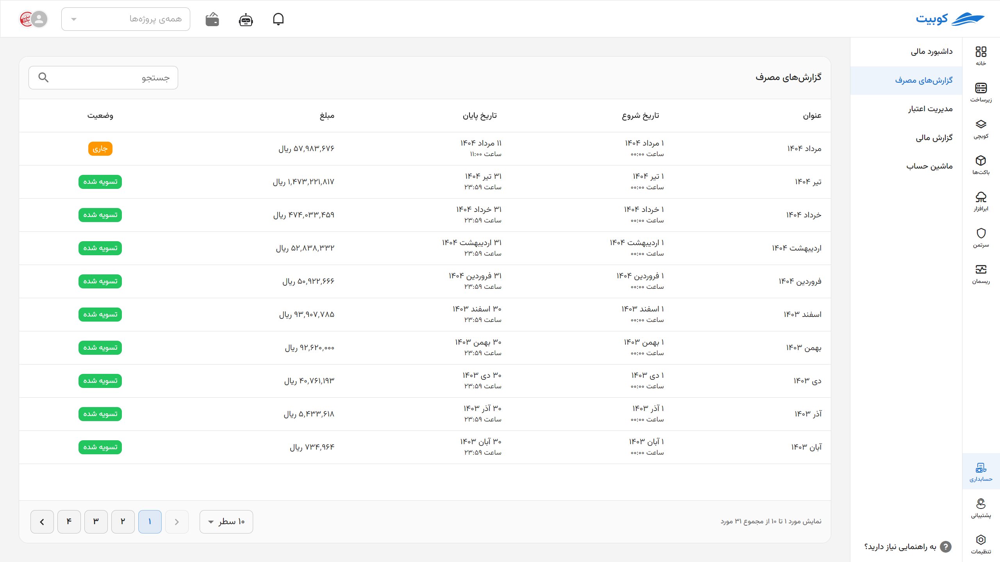
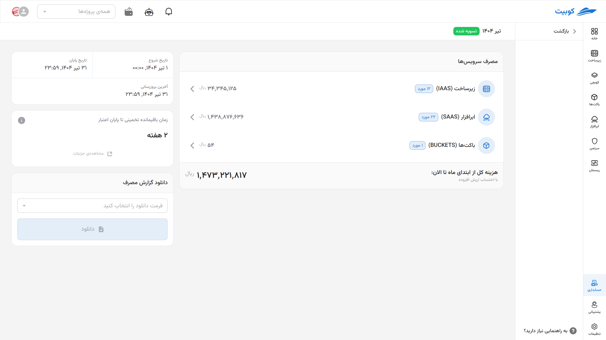
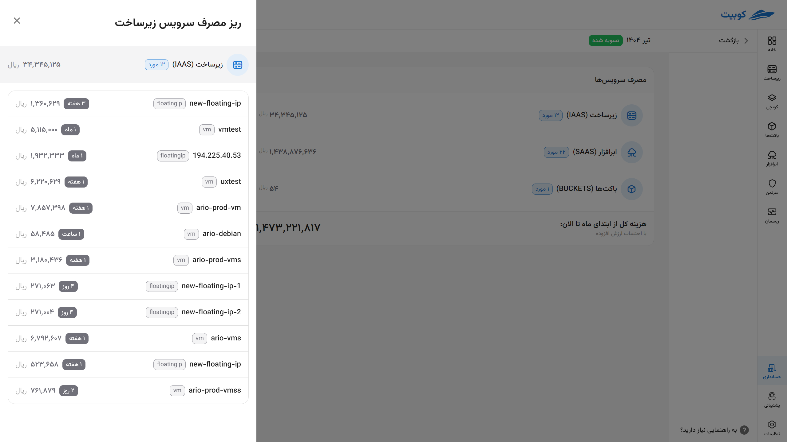

# Usage Reports

The **Usage Reports** section allows you to view and review the details of your monthly expenses, broken down by service, in a precise and trackable manner.

## Monthly Invoices

In this section, invoices issued for each month are displayed. By clicking on any invoice, you will be directed to the details page for that month.

**Each invoice includes the following information:**

- **Invoice Status:**
  1. **Current** (only for the current month)
  2. **Settled** (full payment completed)
  3. **Unsettled** (in case of outstanding debt or negative credit)
- **Invoice Start and End Date** along with the exact time
- **Total Invoice Amount** including value-added tax

## Service Usage

In this section, your costs are displayed based on service categories.

Each row includes:

- **Service Name**
- **Number of Resources Used**
- **Total Cost of That Service**

By clicking on each service, you will be directed to the **Detailed Resource Usage** page.

### Details of Consumed Resources

In the detailed usage section for each service, the following information is displayed for each resource:

| Field              | Description                                                                |
| ------------------ | -------------------------------------------------------------------------- |
| **Resource Name**  | The name you or the system assigned to the resource                        |
| **Resource Type**  | Type of resource used (e.g., VM, Floating IP, network traffic, etc.)       |
| **Usage Duration** | Total time the resource was active or allocated during the reported period |
| **Resource Cost**  | Cost incurred for that resource, considering duration and related tariffs  |

## Invoice Period

Each invoice covers a specific time period that includes the relevant financial information:

- **Start Date and Time**
- **End Date and Time**
- **Time of Last Invoice Update**

## Estimated Time Remaining Until Credit Depletion

In this section, the system analyzes the current usage trend and provides **an estimate of how long your available credit will last**. This forecast helps with better decision-making for account recharging.

## Download Usage Report

To obtain an invoice or usage report, you can select your **preferred file format** and download the report.
