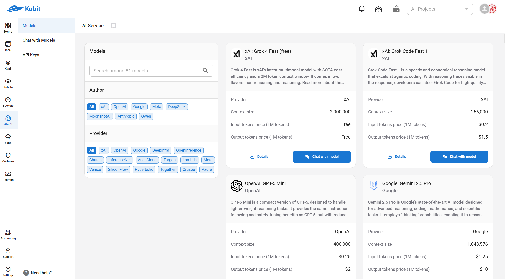
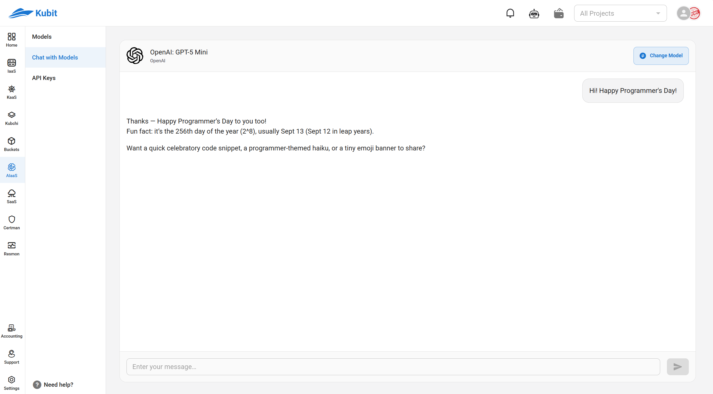

# Artificial Intelligence (AI)

## Introduction

The **AI Service** is a scalable cloud platform for accessing advanced AI models. It helps developers, business owners, and startups easily leverage the power of Large Language Models (LLMs) without the need for complex infrastructure.

---

## Features

### 1. LLM as a Service (LLMaaS)

- **Cloud-based API access** for fast and easy use.
- **Fully compatible with standard OpenAI clients**.
- **High scalability** suitable for small projects to large enterprises.
- **Switch between models, providers, and endpoints** with minimal changes.



---

### 2. Chat with AI Models

- **Unified interface** for testing and interacting with models.
- **Evaluate and compare models** in a simple, user-friendly environment.
- **Access to over 80 top models** from leading global providers.



---

## Benefits

- Reduced development time and infrastructure costs.
- Access to the latest models without worrying about updates.
- Suitable for development teams, startups, and scalable businesses.

---

## API Guide

### Authentication

All requests must include the following header:

```http
Authorization: Bearer YOUR_API_KEY
```

---

### Example: Sending a Message to a Model

```bash
curl https://aiaas.kubit.cloud/api/v1/chat/completions \
  -H "Authorization: Bearer YOUR_API_KEY" \
  -H "Content-Type: application/json" \
  -d '{
    "model": "openai/gpt-5",
    "messages": [
      {"role": "system", "content": "You are a helpful assistant"},
      {"role": "user", "content": "Hello! Can you tell me a short story?"}
    ]
  }'
```

**Sample Response:**

```json
{
  "id": "chatcmpl-12345",
  "object": "chat.completion",
  "created": 1758730329,
  "model": "openai/gpt-5",
  "choices": [
    {
      "index": 0,
      "message": {
        "role": "assistant",
        "content": "Once upon a time..."
      },
      "finish_reason": "stop"
    }
  ]
}
```

---

### Switching Between Models

Simply change the `model` value in the request; no need to modify the code structure.

---

## Use Cases

- Intelligent chatbots
- Text and data analysis
- Customer support
- Smart content generation and marketing
- Evaluation and comparison of AI model performance
