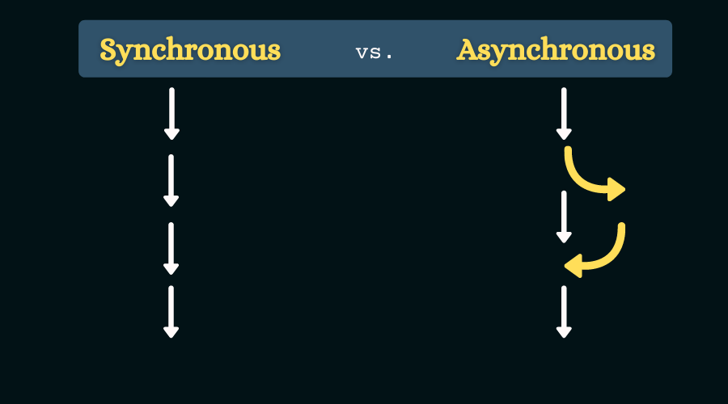

# Async Programming



First of all, create this `logger-utility.js` file:

```js
let lastStep = 0
export const step = (n) => {
  lastStep = n
  if (n > 1) console.timeEnd(n - 1)
  console.time(n)
}
export const finish = () => console.timeEnd(lastStep)
```

Don't care it. Just know we'll use it in all our subsequent examples.

---

Let's start from step 2 (as **motivation** step).

## 2. What's the problem?

See the below **not async (sync)** program:😕

```js
import {readFileSync} from 'node:fs'
import {finish, step} from './logger-utility.js'

step(1)
// Let's read a file:
const data = readFileSync('async-programming.md')

step(2)
// I have some other works here.
// So I don't want to wait for I/O operation to be completed, currently.
// But I can't!😕

step(3)
// After some irrelevant works, this is the first place that I need to `data`:
console.info('File size:', data.length)

finish()
```

## 1. What is it?

In this article, it points to **asynchronous I/O operations (often disk and network communications)**. Not _multi-thread processes_ (that we may call it _parallel-programming_, from now on)!

In other words, it's about **a single thread that should not be blocked by I/O devices, as much as possible**. Not _multi-thread to process multiple things simultaneously_.

Again, In other words, our goal is **not** _improving performance_ by distributing our process over multiple processors. But our goal is to _improve performance_ by **utilizing our single thread idle (blocking/pending) times, _as much as possible_**.

Also, it's **not** about lazy/delayed operations, like [react.js](https://react.dev/) [`useEffect()`](https://react.dev/reference/react/useEffect).

### Pros (in compression to parallel-programming)

1. **"Not being blocked by other resources"**, can be very more effective than _multi-threading_, in some cases. E.g. slow network I/Os.

2. It doesn't have thread-construction/destruction overhead (and maybe programming-complexity).

## 3. How do it?

### 3.1. Legacy APIs:

Traditionally, programming languages hadn't implemented any special API for this purpose. So programmers were using callbacks to reach this approach:

```js
import {readFile} from 'node:fs'
import {finish, step} from './logger-utility.js'

step(1)
// Let's read a file:
readFile('async-programming.md', (err, data) => {
  step(4)
  if (err) console.error('I/O operation encountered some error.\n', err)
  console.info('I/O operation was finished.', data.length, 'bytes were loaded from disk.')
  finish()
})

step(2)
// I have some other works here.
// So I don't want to wait for I/O operation to be completed, currently.😊

step(3)
// OK. Now, I want to wait for I/O operation result.
// But I can't do it here (in THIS PLACE OF CODE).😕
```

### 3.2. Modern APIs {#modern-apis}

Powerful and flexible [`Promise` API][1] arrived here to resolve the problem in the best possible way:👌

```js
import {readFile} from 'node:fs/promises'
import {finish, step} from './logger-utility.js'

step(1)
// Let's read a file w/o blocking for it:😊
const dataPromise = readFile('async-programming.md')

step(2)
// I have some other works here.
// So I don't want to wait for I/O operation to be completed, currently.😊

step(3)
// OK. Now, I want to wait for I/O operation result.
// Using powerful `Promise` API, it's easy: 😊
const data = await dataPromise
console.info('File size:', data.length)

finish()
```

Excellent! But where is `Promise`?🤔

Be patient. We'll show it to you.

---

**From now on, we focus on [`Promise` API][1] as the best solution for async-programming to show you its magical power and flexibility, and also to answer your questions.**

## Promise API; The perfect solution!

### Edge cases

#### How do I handle errors?

You have multiple choices. Already existed `try/catch` block is still with you, if you want:

```js
try {
  const data = await dataPromise
} catch (e) {
  console.error(e)
}
```

But **you probably prefer to do it using [`Promise` API][1] itself**. That's possible too.👌

You'll learn it, in the following sections.

#### What if I want sync scenario for a trivial or special case?

**Then, do I need more lines of code or more complex coding?**

At all! Then it's as easy as the legacy **sync** way. Just `await` it at the first:

```js
const data = await readFile('async-programming.md') // I'm blocked here. Because you want.😊
```

Plus additional features, that you'll see soon.😊

#### What happens if step 2 takes longer than our I/O operation?

To understand this question, look at our first perfect example in [Modern APIs](#modern-apis) section.

Now, suppose step 2 to be:

```js
step(1)
// Let's read a file w/o blocking for it:😊
const dataPromise = readFile('async-programming.md')

step(2)
const someBigData = await readFile('A_HUGE_FILE') // Pay attention to `await`. What happens if we omit it?

step(3)
const data = await dataPromise
```

So the answer of the question is "nothing". **It works; just as it should.** And you shouldn't focus on this.

Basically, in async or parallel programming, you never have the right to predict one thread is finished before another. It's not your business. You should just `await` when needed to make sure everything work as expected.

But if you want to know what happens **if** `data` is ready before step 3, I reassure you that then `await dataPromise` won't take long time. It gives you `data` **immediately** (or maybe raises an error **immediately**).

But get it out of your mind to don't `await` it. `dataPromise` (as its name says) is just a **promise of `data`** (type: `Promise<typeof data>`) not the `data` (or error) itself.

#### OK. But I want to handle the data/error immediately, too?

Don't worry. You're using [Promise][1] API and it's very flexible. Just use its event trigger methods:

```js
step(1)
// Let's read a file w/o blocking for it:😊
const dataPromise = readFile('async-programming.md')
// Handle data:
dataPromise
  .then((data) => {
    console.log('This is the first time that `data` is ready.')
    console.log(data.length, 'bytes loaded from disk.')
    return data
  })
  // Handle error:
  .catch((err) => console.error(err)) // Or just: `.catch(console.error)`

step(2)
// I have some other works here.
// So I don't want to wait for I/O operation to be completed, currently.😊

step(3)
// OK. Now, I want to wait for I/O operation result.
// Using powerful `Promise` API, it's easy: 😊
const data = await dataPromise
console.info('File size:', data.length)
```

:::thinkPoint[Think point!]
What would happen if we didn't `return data` from `then()`'s callback?

[Answer](#chaining-promises)
:::

Even more! You can register event-handlers using `.then()`/`.catch()` methods everywhere and as much as you want. Even after `await`!

```js
step(1)
// Let's read a file w/o blocking for it:😊
const dataPromise = readFile('async-programming.md', 'utf-8')

dataPromise.then((data) => console.log(data.length, 'characters loaded from disk.'))

step(2)
// I have some other works here.
// So I don't want to wait for I/O operation to be completed, currently.😊

// Register another data handler:
dataPromise.then((data) => console.debug(typeof data))

// ...

// Register an error handler:
dataPromise.catch((err) => {
  /* Some error handler */
})

step(3)
// OK. Now, I want to wait for I/O operation result.
// Using powerful `Promise` API, it's easy: 😊
const data = await dataPromise.catch((err) => {
  console.error(err)
  return ''
})
console.info('File size (in characters):', data.length)
```

:::thinkPoint[Think point!]
Why we didn't `return data` from `then()`'s callback, this time?

And what was the purpose of `return ''` in the `await dataPromise.catch(...)`?

[Answer](#chaining-promises)
:::

#### Excellent `try`/`catch` alternative👌. What about `try`/`catch`/`finally`?

```js
promise
  .then(dataHandler)
  .catch(errorHandler)
  .finally(() => console.log('👋')) // 😊
```

:::tip[.catch() is more powerful!]
`.catch()` is more powerful than this! It handles the errors in `dataHandler` too!

What if I don't want this feature?😉

[Answer](https://developer.mozilla.org/en-US/docs/Web/JavaScript/Reference/Global_Objects/Promise/then#onrejected)
:::

### I didn't see `async` keyword in these examples. So what is it?

You didn't see [`Promise` class][2], too!😉

But they are at the background of our examples.

For example, the `readFile()` function (that we imported from `node:fs/promises`) returns an instance of [`Promise` class][2]. From the perspective of TypeScript, the `type` of its return-value is `Promise<typeof data>` (`Promise<Buffer>` or `Promise<string>` depending on our usage).

And it was an `async` function (by definition).

---

`async` keyword is always used for `function`s:

```js
async function myAsyncFunction() {
  /* Some async logic */
}
```

or:

```js
const myAsyncFunction = async function () {
  /* Some async logic */
}
```

or with arrow functions:

```js
const myAsyncFunction = async () => {
  /* Some async logic */
}
```

or for `class` methods:

```js
class Alpah {
  async myAsyncMethod() {
    /* Some async logic */
  }
}
```

So we should ask **What is `async` functions?**

And the answer is easy:

**An `async function` is a `function` that always returns a [`Promise`][2].** _Even if it appears to return something else!_

For example:

```js
async function f() {
  return 2
}
console.log(f()) // --> Promise<...>
console.log(await f()) // --> 2
```

**Don't be surprised! Just don't use `async` keyword if not needed.**

When is it needed? Continue reading the next section ...

### So what is the relation of `async` and `await`?

**`await` keyword can only be used in an `async function`!**

But in our examples, it wasn't like that!

Yes. [Top-level `await`](https://developer.mozilla.org/en-US/docs/Web/JavaScript/Reference/Operators/await#top_level_await) is an exception. Currently, [all modern JS environment support (module) top-level await](https://developer.mozilla.org/en-US/docs/Web/JavaScript/Reference/Operators/await#browser_compatibility).

### What is `Promise`? (1)

The wonderful thing is that `Promise` is a very simple `class`! You can implement it with a few lines of code!

The most significant portion of supporting `Promise` API by a programming language is to support `async`/`await` keywords!

In the next sections, you'll see how much it's simple.

### Convert a legacy async API to `Promise` API

Easy work! See below examples:

#### 1. Simple example w/o data/error: JS `setTimeout()`

JavaScript has a historic [`setTimeout()`](https://developer.mozilla.org/en-US/docs/Web/API/setTimeout) function. It, like other legacy async APIs gets a callback (to run it after the `delay` (the second parameter)):

```js
console.log('1')
setTimeout(() => console.log('3'), 1000) // Logs `3` after 1000 ms
console.log('2') // Logs `2` immediately after `1`
```

Do you like an `async function sleep()` like this:

```js
console.log('1')
sleep(1000).then(() => console.log('3')) // Logs `3` after 1000 ms
console.log('2') // Logs `2` immediately after `1`
```

So if you want, you can easily use it synchronously like this:😊

```js
console.log('1')
await sleep(1000)
console.log('3') // Logs `3` after 1000 ms
```

OK. Let's convert `setTimeout` to our likely `sleep`:

```js
const sleep = (ms) => new Promise((resolve) => setTimeout(resolve, ms))
```

Just it and the work is finished!😊

::::thinkPoint[Where is async keyword?]

The above `sleep` function, explicitly returns a `Promise`. So it doesn't need to declared `async`. Anyway, you can if you want:

```js
const sleep = async (ms) => await new Promise((resolve) => setTimeout(resolve, ms))
```

These are equivalent.

:::tip
In `async` functions `return promise` and `return await promise` are equivalent!

This is an advanced feature that [you'll learn it in the following sections](#chaining-promises).

But currently, as a general rule:

**Don't forget using `await` in your `async` functions**.

What happens if you miss it?🤔
:::
::::

:::tip
Node.js v15+ has a built-in `async` version of `setTimeout()` (like our `sleep()` + some other features from legacy `setTimeout()`):

https://nodejs.org/api/timers.html#timerspromisessettimeoutdelay-value-options
:::

:::tip
Bun.js already implemented our modern `sleep()`:

https://bun.sh/guides/util/sleep 😊
:::

#### 2. Full-feature example w/ data/error: Node.js legacy `readFile()`

As you already have seen, Node.js already implemented modern `Promise`-based `readFile()` + a lot of other legacy APIs.

But, what if we want to convert it, ourselves?

OK. Let's do it:

```js
import {readFile as legacyReadFile} from 'node:fs'

const readFile = (...args) =>
  new Promise((resolve, reject) => {
    legacyReadFile(...args, (err, data) => {
      if (err) return reject(err)
      resolve(data)
    })
  })
```

And finished. Just add `...args` type to it to make it a complete solution.😊

### What is `Promise`? (2)

A `Promise<DataType>` is a 

### Combine multiple promises

#### 1. Series {#chaining-promises}

**Magical feature! Chaining promises!**

#### 2. Parallel

##### `Promise.all()`

Read more: https://developer.mozilla.org/en-US/docs/Web/JavaScript/Reference/Global_Objects/Promise/all

##### `Promise.any()`

Read more: https://developer.mozilla.org/en-US/docs/Web/JavaScript/Reference/Global_Objects/Promise/any

##### `Promise.race()`

Read more: https://developer.mozilla.org/en-US/docs/Web/JavaScript/Reference/Global_Objects/Promise/race

##### `Promise.allSettled()`

Read more: https://developer.mozilla.org/en-US/docs/Web/JavaScript/Reference/Global_Objects/Promise/allSettled

### Streaming!

## Async/Parallel programming; Dos and Don'ts

## Examples

1. https://stackoverflow.com/a/71166133/5318303

[1]: https://developer.mozilla.org/en-US/docs/Web/JavaScript/Reference/Global_Objects/Promise
[2]: https://developer.mozilla.org/en-US/docs/Web/JavaScript/Reference/Global_Objects/Promise/Promise
