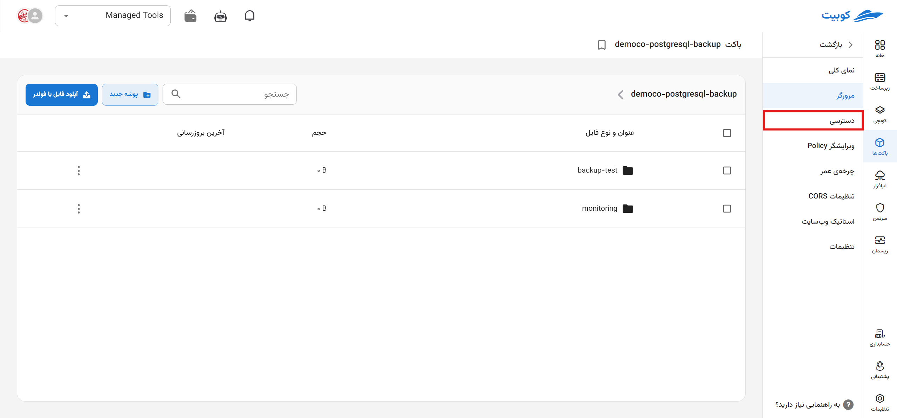
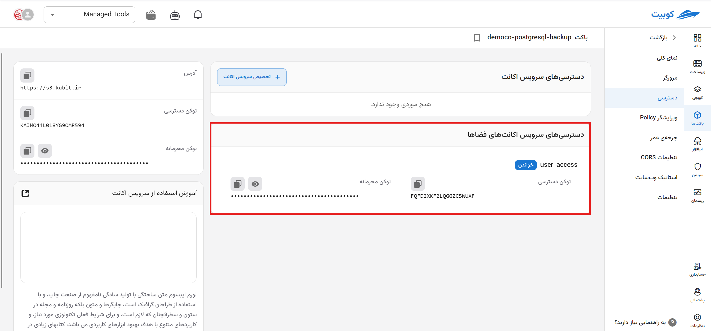
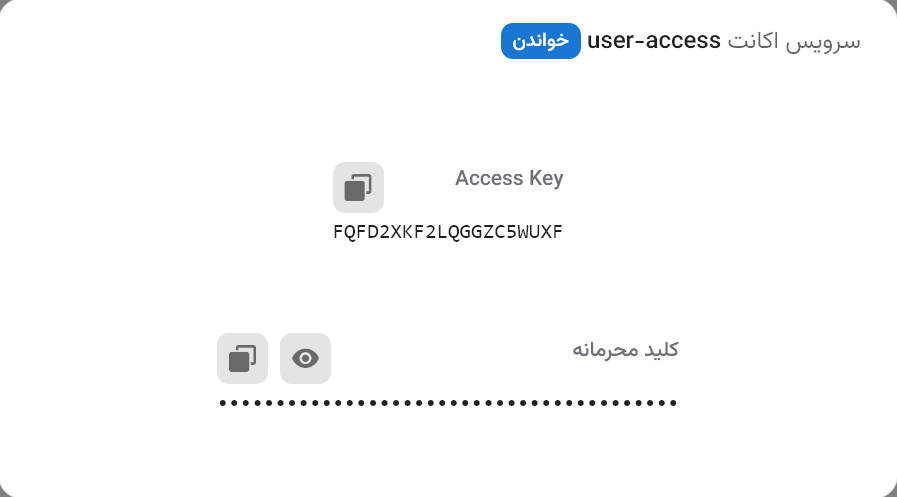
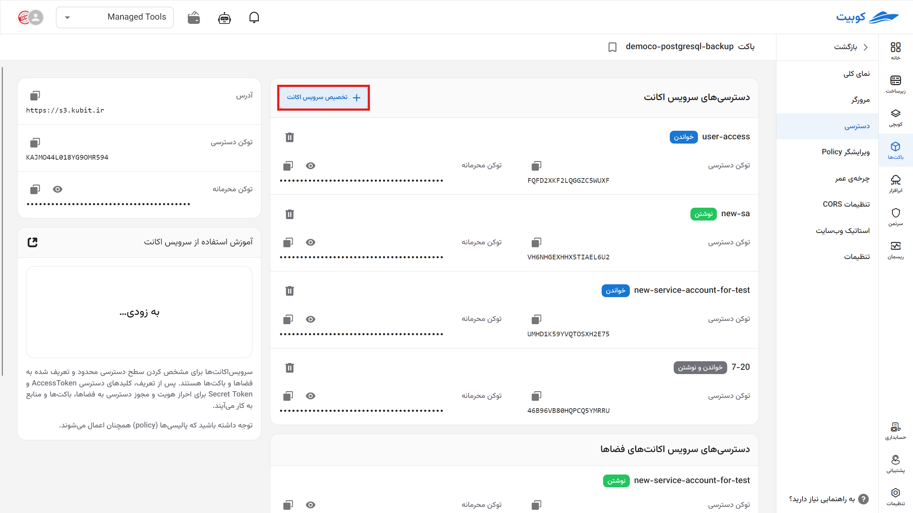
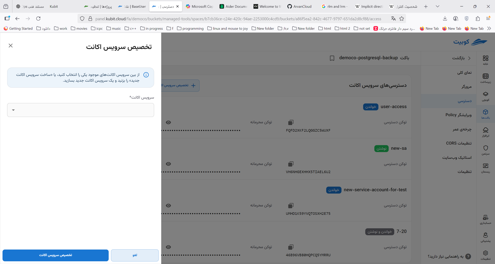
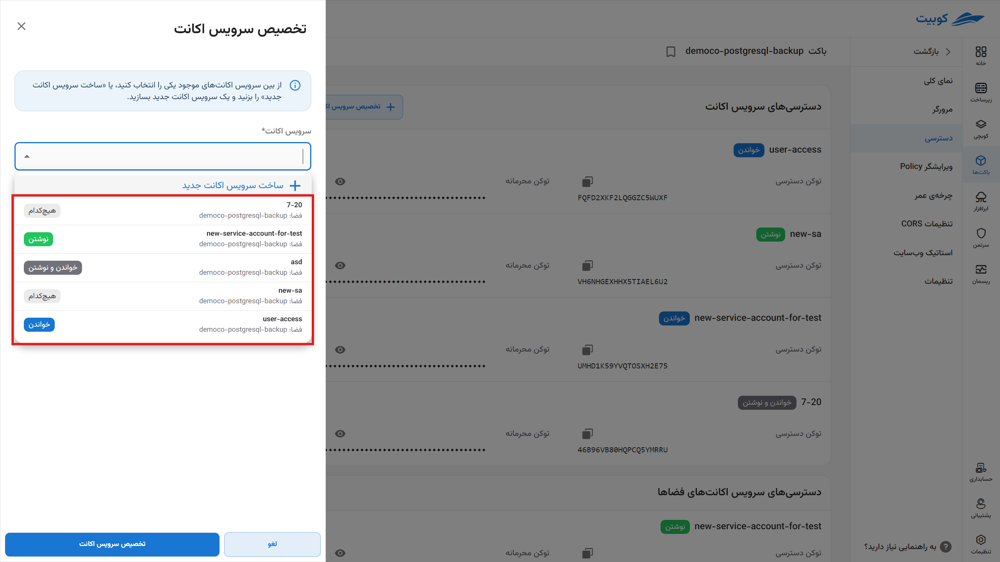
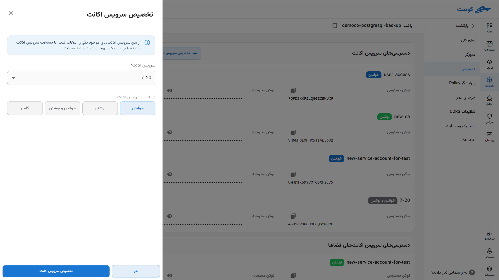
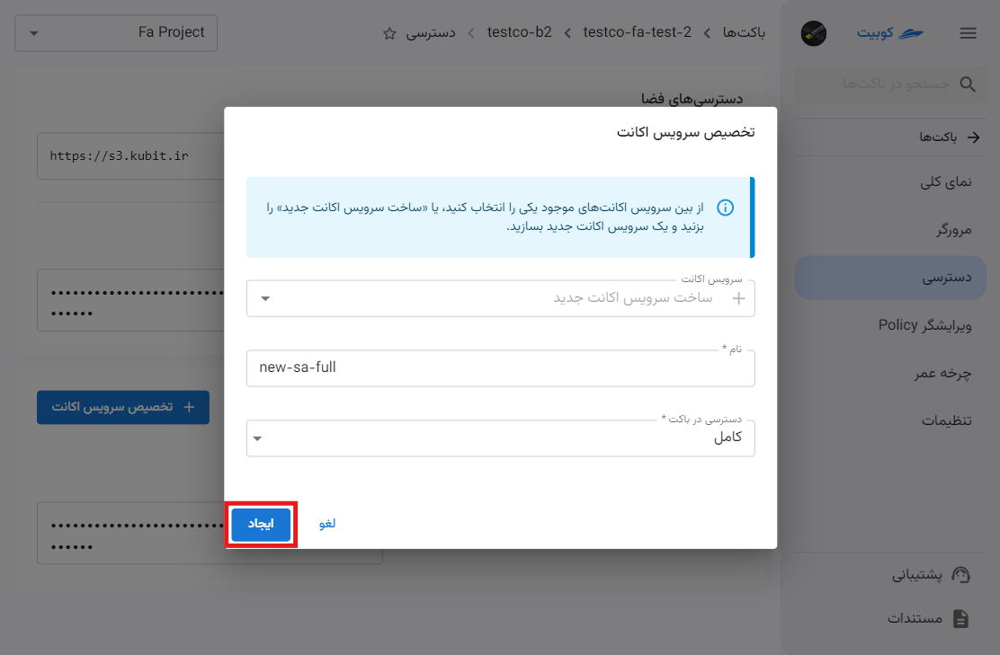
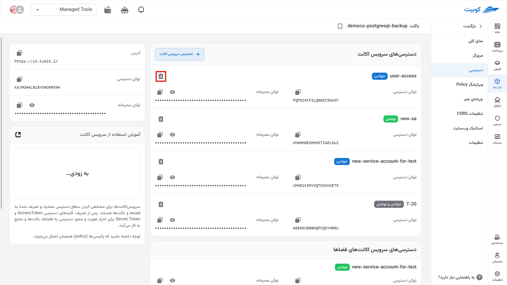
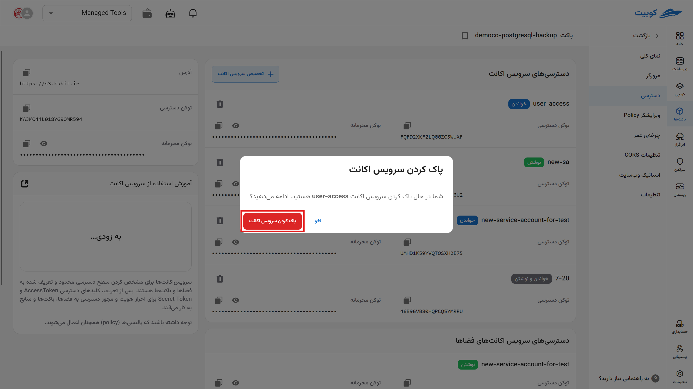

# Access

Permissions are used to define access levels and manage access to buckets, while Access Tokens and Secret Tokens are used for authentication and granting access to buckets and resources. The Access Token serves as the user identifier, and the Secret Token acts as a confidential key to verify their authenticity. Service accounts are also used to assign limited and managed access to individuals in the organization and users.
Note that policies still apply to buckets.

On the access page, **access tokens** and a list of **service accounts** are available:

### Space Access

In this section, the **address** and **access key** for the space are provided. Each key includes an Access Key and a Secret Key:

### Service Account Access

In this section, you can view the list of service accounts assigned to the bucket. You can also assign a new service account or remove an existing one from the bucket:

#### Assigning a Service Account

To assign a service account, click the **Assign Service Account** option:

You can select an existing service account from the available options or choose **Create New Service Account** to create a new one:

##### Selecting from Existing Service Accounts

Select the **service account** and its access level in the bucket from the **Access in Bucket** list. Finally, click the **Create** button.

##### Creating a New Service Account

Enter the **name** of the new service account and select its access level in the bucket from the **Access in Bucket** list. Finally, click **Create** to create and assign the service account to the bucket.

#### Removing a Service Account from a Bucket

- To remove, simply click the trash can icon next to the service account name.
- Then, click the **Delete Service Account** button.
  
  
