---
subDocuments:
  - browser
  - access-settings
  - policy
  - lifecycle
  - cors
  - static-website
---

# Bucket Management

On this page, a report chart of the organization's storage status is available, including **number of buckets**, **used storage volume**, **upload traffic**, and **download traffic**, along with a list of the organization's buckets (buckets of the selected project and shared buckets in the organization).

From the buckets service page, after [connecting](../getting-started#bind-project) / [selecting](../getting-started#select-project) a project, you will be directed to the project's buckets page:

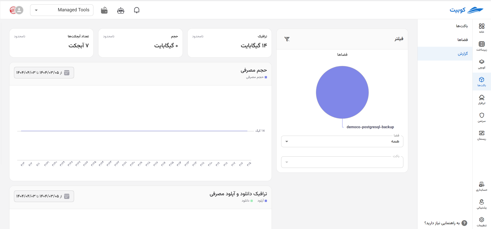

## Buckets List

At the bottom of the service page, a list of the organization's buckets is displayed, including information such as **name**, **location/region**, **size**, **creation time**, and **public access** for each bucket:
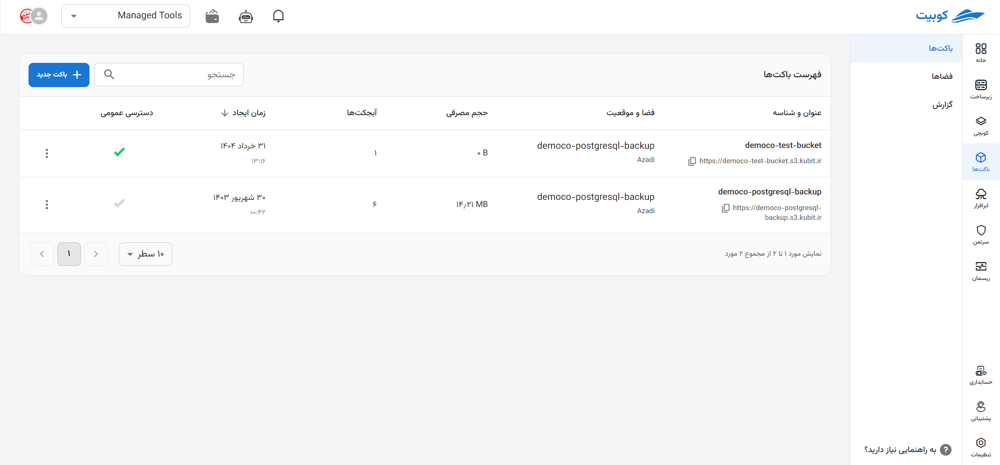
Additionally, clicking on the name of any bucket will direct you to the [Bucket Browser](./browser) page.

### Public Access {#bucket-public-access}

Through the **Public Access** option, you can modify the bucket's access settings and enable/disable it. When this option is enabled, public access to the bucket and downloading its objects become available.

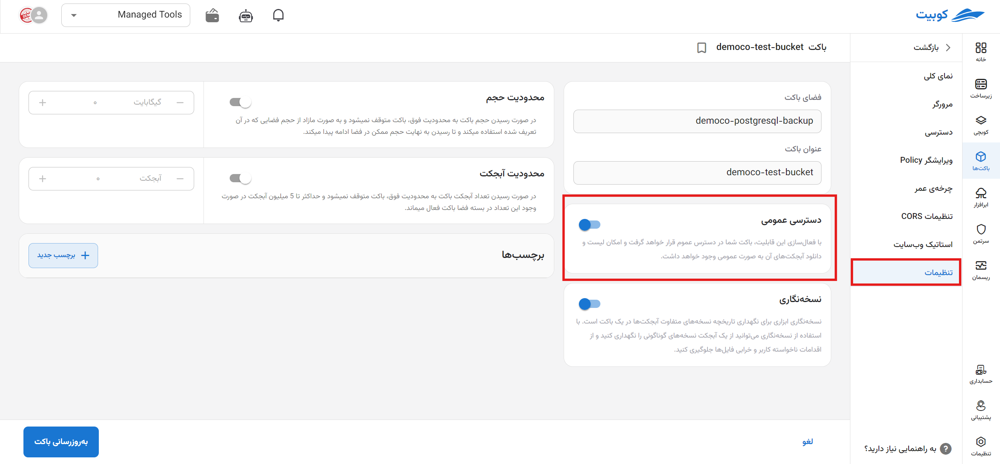

### Bucket Operations

In the operations column, via the three-dot button, a list of available operations for each bucket is provided. Clicking on any of these will direct you to the relevant page/dialog:
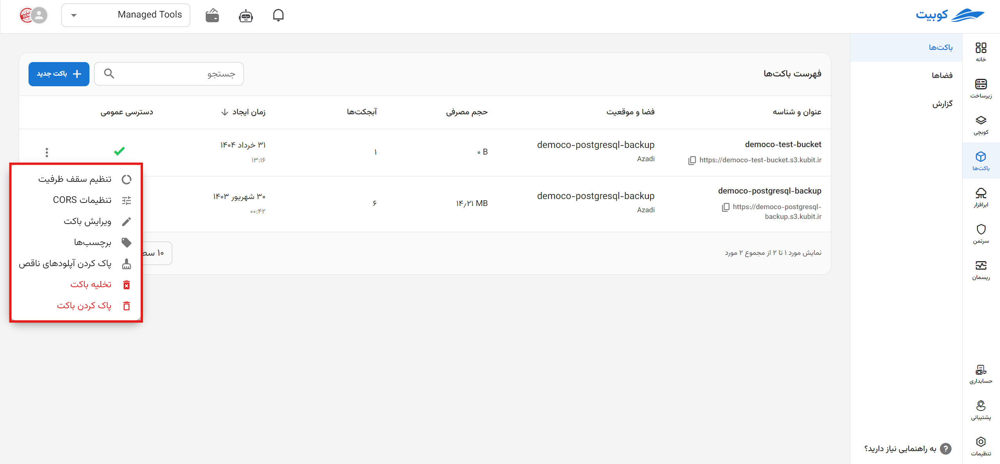

#### Edit Bucket

Through **Edit Bucket**, you can modify bucket settings such as changing the status of **public access**, **versioning**, and **tags**. After clicking **Edit Bucket**, you will be directed to the **Bucket Settings** page:
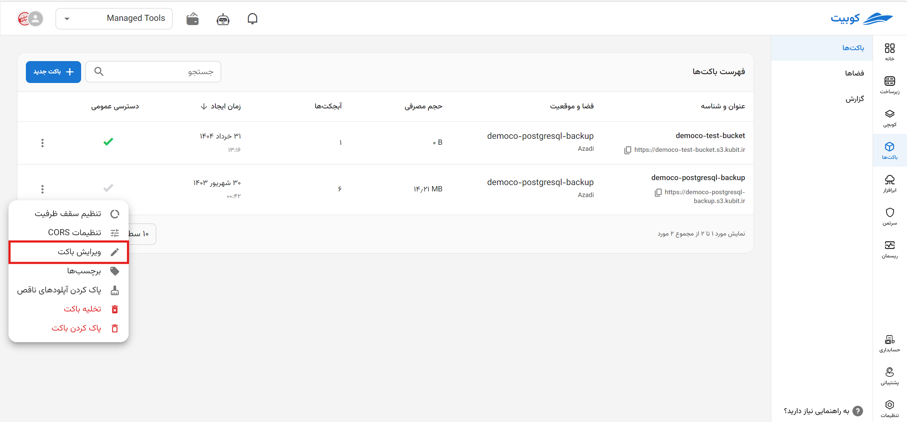
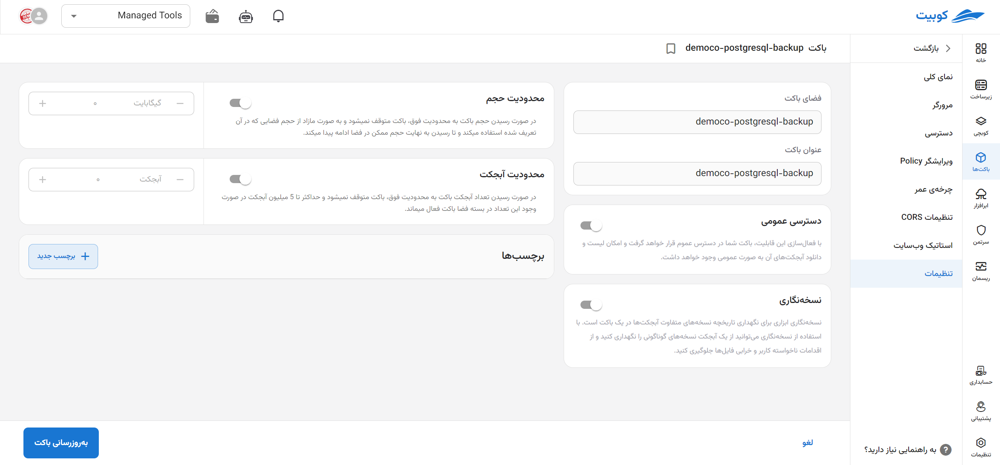

:::caution[Non-Editable Fields]
Note that the **name** and **region** fields are non-editable.
:::

Make the desired changes and click **Update Bucket**:
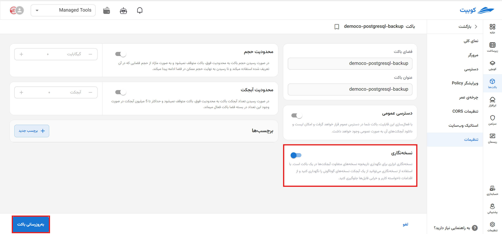
For other settings such as **public access** and **tags**, you can proceed in the same manner.

#### Tags

By clicking on the **Tags** option, a list of the bucket's tags and the ability to add a new tag are available:
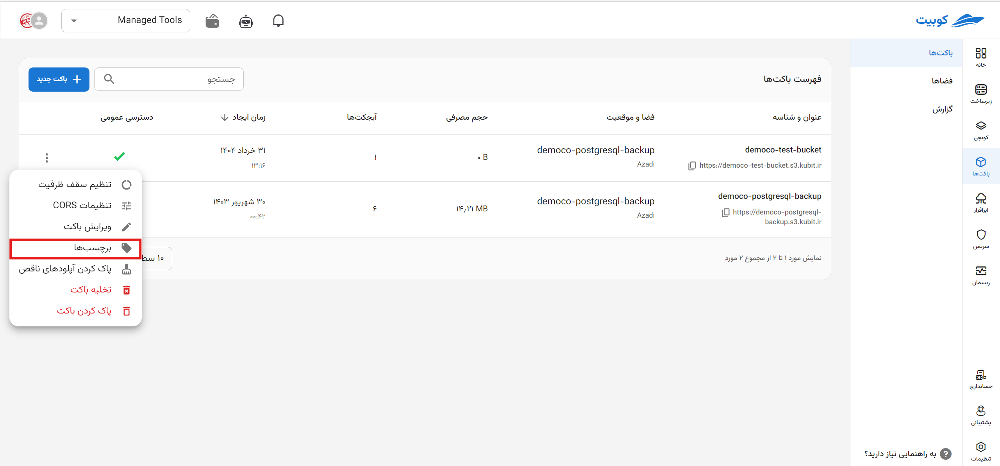
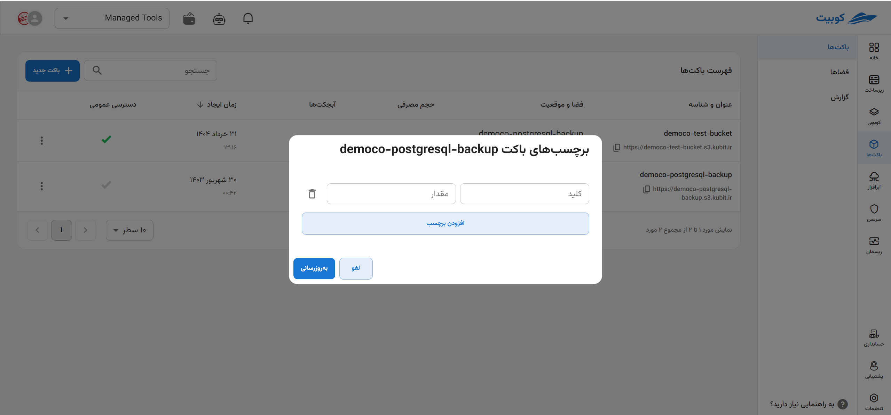

##### Creating a New Tag

To create a new tag, you can enter the new values and click **Update**:
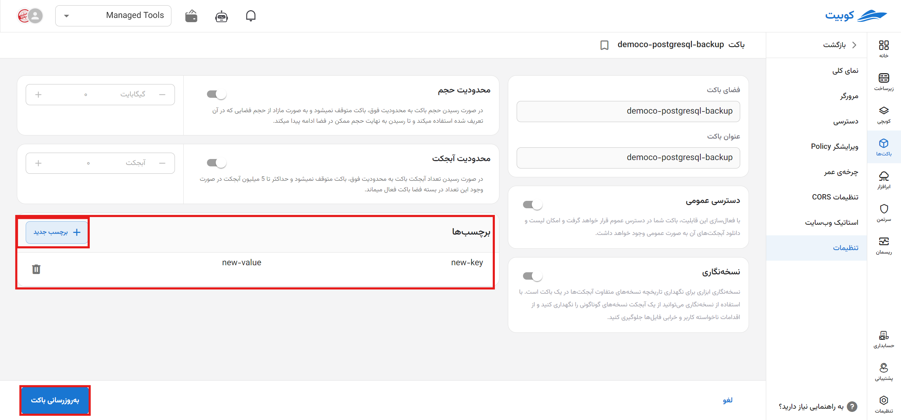

##### Deleting a Tag

To delete a tag, simply click on the **trash can** icon next to the relevant key-value pair:
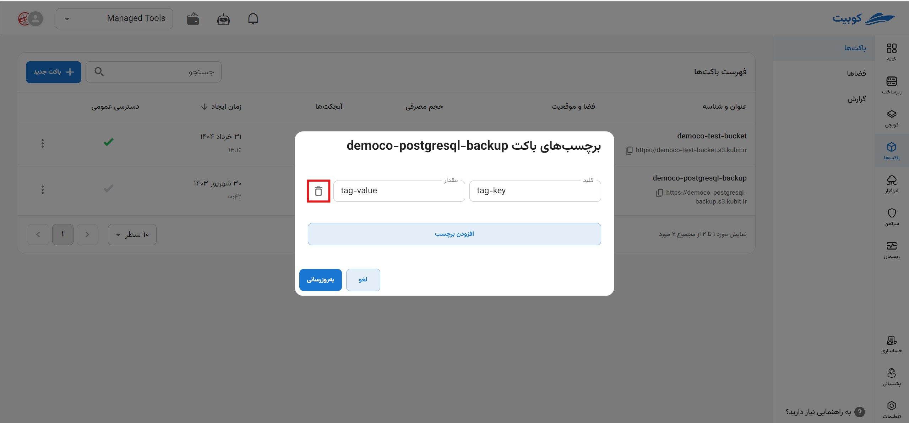

#### Clear Bucket

To clear a bucket (delete all existing objects), click **Clear Bucket**:

Then, to perform the clear operation, click the **Clear Bucket** option:
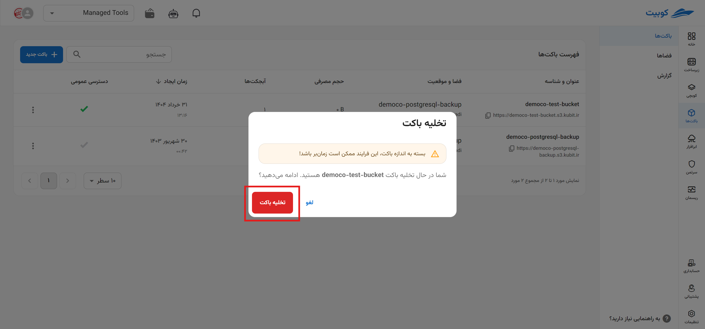

#### Delete Bucket

To delete a bucket (along with all its objects), click **Delete Bucket**:
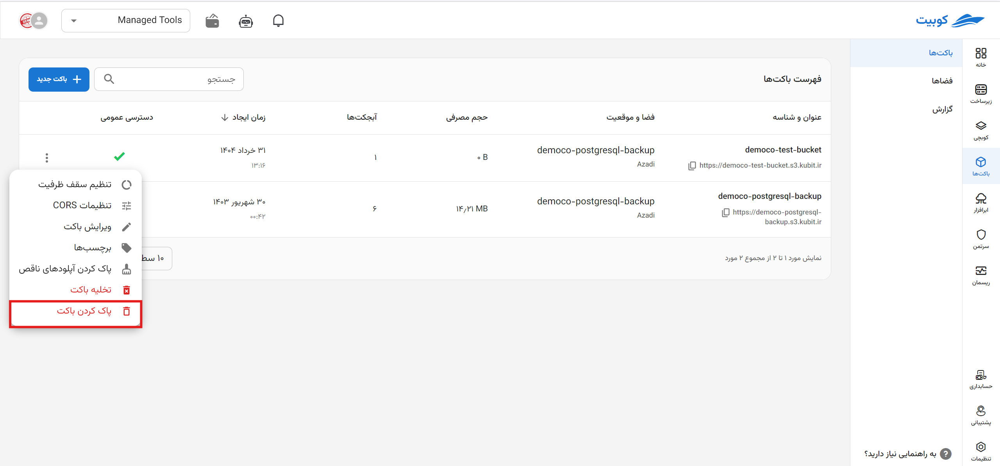

Then, to perform the delete operation, click the **Delete Bucket** option:
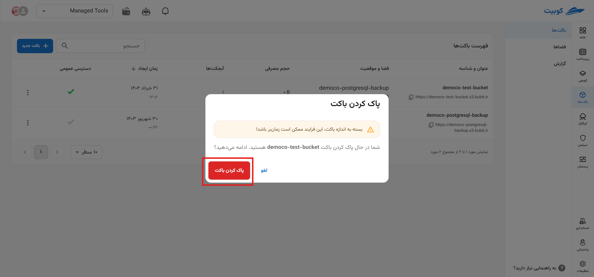

## Overview

On the overview page, you can access the report chart for the respective bucket:
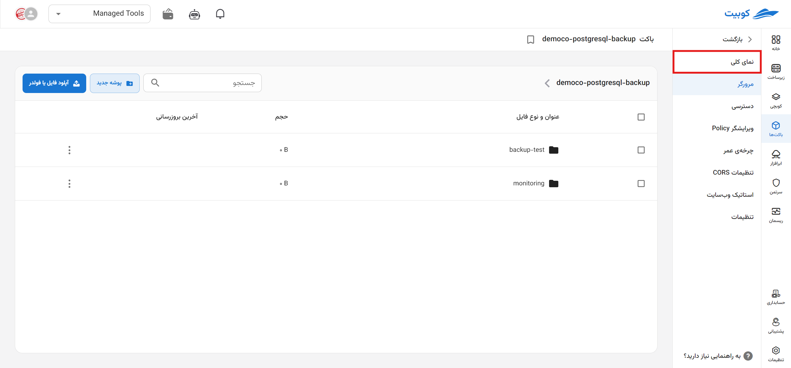
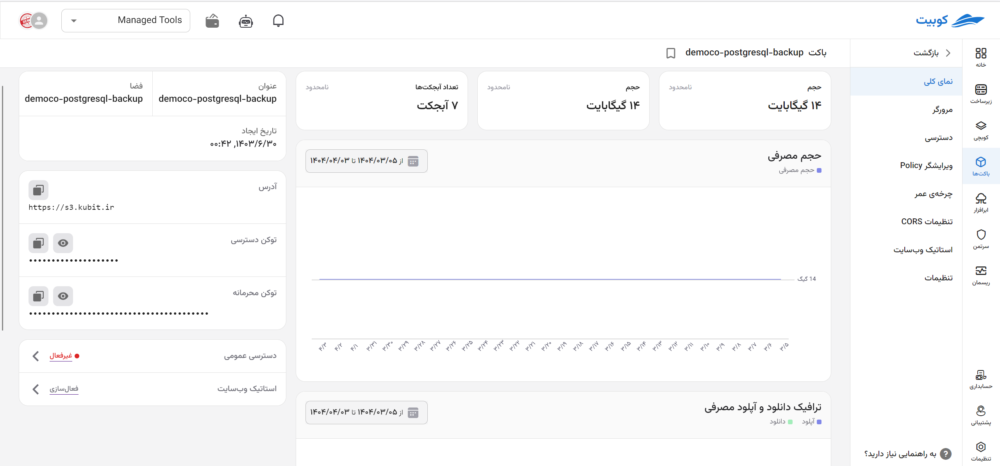

To obtain bucket charts for different time periods, you can click the **Filter** option and select the desired time range:
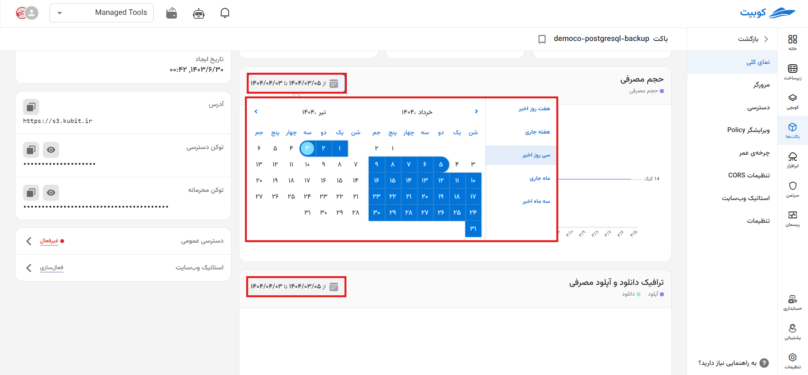
