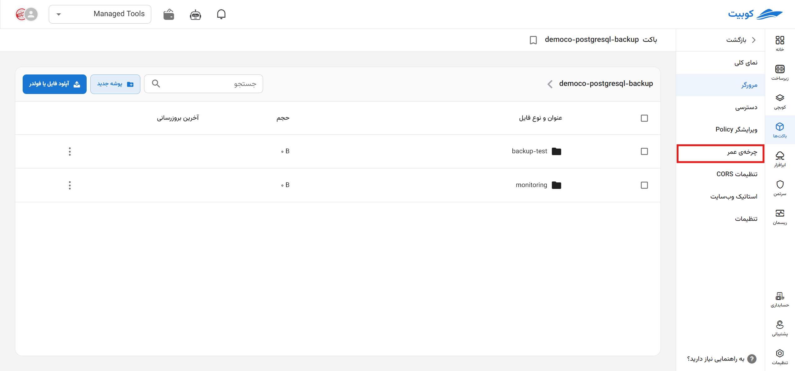
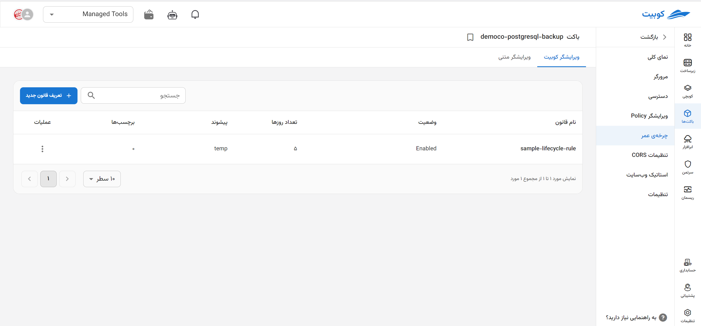
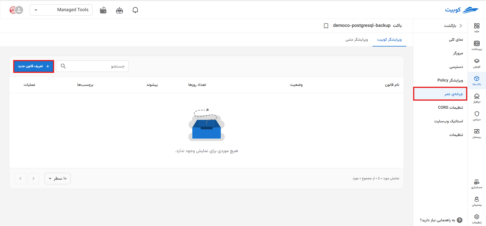
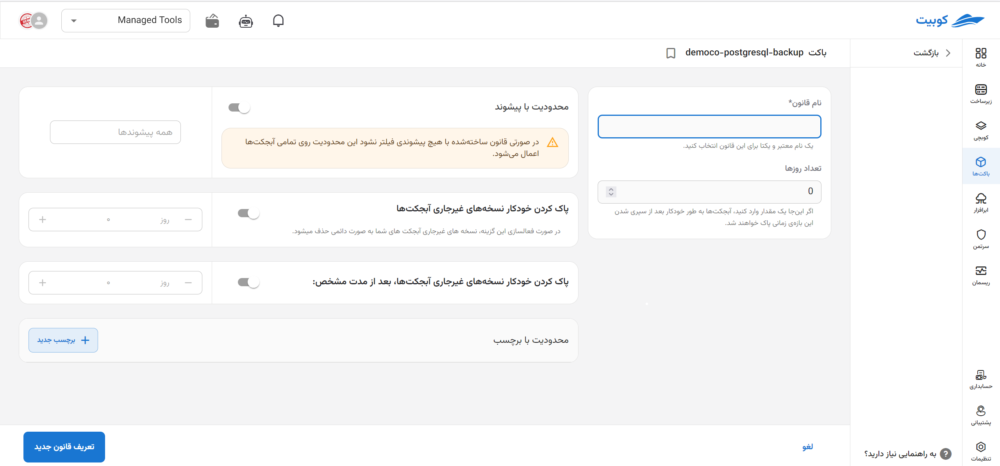
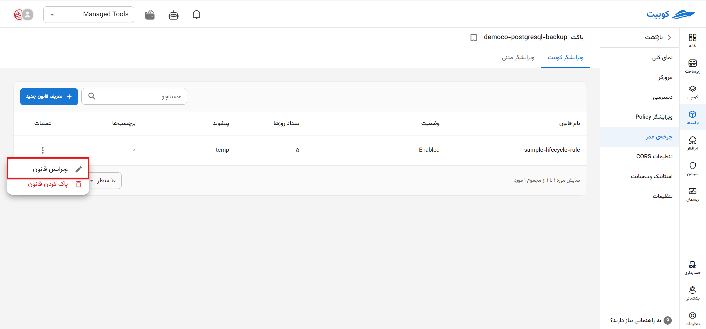
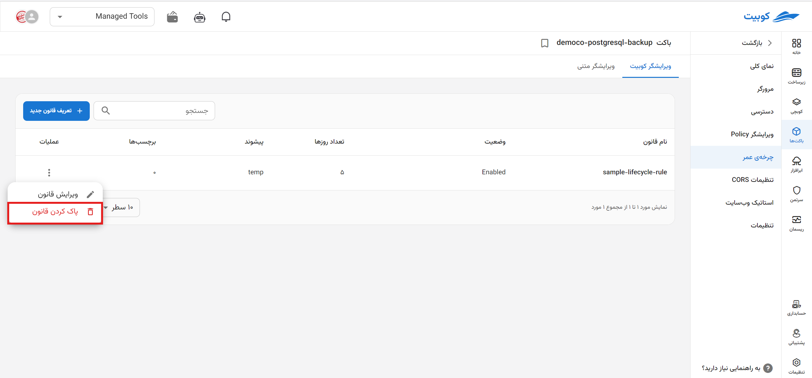
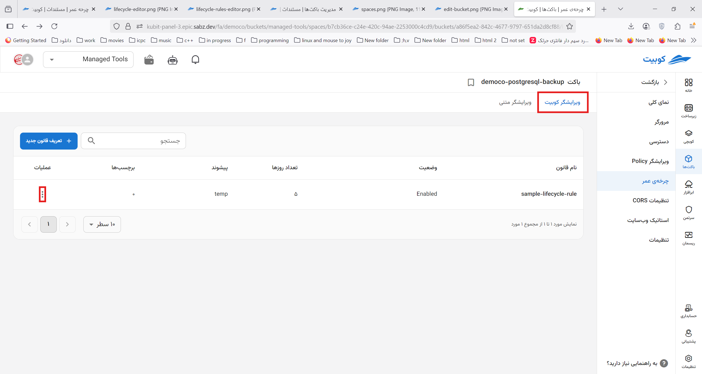
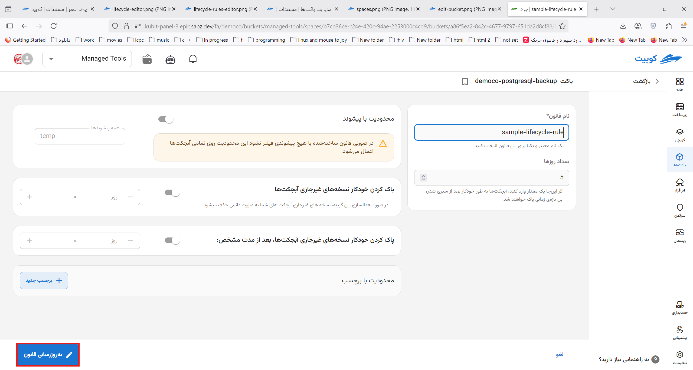
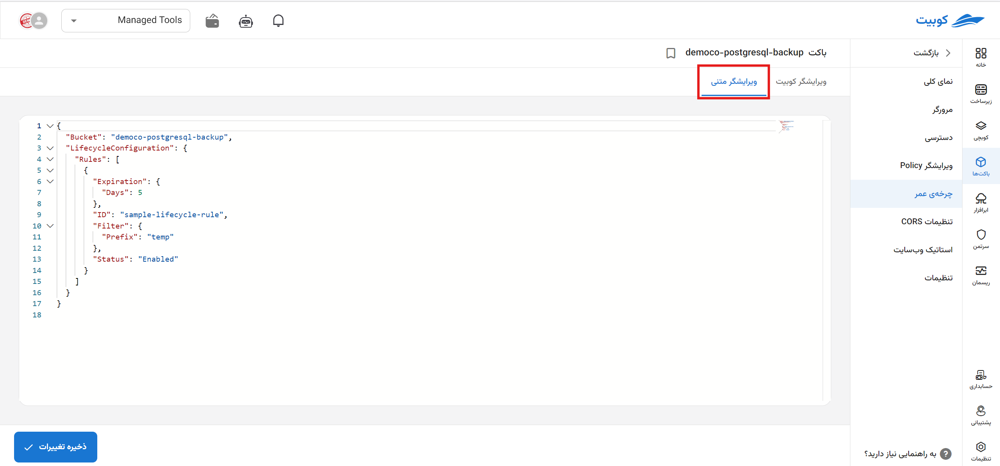

# Lifecycle

**Lifecycle** in the context of S3 (cloud storage) is a set of rules that allows you to automate object management to reduce costs and optimize storage. With this feature, you can move objects to cheaper storage tiers or delete them after a specified period.
On the Lifecycle page, a list of **defined rules** is provided along with the ability to **define a new rule**:


In the list of rules, information such as **name**, **status**, **number of days**, **prefix**, and the number of **tags** is displayed:


## Defining a New Rule

The values that can be set in a rule, along with their descriptions, are as follows:

- **Rule Name (Required)**: A valid and unique name chosen to identify the lifecycle rule.
- **Number of Days**: The time period after which objects are deleted following their creation.
- **Scope Limitation of the Rule**
  - **Prefix**: Applies the rule only to objects whose names start with the specified prefix. For example, to apply the rule to objects in the `imgs` folder in the target bucket, the prefix value should be `imgs/`. You can even limit the rule to a specific object by entering its name, such as `imgs/kubernetes.png`.
  - **Tags**: Applies the rule to objects that have the specified tag.
- **Delete Noncurrent Versions** (_specific to buckets with versioning_): Deletes noncurrent versions of objects after a specified time period.
- **Delete Incomplete Multipart Uploads**: Deletes objects that remain incomplete after a multipart upload.

:::caution[No Restrictions on the Rule]
Note that if you do not specify a prefix or tag, the created rule will apply to all objects in the bucket.
:::

To define a new rule, click the **Define New Rule** button to be directed to the **New Rule** subpage. A form containing the required information for creating the rule (as described above) will be displayed.



## Editing a Rule

- To edit a rule, click the three-dot button in the operations column of the desired rule.
- Then, click the **Edit Rule** option to be directed to the edit form.
- Make the necessary changes and click **Update Rule**.
  

## Deleting a Rule

- To delete a rule, click the three-dot button in the operations column of the desired rule.
- Then, click the **Delete Rule** option.
  

## Lifecycle Editor

You can use the graphical editor to make desired changes and then update them.


Additionally, it is possible to define and edit lifecycle rules using the JSON editor, which displays a list of existing rules in the bucket.


- Sample Lifecycle Rule

```
{
  "Rules": [
    {
      "ID": "ExampleRule",
      "Status": "Enabled",
      "Filter": {
        "And": {
          "Prefix": "logs/",
          "Tags": [
            {
              "Key": "Environment",
              "Value": "Production"
            },
          ]
        }
      },
      "Transitions": [
        {
          "Days": 30,
          "StorageClass": "GLACIER"
        }
      ],
      "Expiration": {
        "Days": 365
      },
      "AbortIncompleteMultipartUpload": {
        "DaysAfterInitiation": 7
      }
    }
  ]
}
```

### Keys for Each Rule

- **ID**: An optional identifier for the rule, helping with rule identification and management. Example: `MoveToGlacierAfter30Days`
- **Status**: Specifies the rule's status. Possible values: `Enabled`, `Disabled`
- **Filter**: Determines which objects the rule applies to.
  - _Prefix_: Targets objects with the specified prefix. Example: `logs/` (only objects whose path starts with logs/).
  - _Tags_ (optional): Targets objects based on tags. Example:
  ```
  "Tags": [
    {
      "Key": "Environment",
      "Value": "Production"
    },
  ]
  ```
- **Transitions**: Defines the movement of objects to cheaper storage tiers.
  Structure: An array of transitions, each including:
  - _Days_: The number of days after object creation when the transition occurs. Example: `30` (move after 30 days).
  - _Date_ (optional): A specific date for the transition. Example: `2025-01-01T00:00:00Z`
  - _StorageClass_: The destination storage class. Possible values:
    `GLACIER`, `DEEP_ARCHIVE`, `STANDARD_IA (Standard-Infrequent Access)`,
- **Expiration**: Specifies when objects are deleted.
  - _Days_: The number of days after object creation when deletion occurs. Example: `365` (delete after one year).
  - _Date_ (optional): A specific date for deletion. Example: `2025-01-01T00:00:00Z`
- **NoncurrentVersionTransitions** (optional): Moves noncurrent versions of objects to cheaper storage classes.
  - _NoncurrentDays_: The number of days after a version becomes noncurrent when the transition occurs. Example: `30`
  - _StorageClass_: The destination storage class. Example: `GLACIER`
- **NoncurrentVersionExpiration** (optional): Specifies when noncurrent versions of objects are deleted.
  - _NoncurrentDays_: The number of days after a version becomes noncurrent when deletion occurs. Example: `180`
- **AbortIncompleteMultipartUpload** (optional): Deletes incomplete multipart uploads after a specified number of days.
  - _DaysAfterInitiation_: The number of days after the upload starts when deletion occurs. Example: `7`
