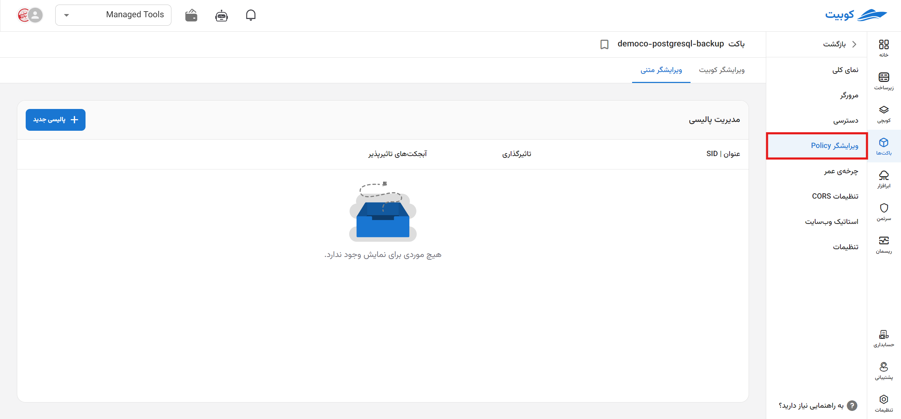
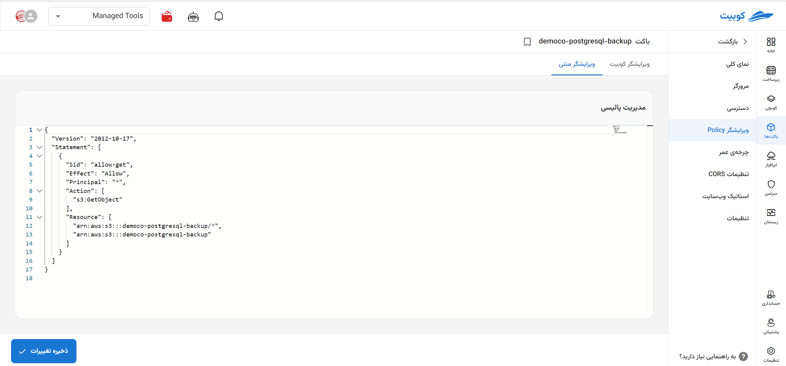
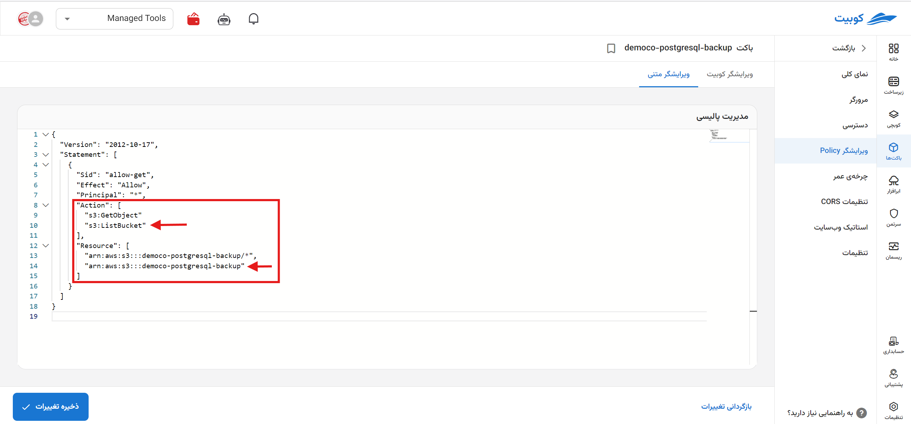

# Policy Editor

A policy is a resource-based rule used to grant access permissions to a bucket and its objects for others (users). Policies are in JSON format, allowing you to securely and efficiently manage your files and buckets by specifying access levels.

Through the **Policy Editor** page, an editor is available to define and modify policies related to the bucket, enabling you to set the required access policies.


Below, each policy value is explained.

### Policy Values

| Key        | Description                                                                                                                                                                              |
| ---------- | ---------------------------------------------------------------------------------------------------------------------------------------------------------------------------------------- |
| Versioning | Specifies the policy language version, indicating compatibility with the JSON policy structure introduced in October 2012.                                                               |
| Statement  | Contains a list of access rules, each defining a set of permissions.                                                                                                                     |
| Sid        | An optional identifier used to distinguish rules.                                                                                                                                        |
| Effect     | Specifies whether the rule allows or denies access. Here, `Allow` grants the specified permissions, while `Deny` restricts them.                                                         |
| Principal  | Determines which users or services the rule applies to. For example, `*` applies to all users, and `{ "AWS": "arn:aws:iam::123456789012:user/ExampleUser" }` applies to a specific user. |
| Action     | Specifies the actions the policy allows. For example, `s3:GetObject` permits retrieving (reading) objects from the bucket.                                                               |
| Resource   | Specifies the ARNs and objects the policy applies to. In this case, it indicates the policy applies to all objects in the bucket `arn:aws:s3:::bucket-name/*`.                           |

- Sample Policy

```
{
  "Version": "2012-10-17",
  "Statement": [
    {
      "Sid": "PublicReadGetObject",
      "Effect": "Allow",
      "Principal": "*",
      "Action": "s3:GetObject",
      "Resource": "arn:aws:s3:::example-bucket/*"
    }
  ]
}
```

### Permissions

The complete list of possible permissions for applying in a policy is provided in the table below.

| Permission                         | Description                                                  |
| :--------------------------------- | :----------------------------------------------------------- |
| Full Access (/\*)                  | Grants permission to perform any operation on the bucket.    |
| GetObject                          | Grants permission to read bucket objects.                    |
| PutObject                          | Grants permission to write bucket objects.                   |
| DeleteObject                       | Grants permission to delete bucket objects.                  |
| ListBucket                         | Grants permission to list bucket contents.                   |
| GetBucketLocation                  | Grants permission to read the bucket's location.             |
| PutBucketPolicy                    | Grants permission to write the bucket's policy.              |
| GetBucketPolicy                    | Grants permission to read the bucket's policy.               |
| DeleteBucketPolicy                 | Grants permission to delete the bucket's policy.             |
| GetObjectAcl                       | Grants permission to read the ACL of bucket objects.         |
| PutObjectAcl                       | Grants permission to modify the ACL of bucket objects.       |
| GetBucketAcl                       | Grants permission to read the bucket's ACL.                  |
| PutBucketAcl                       | Grants permission to modify the bucket's ACL.                |
| ListAllMyBuckets                   | Grants permission to list all user buckets.                  |
| CreateBucket                       | Grants permission to create a new bucket.                    |
| DeleteBucket                       | Grants permission to delete a bucket.                        |
| GetBucketLogging                   | Grants permission to read bucket logging settings.           |
| PutBucketLogging                   | Grants permission to modify bucket logging settings.         |
| PutLifecycleConfiguration          | Grants permission to modify bucket lifecycle settings.       |
| GetLifecycleConfiguration          | Grants permission to read bucket lifecycle settings.         |
| GetBucketVersioning                | Grants permission to read the bucket's versioning status.    |
| PutBucketVersioning                | Grants permission to modify the bucket's versioning status.  |
| GetObjectVersion                   | Grants permission to read versioned bucket objects.          |
| DeleteObjectVersion                | Grants permission to delete versioned bucket objects.        |
| RestoreObject                      | Grants permission to restore versioned bucket objects.       |
| GetBucketTagging                   | Grants permission to read bucket tags.                       |
| PutBucketTagging                   | Grants permission to modify bucket tags.                     |
| DeleteBucketTagging                | Grants permission to delete bucket tags.                     |
| GetObjectTagging                   | Grants permission to read tags of bucket objects.            |
| PutObjectTagging                   | Grants permission to modify tags of bucket objects.          |
| DeleteObjectTagging                | Grants permission to delete tags of bucket objects.          |
| GetBucketNotificationConfiguration | Grants permission to read bucket notification settings.      |
| PutBucketNotificationConfiguration | Grants permission to modify bucket notification settings.    |
| GetBucketPolicyStatus              | Grants permission to read the bucket policy status.          |
| GetBucketCors                      | Grants permission to read bucket CORS settings.              |
| PutBucketCors                      | Grants permission to modify bucket CORS settings.            |
| DeleteBucketCors                   | Grants permission to delete bucket CORS settings.            |
| GetBucketRequestPayment            | Grants permission to read bucket request payment settings.   |
| PutBucketRequestPayment            | Grants permission to modify bucket request payment settings. |
| GetBucketWebsite                   | Grants permission to read bucket website settings.           |
| PutBucketWebsite                   | Grants permission to modify bucket website settings.         |
| DeleteBucketWebsite                | Grants permission to delete bucket website settings.         |
| GetBucketEncryption                | Grants permission to read bucket encryption settings.        |
| PutBucketEncryption                | Grants permission to modify bucket encryption settings.      |
| PutBucketOwnershipControls         | Grants permission to modify bucket ownership controls.       |
| GetBucketOwnershipControls         | Grants permission to read bucket ownership controls.         |
| GetBucketLifecycle                 | Grants permission to read bucket lifecycle settings.         |
| PutBucketLifecycle                 | Grants permission to modify bucket lifecycle settings.       |
| DeleteBucketLifecycle              | Grants permission to delete bucket lifecycle settings.       |
| AbortMultipartUpload               | Grants permission to abort multipart uploads in the bucket.  |

### Editing Policy

You can use the **Policy Editor** to modify policies. For example, add `"s3:ListBucket"` to **Action** and `"arn:aws:s3:::testco-b2"` to **Resource** (these changes grant the user permission to list contents and read bucket objects), then click **Save**:

You can apply other required changes in the same manner.
