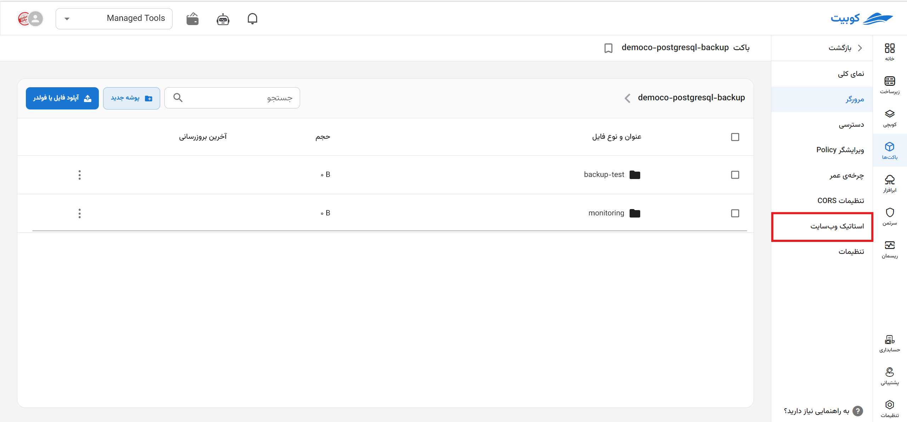
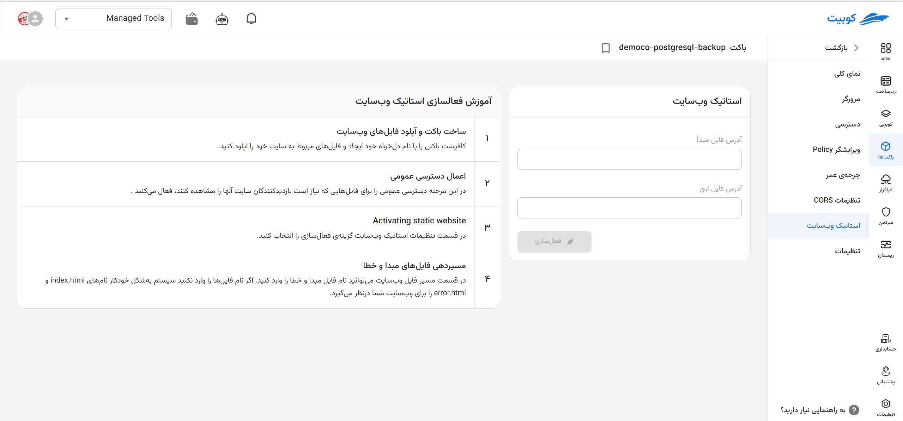
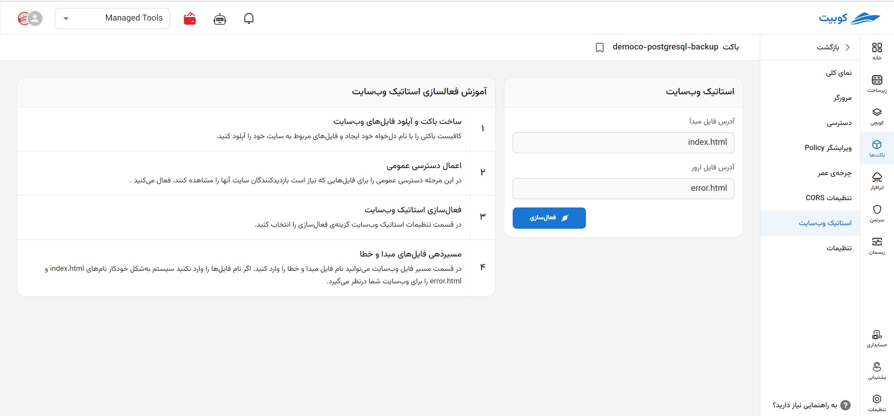

# استاتیک وب‌سایت

Static Website Hosting در باکت‌ها قابلیتی است که باکت را به یک وب‌سایت ایستا تبدیل می‌کند. با فعال‌سازی آن، می‌توانید فایل‌های HTML، CSS، و JavaScript را به‌صورت مستقیم از فضای ذخیره‌سازی ابری برای کاربران ارائه دهید و یک آدرس URL اختصاصی برای وب‌سایت خود دریافت کنید.

# فعال‌سازی

:::warning[توجه]
لازم است پیش از فعال کردن استاتیک وب‌سایت به دو نکته توجه داشته باشید:

1. مطمئن شوید که فایل‌های موردنیاز برای نمایش وب‌سایت در باکت آپلود شده باشند.
2. گزینه [دسترسی عمومی](../#bucket-public-access) باکت فعال شده باشد.

:::

- ابتدا به زیرصفحه **استاتیک وب‌سایت** مراجعه کنید و گزینه **فعال‌سازی استاتیک وب‌سایت** را انتخاب کنید.
- سپس، مقادیر **آدرس فایل مبدأ** و **آدرس فایل ارور** را وارد کرده و روی **اعمال تغییرات** کلیک کنید.
- پس از فعال‌سازی، یک **آدرس URL** اختصاصی برای وب‌سایت شما ایجاد می‌شود که پس از مراجعه به آن، محتویات باکت به‌صورت وب‌سایت نمایش داده خواهد شد.
  
  
