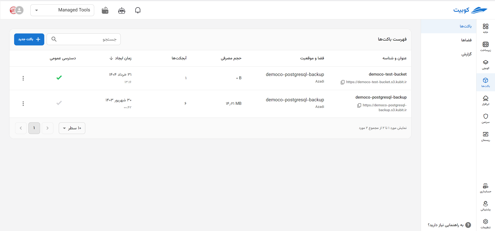
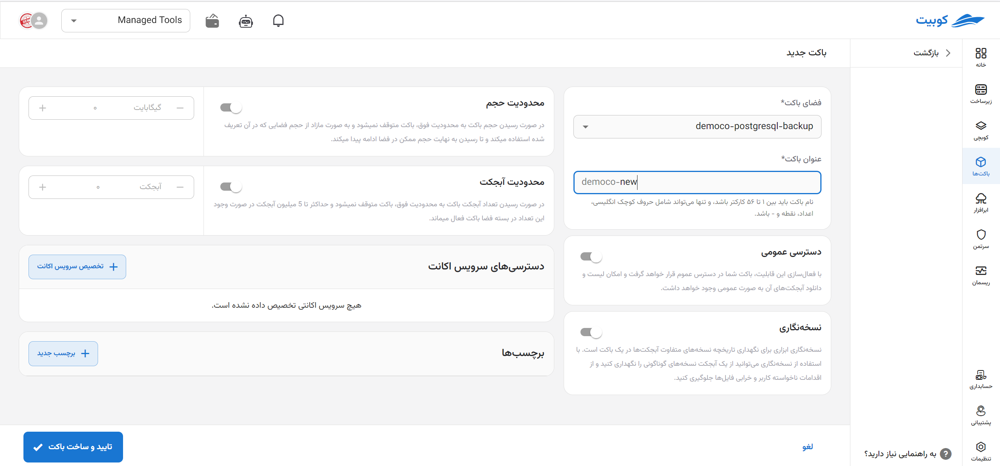
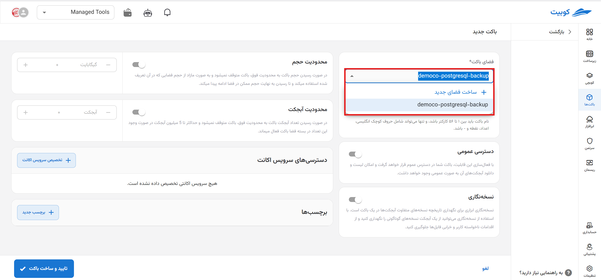
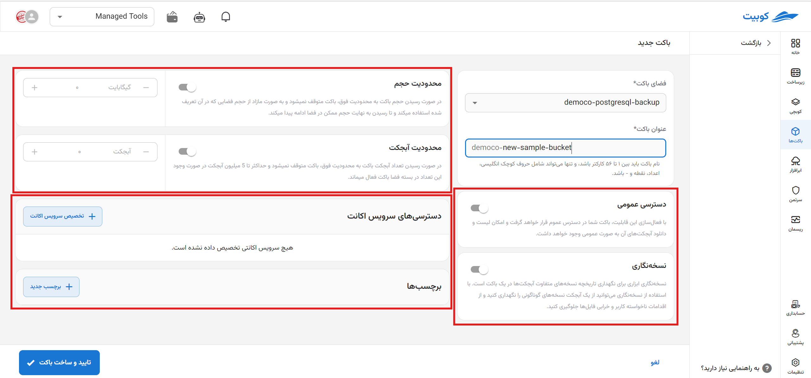
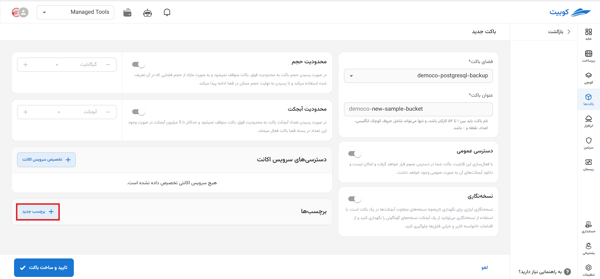
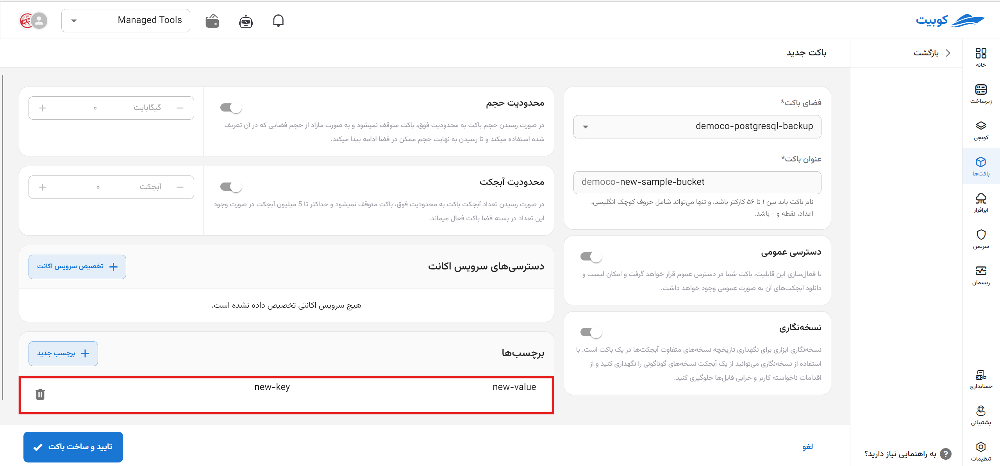
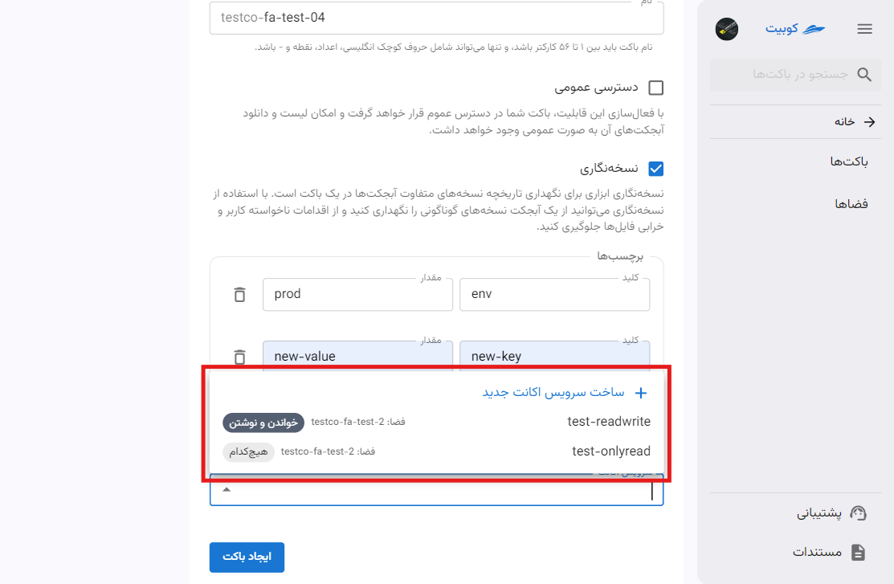
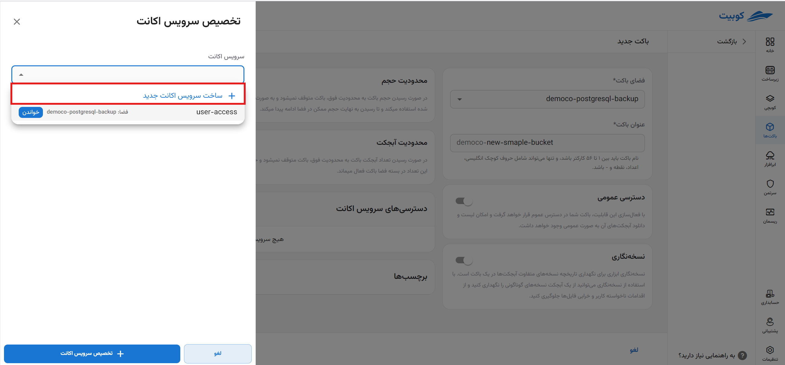
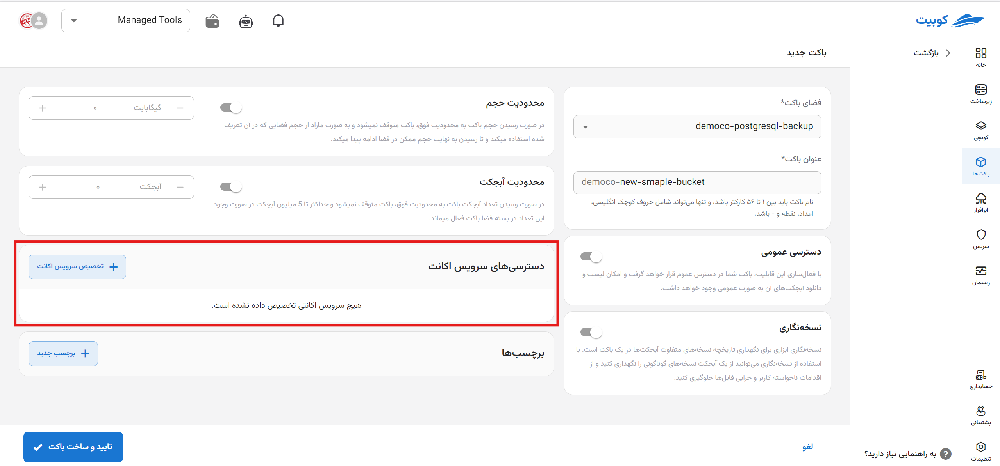

# Creating a New Bucket (Step Two)

On the bucket service page, after [connecting](../getting-started#bind-project) / [selecting](../getting-started#select-project), click on **Create New Bucket** to be directed to the bucket creation form:

## Step One: Selecting Space and Name

First, select the **space** and enter the **name** of the bucket:

:::warning[Bucket Name]
The bucket name must be between 3 and 63 characters and can only include English letters, numbers, periods, and hyphens.
Also, the bucket name cannot be edited after creation.
:::

:::info[Default Values for Bucket Creation Form]

- The **last created space** in the project is automatically selected as the bucket's space. However, you can choose your desired space from the available spaces.
- If the **organization name as a prefix in the bucket name** is set, the bucket name will be in the format `TestOrg-bucketname`.
  

:::

## Step Two: Bucket Settings

After selecting the space and name, you can configure additional optional settings for the bucket being created:

- **Public Access:**
  Enabling this option allows public sharing of the bucket and downloading of objects.
- **Versioning:**
  To prevent unintended user actions and file corruption, you can maintain different versions of an object.
- **Tags:**
  For categorization, resource control, and bucket access management, you can assign various tags to the bucket.
- **Account Service:**
  To assign restricted access to the bucket, you can select the desired account service in this section.
- **Storage Limit:**
  You can define a **storage ceiling** for your bucket. If this limit is reached, the bucket will not stop, and it will use excess storage from the **space** it belongs to.
- **Object Limit:**
  You can define a ceiling for the number of objects in your bucket. If this limit is reached, the bucket will not stop and will use excess object counts from the **space** it belongs to (up to a maximum of 5 million objects).

  

### Adding a Tag

Click on **Add Tag** to create empty key-value fields, then fill them with the desired values:

Naming Rules:

- The maximum number of tags per resource is 50.

- For each **resource**, a unique **key** value is required, and each key can only have one **value**.

- Maximum length of **key**: 128 UTF-8 characters.

- Maximum length of **value**: 128 UTF-8 characters.

- Allowed characters include: English letters (a-z, A-Z), Persian letters (ا-ی), Persian and English numbers, and characters `. : + = @ _ / -`.

- Keys and values are case-sensitive for English letters.

For all conditions, see this [document](https://docs.aws.amazon.com/mediaconnect/latest/ug/tagging-restrictions.html).

### Selecting an Account Service

:::caution[When is Selecting an Account Service Mandatory?]
Note that if assigning an account service is mandatory for the selected space, the account service option in bucket creation will not be optional, and you must assign at least one account service to the bucket.
:::

When selecting an account service, two scenarios are possible: either an account service exists in the selected space, or it does not. If a list of account services is available, you can select one of them. If no account service exists, you can choose the **Create New Account Service** option to automatically create a new account service:

:::tip[Automatic Account Service Creation]
If you choose to create a new account service, an account service with full access will be automatically created and assigned to this bucket:

:::
After selecting the account service, click **Confirm and Create Bucket** to create the desired bucket:
