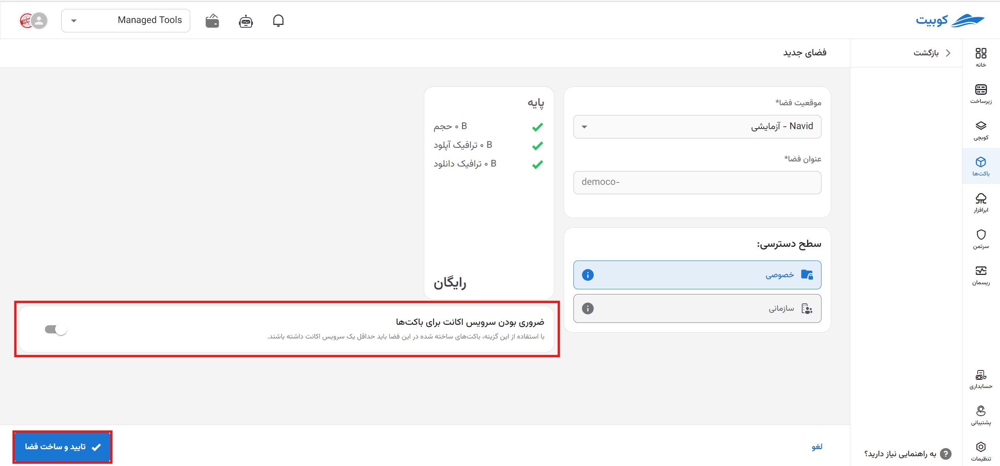

# Creating a New Space (Step One)

On the bucket service page, after [connecting](../getting-started#bind-project) / [selecting](../getting-started#select-project) a project, go to the **Spaces** page and click on **Create New Space**:

## Step One: Selecting Location and Name

First, select the **space location** from the list of available locations and enter the **space name**:

## Step Two: Selecting a Plan

Choose a plan from the available plans based on your needs:

:::info[Default Plan]
If no plan is selected at this stage, the **basic plan** with the **auto-renewal** option enabled will be selected by default. You can also change the selected plan after creating the space.
:::

## Step Three: Space Settings

In the advanced settings section, there are additional settings you can configure for the space, including sharing the space within the organization and requiring an account service, which are explained below.

:::info[Optional Advanced Settings]
The settings for sharing within the organization and requiring an account service for buckets are optional, and you can modify these settings after creating the space.
:::

### Shared Within the Organization

This option shares the space at the organization level and with other organization projects, allowing other organization users to use this space for creating buckets.

:::tip[No Access to Shared Space from Other Projects]
Note that other projects will not have access to the settings of the shared space or its buckets and can only use the shared space within the organization to create buckets.
:::

### Requiring Account Service for Buckets

By enabling this option, buckets created in this space must have at least one account service.
For more information about the account service, refer to the basic concepts document, section [Account Service](../#service-account).

Finally, click **Create New Space** to create the desired space. You can now proceed to create a bucket in this space. For further details, refer to the [Creating a New Bucket](../create-bucket) document.
