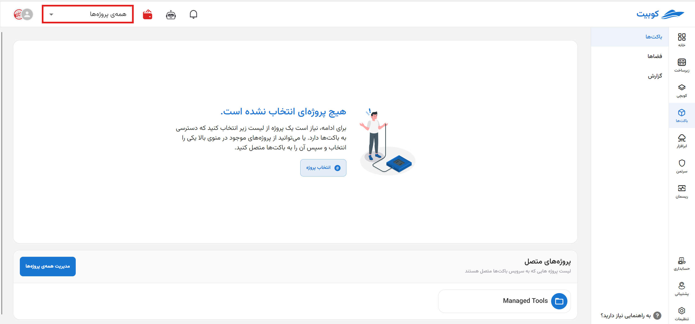
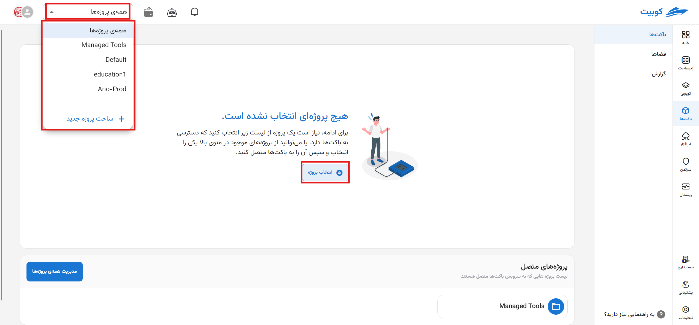
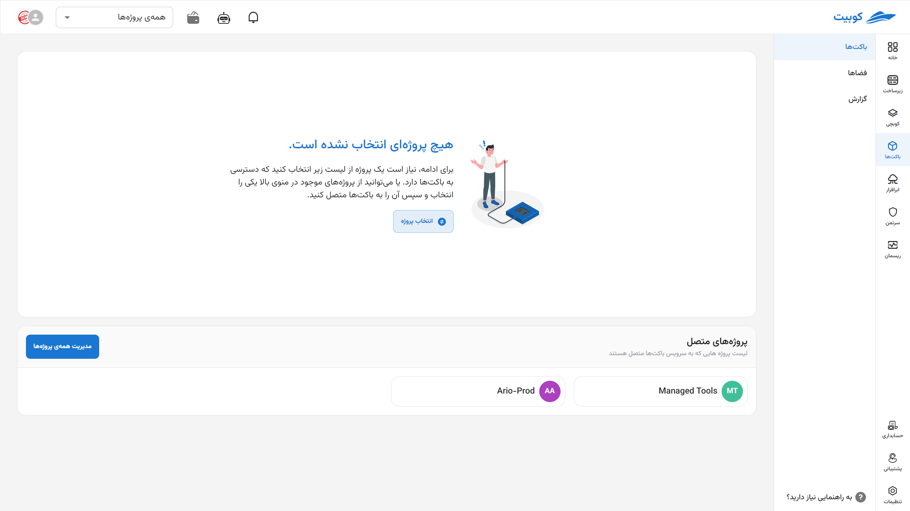
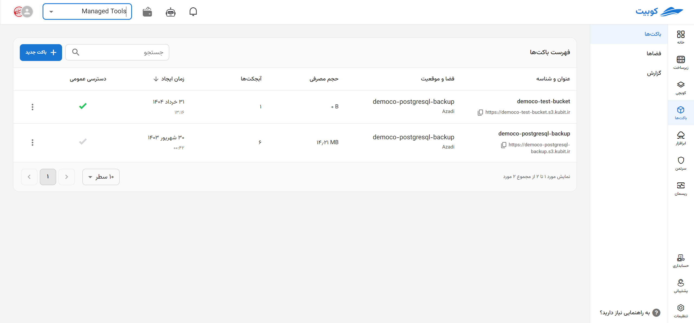
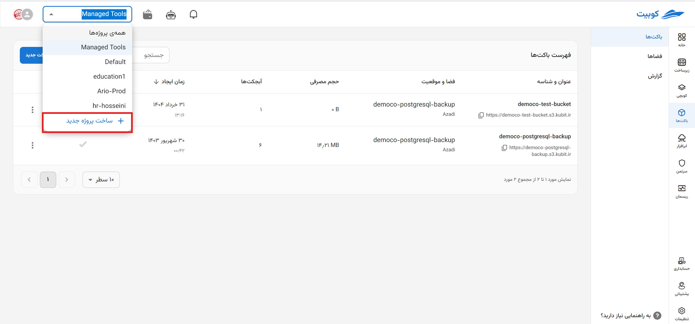

# Getting Started (Step Zero)

Access to **Buckets** and **Spaces** is provided through the Kubit panel's bucket service.
As mentioned in [Basic Concepts](../concepts), buckets are meaningful with spaces; similarly, spaces are meaningful with projects. Therefore, the spaces of the bucket service are separated by projects. To start working with buckets, you must first connect one of the projects you previously created in the [Organization](../../organize) section to this service or select one of the projects already connected to buckets. Below, we explain this process.

First, from the Kubit panel, enter the **Buckets** service:

## Connecting a Project to the Bucket Service{#bind-project}

- Open the list of current organization projects through the **All Projects** option.
- Select your desired project from the list.
- Then, an error about the project not being connected will appear. To connect the project, click the **Connect** button.

Finally, the project is connected to the bucket service, and you will be redirected to the project's buckets page.

## Selecting a Project{#select-project}

On the service's main page, a list of connected projects is visible. You must first select the desired project from this list:

After selecting the project, you will be redirected to the project's bucket list page:

For more details, refer to the [Bucket Management](../buckets) and [Space Management](../spaces) documentation.

:::tip[Creating a Project]
If you wish to create a new project, you can do so through the **Create New Project** option:

Then enter the **Title** and **Key** of the project and click **Create**:

:::
