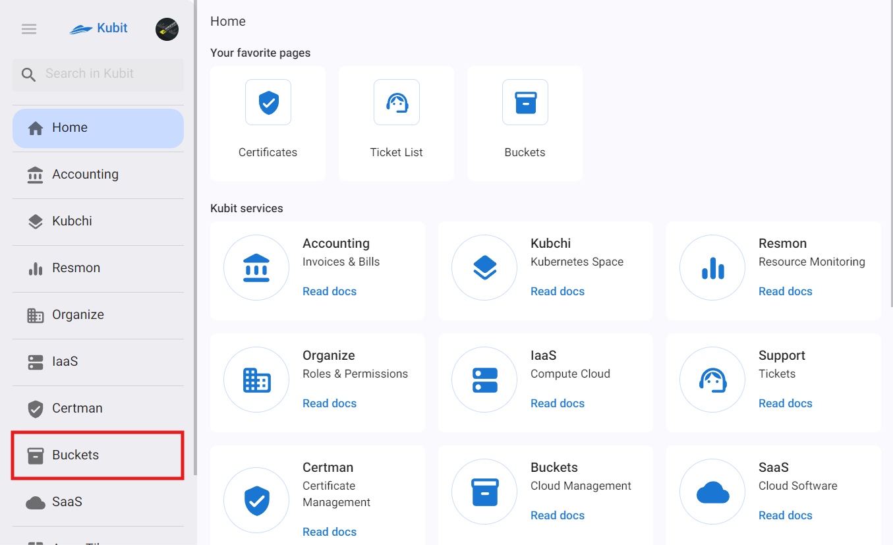

# Buckets (Cloud Storage)

Cloud storage is a service for storing and managing data in a cloud environment. This service provides secure storage for various types of files. Using this service, users can store their data in the Kubit cloud and access it anytime and anywhere.

## Basic Concepts

### Location

The data center where users' data is stored and maintained corresponds to the concept of a location.

### Bucket

Buckets are the primary units for organizing data in cloud storage. Each bucket can contain a collection of files and folders, allowing for organized storage and management of data. Buckets are defined under a space.

### Space

A space is a collection of isolated buckets within a location. The concept of space is defined for segmentation and access management. To use the bucket service, there must be a space within a location that is connected to a project.

### Service Account

A service account is a concept and identity used to define access groups to spaces and buckets. For example, to assign restricted access (read-only) to individuals, a service account is used. Specifically, a service account is defined for the desired bucket according to the required access, and the access scope is defined in the bucket policy. By granting the created service account token to individuals, they can have restricted access to the bucket's files.

### Tag

In the storage service, a tag is a key-value pair assigned to a bucket for categorization, identification, and access management.

### Lifecycle

The lifecycle is a set of rules that automatically manage objects. These rules move objects between different storage classes and delete them after a certain period. This helps in cost savings and better data management.

### Versioning

Versioning allows for storing, retrieving, and restoring different versions of a file within a bucket. Once this feature is enabled, the bucket retains all versions of a file, even after it has been overwritten or deleted. This feature provides the ability to access and recover older versions when needed, protecting data from accidental deletion or modification. Additionally, it supports data recovery and tracking changes.
