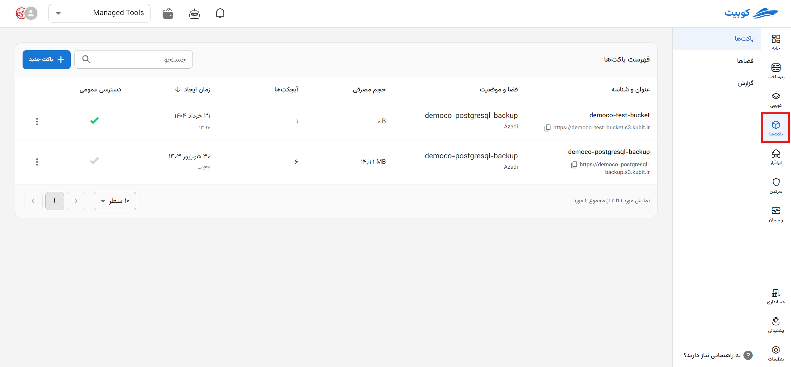

---
subDocuments:
  - concepts
  - getting-started
  - create-space
  - create-bucket
  - buckets
  - spaces
---

# Cloud Storage (Buckets)

**Bucket** or **S3-based cloud storage** is a service for **storing** and **retrieving** any type of data, including website assets, backups, data for cloud-based applications, and more. Unlike models such as File Storage (storing data in a hierarchical file structure like Windows File Explorer for organization) or Block Storage (storing data in fixed-size blocks for increased speed and efficiency), this service allows you to store data as **objects**, which can offer the advantages of both, plus the unique features of objects. Each object has an **identifier** as a unique **metadata** that can be used for better **access** and **categorization** of that object.

After creating your [account](../account) on the **Kubit** website and selecting the relevant [project](../organization), follow the step-by-step service guide below.

### Quick Access:

| [**Using the Web Browser**](buckets/browser#browser)                                 | [**Using the S3 Browser**](buckets/browser#s3browser)                           |
| ------------------------------------------------------------------------------------ | ------------------------------------------------------------------------------- |
| A web-based panel tool provided graphically for managing your files in cloud storage | A Windows tool that allows you to easily manage and access cloud storage files. |

:::info[Tools Compatible with Buckets]

Any tool compatible with **S3 storage** is also compatible with **Kubit buckets**.

:::

### Explanations and Step-by-Step Guides:

**\*You can find how to use buckets with code (SDK) in this [link](https://docs.aws.amazon.com/AmazonS3/latest/API/sdk-general-information-section.html). Python examples are also available in this [link](https://boto3.amazonaws.com/v1/documentation/api/latest/guide/s3-examples.html).**

- **Overview of [Buckets](buckets) and [Spaces](spaces)**: Dashboard providing general information about each bucket and space
- **[Buckets and Spaces](concepts)**: Exploring concepts related to S3-based services
- **[Static Website](buckets/static-website)**: Using cloud storage as a platform for websites
- **[Browsers](buckets/browser)**: Methods for accessing and managing files in storage
- **Access Management for [Buckets](buckets/access-settings) and [Spaces](spaces/access-settings)**: Managing user access levels through the account service
- **[Policy Management](buckets/policy) (Bucket Policy)**: Public permissions to specify object and bucket access levels when working with buckets
- **[Lifecycles](buckets/lifecycle) (Life Cycles)**: Rules for the retention of objects in buckets
- **[CORS Settings](buckets/cors)**: Sharing resources and objects with web browsers
