# Access Management

On the access management page, **access tokens** and a list of **service accounts** are available:
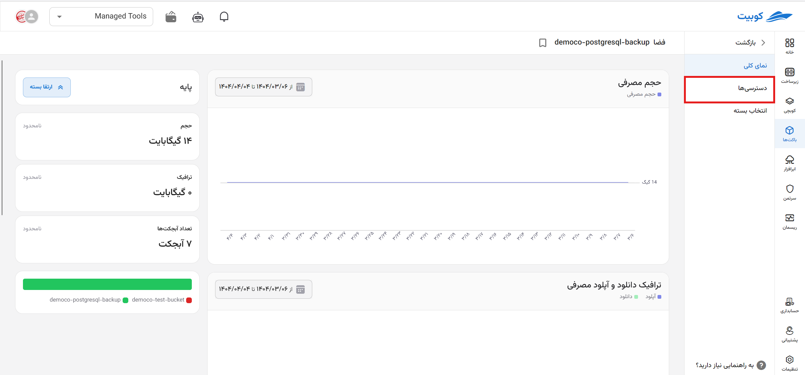

On this page, you will have access to **space access keys** and the **list of service accounts**:
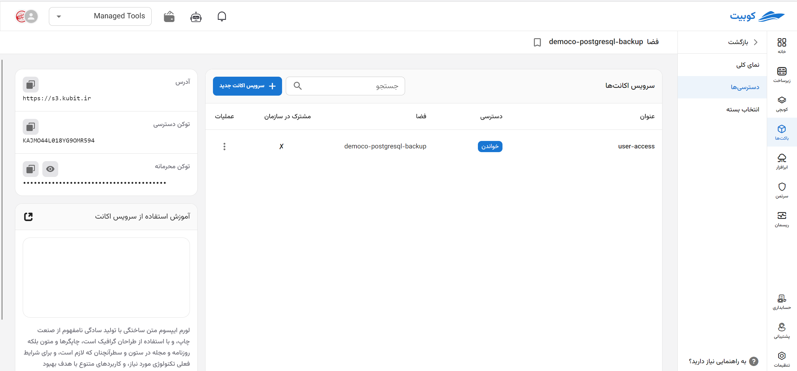

## Service Accounts

In this section, the list of available service accounts is displayed along with information such as **name**, **access status in the space**, **space name**, **shared within the organization**, and the option to **create a new service account**.

### Creating a New Service Account

To create a service account for this space, click on the **Create New Service Account** button:
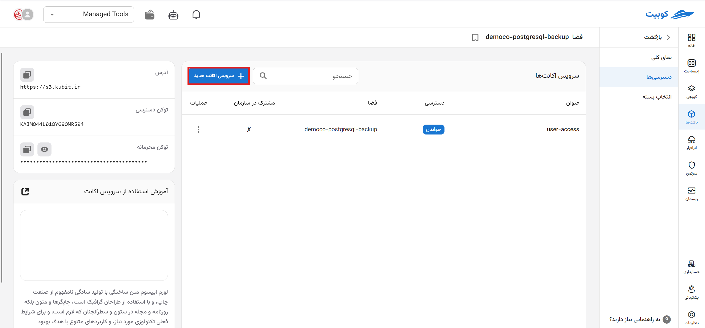

Enter the **name** and select the type of **access**:
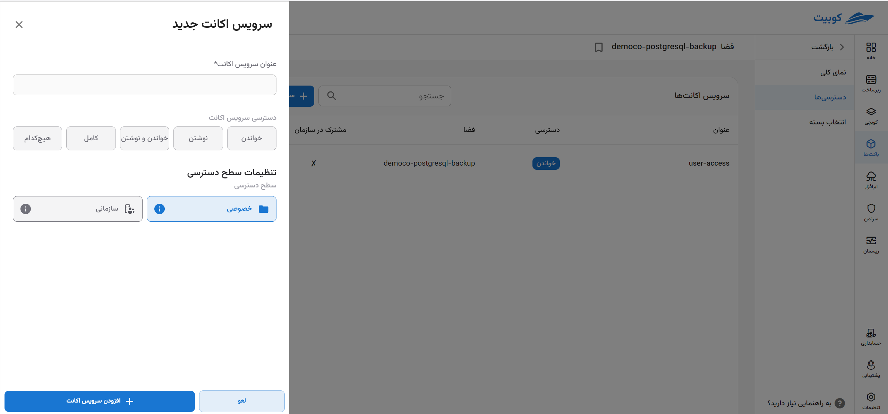

If you wish to share the service account at the organization level, select the **Shared within the organization** option and click **Create**:

The service account with the defined access level for the selected space will be created.

### Service Account Operations

In the operations column, via the three-dot button, a list of available operations for each service account is provided:
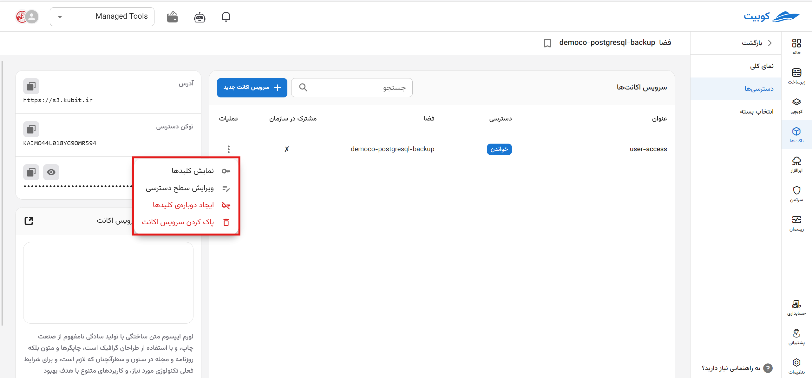

#### Display Keys

- First, click on the **Display Keys** option.
- A window containing the Access Key and Secret Key unique to the selected service account will be displayed.
  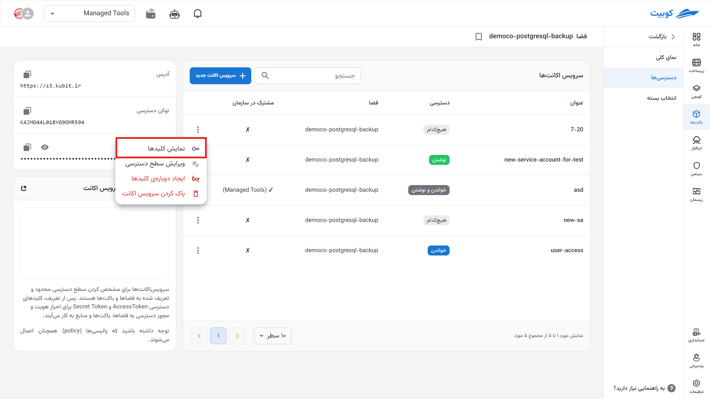
  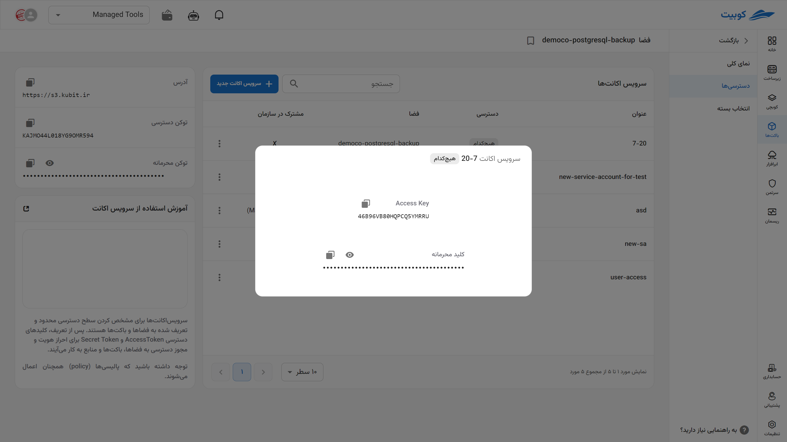

#### Edit Access Level

- First, click on the **Edit Access Level** option.
- Then, select the desired access level from the list of access levels.
- Finally, to update the access level, click **Update Access Level**.
  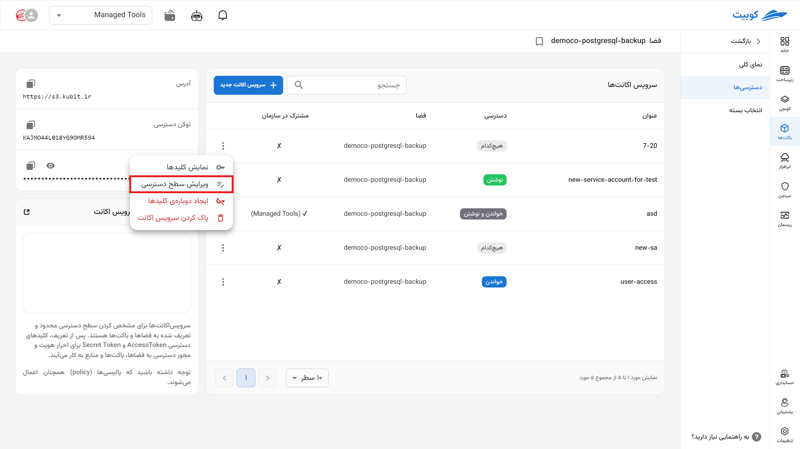
  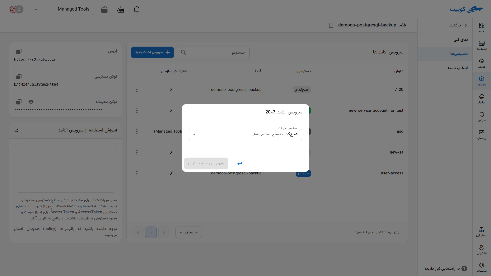
  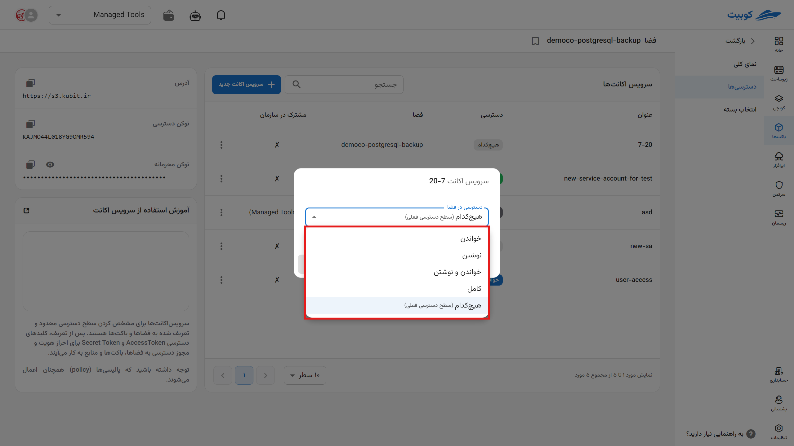

#### Regenerate Keys

This operation invalidates the current service account keys and replaces them with new ones.

- First, click on the **Regenerate Keys** option.
- If you are sure about performing this operation, click **Regenerate Keys**.
  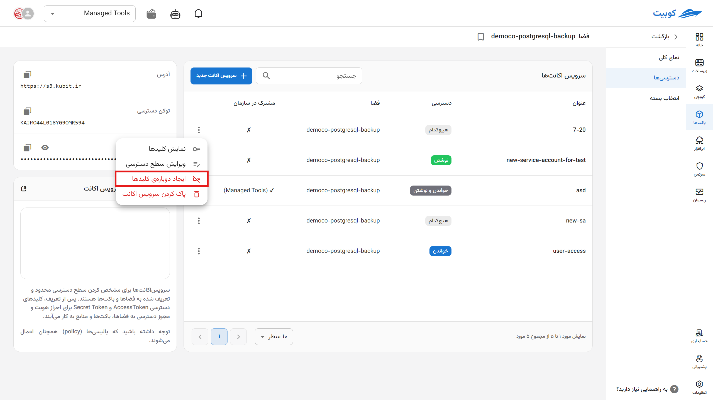

#### Delete Service Account

- First, click on the **Delete Service Account** option.
- If you wish to delete the service account from the buckets as well, select the **Remove Service Account from Buckets in this Space** option.
- Finally, to perform the deletion operation, click **Delete Service Account**.
  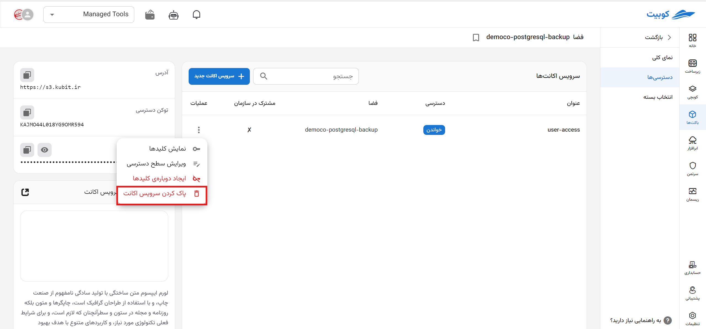
  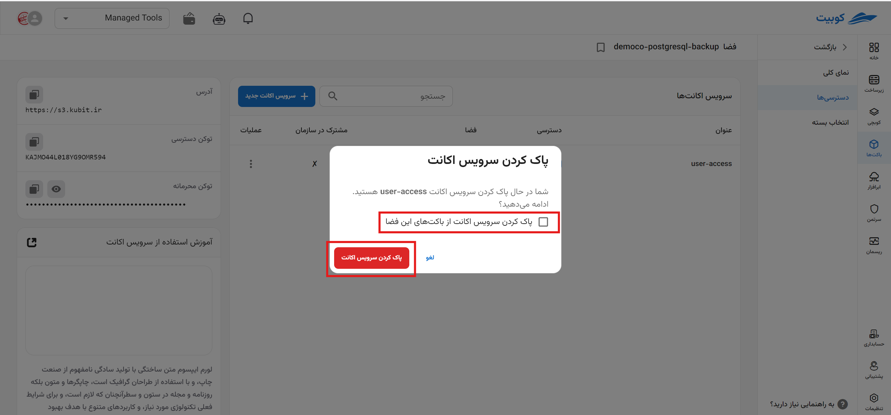
