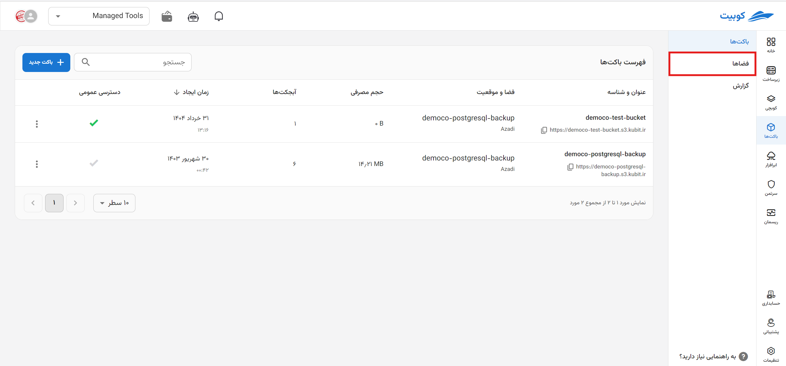
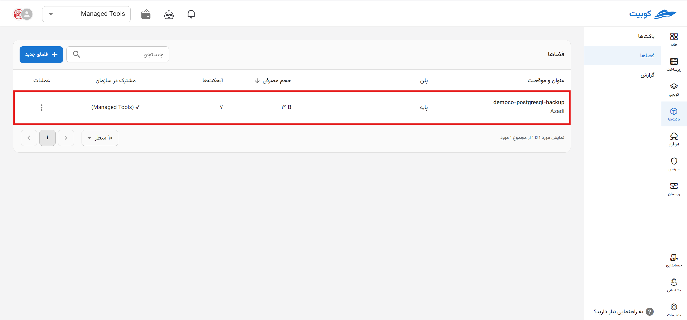
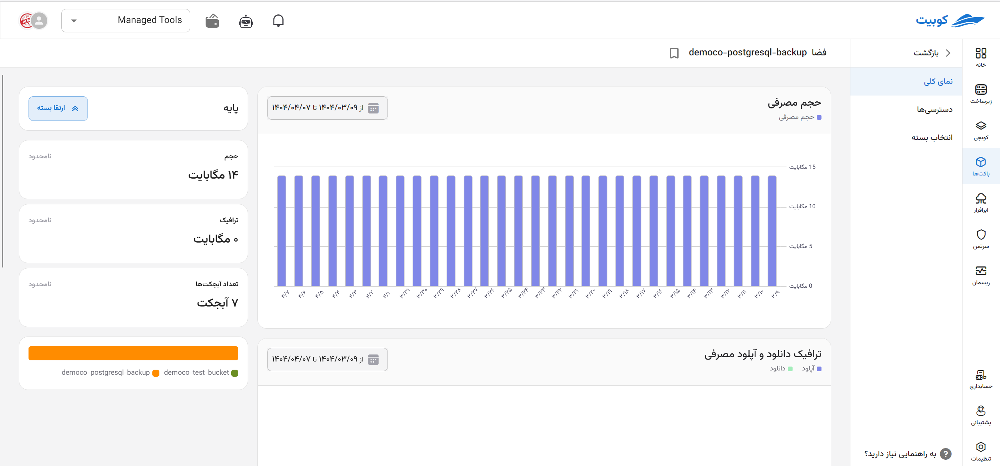
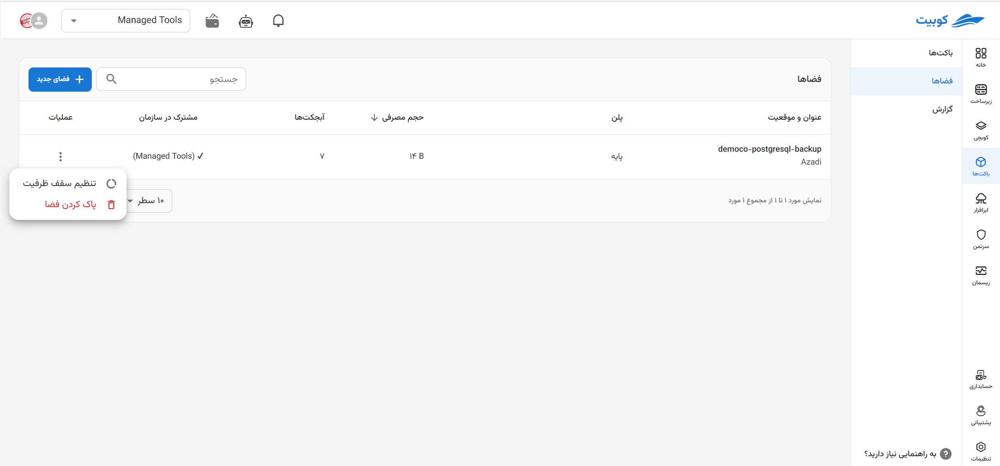
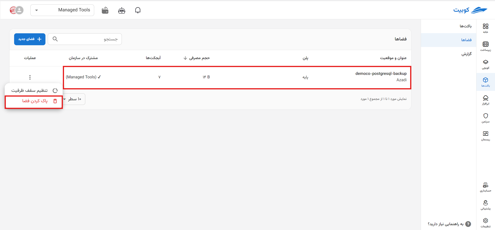
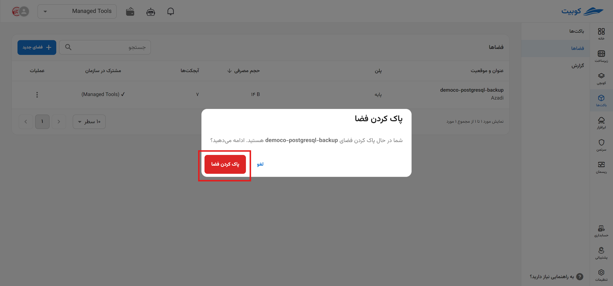
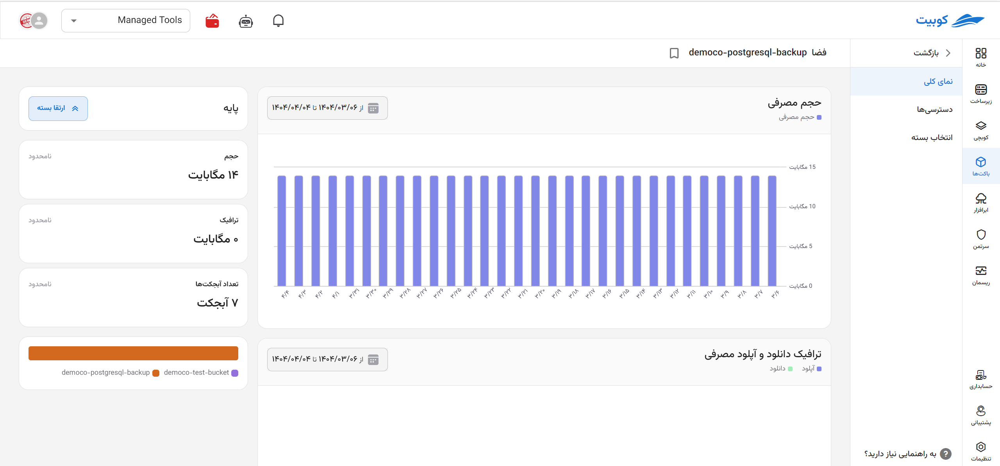
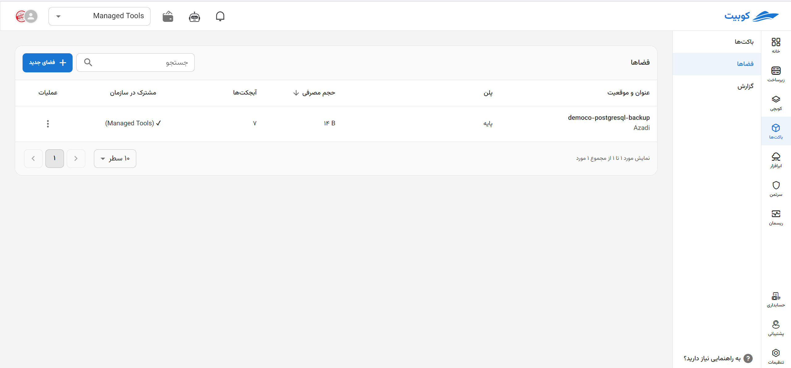

---
subDocuments:
  - access-settings
---

# Space Management

On this page, a report chart of the organization's storage space status includes **the number of buckets**, **used storage size**, **upload traffic**, and **download traffic**, along with the **list of organization spaces** (spaces of the selected project and spaces shared within the organization).

From the bucket service page, after [connecting](../getting-started#bind-project) / [selecting](../getting-started#select-project) a project, click on **Spaces**:

As you can see, the spaces page includes a report chart for different time periods:

## List of Spaces

The list of spaces for the selected project is also visible at the bottom of the page. This list includes information such as **location**, **size**, and **shared within the organization** for each space:

## Operations for Each Space

In the operations column, via the three-dot button, a list of available operations for each space is provided. Clicking on any of them will direct you to the relevant page/dialog:

### Deleting a Space

:::warning[Space Deletion Restriction]
If there are buckets in the selected space, it cannot be deleted. To delete the space, first remove the buckets within it.
:::

- To delete a space, click on the three-dot button for the respective space and select the **Delete Space** option.
- Then, click **Delete** to remove the space.
  
  

### Overview

List of buckets in the space:

By clicking on the name of any bucket, you will be redirected to the [Bucket Browser](../buckets/browser) page:

