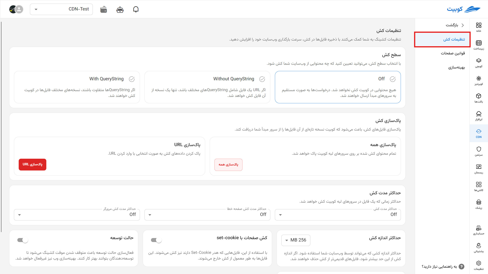

---
subDocuments:
  - rules
  - optimization
---

# CDN Settings (Step Two)

In this section, you can configure the rules and settings related to how the CDN operates to accelerate your website.

## Cache Operation Level

By selecting the cache level in Kubit, you can precisely determine which content from your site is cached at Kubit's Network Edge. This significantly increases response speed to users, reduces server resource consumption, and provides a smoother user experience.

1. **Off**
   In this mode, no content is cached on Kubit servers. All requests are directed straight to your origin servers. This option is suitable for situations where you prefer not to use caching, such as during specific development or troubleshooting phases.
2. **No QueryString**
   The "No QueryString" concept means that Kubit ignores URL parameters (e.g., `?v=2` or `?utm_source=...`) when caching files and stores them based solely on the main file path. This prevents caching duplicate versions of a file due to parameter differences, ultimately reducing cache memory usage and improving efficiency. This option is useful when URL parameters are used for analytics, tracking, or browser cache busting but do not alter the file's actual content. For example, static files like CSS and JS, which rarely change, internal page links, or links with discount or referral codes pointing to the same file, should ideally be cached only once.

   - **Caching Low-Change Files:** Static files like CSS or JS that rarely change.
   - **Avoiding Duplicate Content Caching:** Ignoring marketing or tracking queries like `utm_source`, `referral_code`, or other parameters that do not alter file content.

3. **With QueryString**
   In this mode, a separate cached version is created for each unique combination of URL parameters. This is suitable for cases where parameters genuinely change the page or file content. Its advantage is high accuracy in caching variable and personalized content. Suggested use cases:

   - **Search Results:** Caching frequently repeated queries for faster response.
   - **Paginated Pages:** Like `?page=2` or `?limit=50` to avoid repeated content generation.
   - **Filters in Stores:** Like `?category=shoes&color=black`, where each filter displays a new content combination.

## Clearing Cached Data

This essential feature in Kubit allows you to clear cached data whenever needed, enabling you to publish updated versions of your content from the origin server.

- **Selective Clearing by URL**
  Simply enter the exact URL of the file or page that needs updating to clear its cache selectively. This method is highly practical for quickly deploying changes without clearing the entire site cache.
- **Clear Everything**
  With one click, all cached data on the Kubit network is deleted, and from that moment, all requests are served directly from the origin server. This option is typically used in critical situations or major updates.

## Cache Data Expiration Duration

You can specify how long each type of content remains in Kubit's cache. This duration is flexibly adjustable and plays a key role in balancing content freshness with optimized performance.

## Caching Error Pages

In case of HTTP errors like 404 (Not Found) or 500 (Internal Server Error), Kubit can cache error responses for a specified duration. This prevents repeated requests to the origin server and helps reduce server load during critical situations, such as temporary site outages or sudden traffic spikes.

However, choosing the cache duration for such errors requires caution. For example, if a page like a product or category, which is usually accessible, temporarily returns an error, it should not be cached for too long, as these pages are likely to recover quickly.

Thus, precisely setting the cache duration for each error type can improve user experience and maintain server infrastructure health.

## Browser Cache Duration

In addition to Kubit's caching, you can also set how long files are stored in the end user's browser cache. This increases page load speed on subsequent visits and reduces bandwidth consumption.

## Maximum Cache Size

Each file or content can be cached up to a specific size limit. By increasing this size, larger files like videos or advanced web applications can also be cached on Kubit.

Available values: `127MB` | `256MB` | `512MB` | `2048MB`

## Always Online

By enabling this feature, if your server or site goes down, Kubit can display the last cached version of pages to visitors. This is particularly useful during power outages, DDoS attacks, or unexpected updates, ensuring user experience stability.

## Caching Pages with Set-Cookie

By default, pages with the `Set-Cookie` header (e.g., for logged-in users) are not cached. Enabling this option allows caching such pages, though careful management of security and content updates is required.

## Development Mode

During site development or frequent changes, caching may cause outdated versions to be displayed. By enabling this mode, all caches are temporarily disabled, and changes are shown instantly. This feature is invaluable for web developers.
