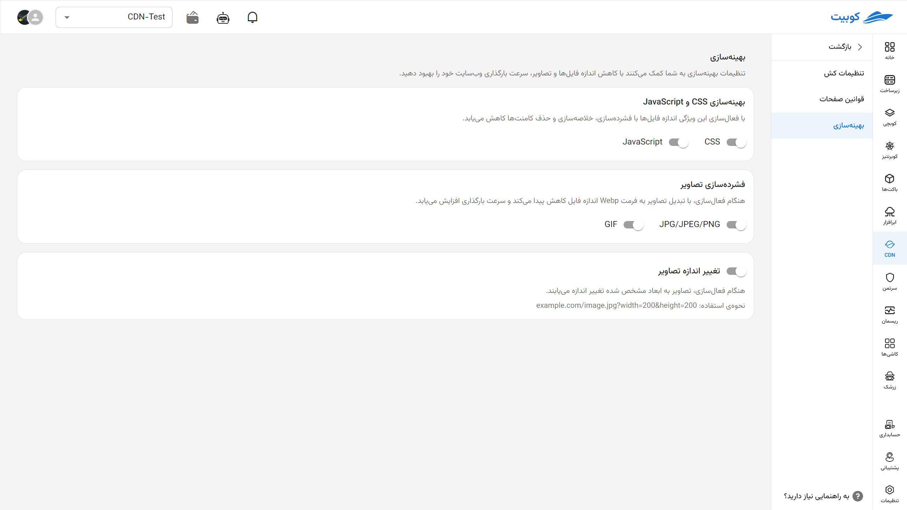

# بهینه‌سازی

در این بخش، مجموعه‌ای از قابلیت‌های کاربردی و خودکار برای بهینه‌سازی عملکرد کل زیرصفحات وب‌سایت شما فراهم شده است. با فعال‌سازی این ویژگی‌ها می‌توانید سرعت بارگذاری و تجربه کاربری وب‌سایت خود را به‌صورت چشم‌گیری افزایش دهید.

:::tip[شمول و استثنای قوانین بهینه‌سازی]
قوانینی که در این تب اعمال می‌کنید **به‌صورت سراسری روی تمام صفحات وب‌سایت شما** اثر می‌گذارند.  
در صورتی‌که نیاز دارید **صفحات خاصی را از این قوانین مستثنا کنید** یا **تنظیمات جداگانه‌ای اعمال کنید**، لطفاً به بخش [قوانین](../rules) مراجعه کنید.
:::

## موارد قابل بهینه‌سازی

### بهینه‌سازی CSS و JavaScript

با فعال‌سازی این ویژگی، فایل‌های CSS و JavaScript شما به صورت خودکار بهینه‌سازی می‌شوند. این بهینه‌سازی شامل فشرده‌سازی، حذف فضاهای خالی و کامنت‌ها، و گاهی ترکیب فایل‌ها است که باعث کاهش حجم کلی منابع می‌شود و در نتیجه، زمان بارگذاری صفحات وب‌سایت کاهش می‌یابد.

### فشرده‌سازی فایل‌های CSS

تمام فایل‌های CSS با حذف فاصله‌های اضافی، خطوط خالی و توضیحات (کامنت‌ها) سبک‌تر شده و سریع‌تر بارگذاری می‌شوند.

### فشرده‌سازی فایل‌های JavaScript

اسکریپت‌های JavaScript نیز به همان شیوه فشرده می‌شوند تا حجم کلی فایل کاهش یابد. این کار در عملکرد کلاینت مؤثر است و سرعت بارگذاری را بهبود می‌دهد.

### فشرده‌سازی تصاویر

با فعال‌سازی این گزینه، تصاویر به صورت خودکار به فرمت‌های مدرن‌تر و کم‌حجم‌تری مانند WebP تبدیل می‌شوند. این کار بدون افت محسوس کیفیت، حجم تصاویر را کاهش داده و تجربه کاربری را بهبود می‌بخشد.
تصاویر با فرمت‌ JPG/JPEG/PNG به WebP یا فرمت‌های مشابه تبدیل می‌شوند تا حجم آن‌ها کاهش یابد.
تصاویر متحرک GIF نیز فشرده شده یا به فرمت‌های جایگزین با عملکرد بهتر تبدیل می‌شوند تا مصرف پهنای باند کاهش پیدا کند.

### تغییر اندازه تصاویر

با فعال‌سازی این گزینه، اندازه تصاویر آپلود‌شده یا موجود در وب‌سایت به ابعاد مشخص‌شده (مثلاً بر اساس نوع دستگاه یا طراحی قالب) تغییر می‌یابند. این کار باعث می‌شود تنها تصویری با اندازه مناسب بر اساس درخواست در لحظه (on-the-fly) برای نمایش بارگذاری شود و از لود شدن سایز نامناسب جلوگیری گردد. مزایای این امر شامل کاهش حجم صفحه، بهبود عملکرد در موبایل و تبلت، مصرف کمتر از پهنای باند کاربر، سرعت بالاتر بارگذاری و امتیاز بهتر در PageSpeed می‌باشند.

مثال‌های سیستم تغییر اندازه تصویر on-the-fly:

| نوع درخواست | توضیحات                                                                                            | مثال                                                                                             |
| ----------- | -------------------------------------------------------------------------------------------------- | ------------------------------------------------------------------------------------------------ |
| crop        | `x,y`: مختصات گوشه‌ی مستطیل برش‌خورده در تصویر ورودی `width, height`: عرض و ارتفاع تصویر برش‌خورده | `https://pa.th/to/image.png?commands=crop=x:y::widthxheight`                                     |
| grayscale   | تبدیل تصویر به سیاه و سفید (سطوح خاکستری)                                                          | `https://pa.th/to/image.png?commands=grayscale`                                                  |
| rotate      | چرخاندن تصویر در جهت ساعت‌گرد                                                                      | `https://pa.th/to/image.png?commands=rotate=degree`                                              |
| blur        | `degree`: میزان تاری تصویر                                                                         | `https://pa.th/to/image.png?commands=blur=degree`                                                |
| resize      | `width, height`: عرض و ارتفاع تصویر خروجی                                                          | `https://pa.th/to/image.png?commands=resize=widthxheight`                                        |
| pipe        | اجرای زنجیره‌ای چند فرمان با جدا کردن آن‌ها با ویرگول (`,`)                                        | `https://pa.th/to/image.png?commands=crop=150:150::200x200,grayscale,blur=1,rotate=10,rotate=40` |
