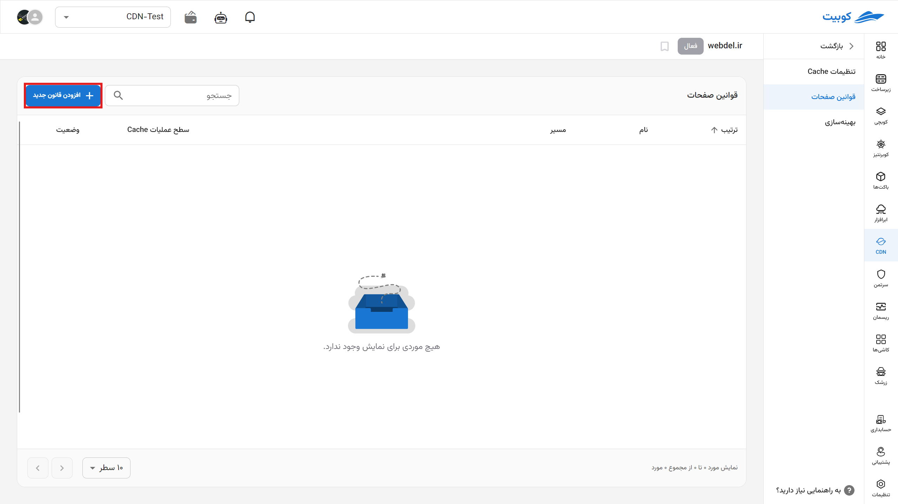
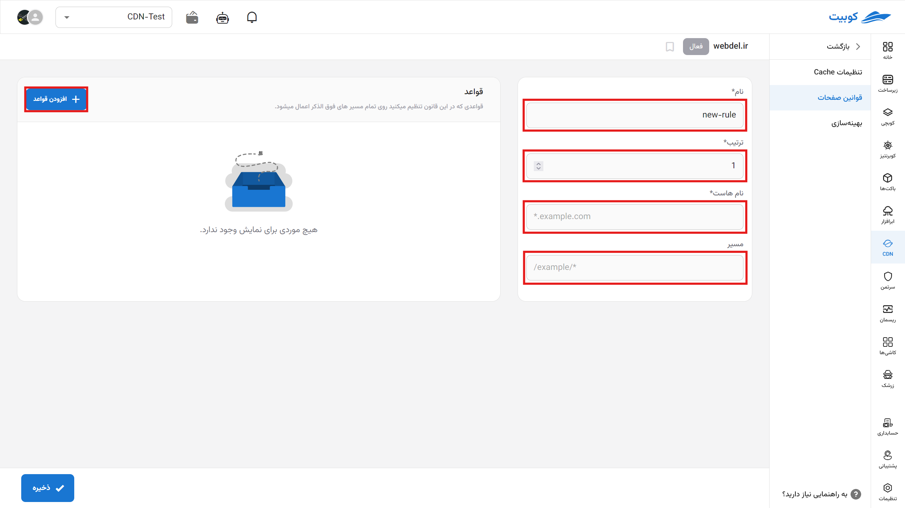

# Page Rules

In this section, specify the CDN rules and manage website traffic more effectively by adding new rules.

## Adding a New Rule

To add a new rule, click on "Add New Rule" from this tab.

In this section, we can view the details related to rule execution:

- Rule Name
- Execution Order (descending, lower value executed first)
- Hostname
- Path
  

By selecting the **Add Rules** option, we can view the list of rules in this section and choose one based on our needs.

## List of Page Rules

### Cache

#### Cache Policies

Enables configuration of caching policies, including the following:

- **Cache Type** (e.g., temporary or permanent cache)
- **Behavior Toward Query String** (caching different versions based on URL parameters)
- **Content Expiration Duration**
- **Behavior During Errors**
- **Impact of Cookie Variables on Cache**

#### Browser Cache

Determines how long files are stored in the user's browser cache to prevent repeated server requests. This reduces bandwidth usage and improves site speed.

### Optimization

#### File Compression

By compressing CSS, JavaScript, and HTML files, content size is reduced, and page load times are shortened.

#### Image Size Reduction

Images are automatically compressed or optimized to reduce their size without noticeable quality loss.

#### Image Resizing

Images are dynamically resized based on the visitor's device dimensions (e.g., mobile or desktop). This reduces server load and enhances user experience.

### Origin Cache Control

Determines how the CDN follows caching instructions sent from the origin server. These settings specify whether headers like `Cache-Control` and `Expires` from the origin are honored or not.

### HTTP Headers

#### Custom Host Header

Allows setting a custom value for the `Host` header when sending requests to the origin server. This feature can be useful in advanced setups, such as accessing separate resources or testing different environments.

#### Headers Sent to the User

Controls HTTP headers sent from the CDN to the user's browser, such as:

- `Cache-Control` (controls cache behavior in the browser)
- `Content-Type` (content type)
- `Access-Control-Allow-Origin` (for CORS)

#### Headers Sent to the Origin

Enables setting or adding HTTP headers when sending requests to the origin server, such as:

- `Authorization`
- `X-Forwarded-For`
- `User-Agent`

#### Ignoring Headers Sent to the User

All or some headers sent from the origin to the user are ignored, and the CDN's default values are used instead.

#### Ignoring Headers Sent to the Origin

This setting specifies that when sending requests from the CDN to the origin server, default headers are used instead of headers customized by the browser or client.

### URL Redirection

Configures URL redirection behavior for cases such as:

- Redirecting from an old domain to a new one
- Changing URL structure
- Redirecting from HTTP to HTTPS (or vice versa)

### Timeouts

Sets time limits for communication between the CDN and the origin server, including:

- **Connection Timeout**: Maximum time to wait for a connection to the server
- **Read Timeout**: Maximum time to wait for a response from the server
- **Send Timeout**: Maximum time allowed for sending data

### Cache by Device Type

Caches different content for various devices (mobile, tablet, desktop) to deliver optimized versions for each display type. This feature is highly beneficial for sites with responsive design.
