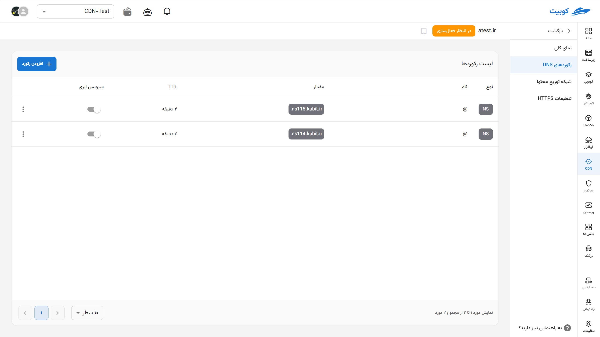
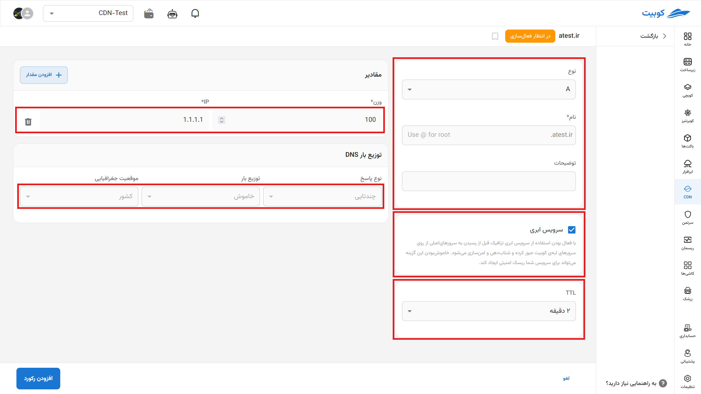
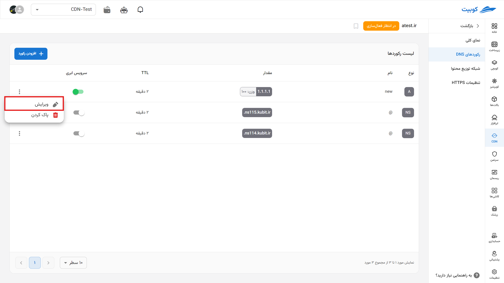

# DNS Settings or Domain Name System (Step One)

In this section, you can view your registered DNS records, edit them, or add a new one.

## Setting Up a New Record

To set up a new record, first click on "New Record."

Then fill in the options with the required values:

- Specify the record type.
- Optimize the TTL setting.
- Configure the remaining fields based on the record type.
- In the last field, enter a description for this record.
- 

## Editing a Record

By clicking on the desired record, you can edit its settings as described above.

## Record Type Settings

| Record Type | Description                                                                                                                                                                                                                                                       |
| ----------- | ----------------------------------------------------------------------------------------------------------------------------------------------------------------------------------------------------------------------------------------------------------------- |
| **A**       | The A (Address Record) is one of the most commonly used DNS records, mapping a domain name to an IPv4 address. When a user enters a domain name like `example.com`, this record tells the browser which IP address (e.g., `192.0.2.1`) to access.                 |
| **AAAA**    | Similar to the A record, the AAAA record maps a domain name to an **IPv6** address. With the increasing use of IPv6, this record has gained greater importance.                                                                                                   |
| **ANAME**   | This record combines features of A and CNAME records. Unlike CNAME, which is not allowed at the domain root, ANAME can be used at the root and is automatically resolved to an IP address. It is very useful for mapping the main (apex) domain to another name.  |
| **CAA**     | The CAA (Certification Authority Authorization) record specifies which certificate authorities are allowed to issue SSL certificates for your domain. This record prevents unauthorized certificate issuance and enhances site security.                          |
| **CNAME**   | The CNAME (Canonical Name) record redirects one domain to another. For example, if `blog.example.com` is a CNAME for `example-blog.host.com`, the browser will first go to the latter. It’s very useful for subdomains but should not be used at the domain root. |
| **MX**      | The MX (Mail Exchange) record determines which server handles emails sent to your domain. This record is essential for setting up email services like Gmail, Zoho, or Microsoft 365. Priority among multiple servers is set using the "priority" value.           |
| **NS**      | The NS (Name Server) record specifies which servers are responsible for responding to DNS requests for a domain. This record is fundamental to the DNS system’s operation, as it determines which DNS servers the domain is connected to.                         |
| **PTR**     | The PTR (Pointer) record is used in reverse DNS, mapping an IP address to a domain name. This record is particularly important for server authentication, especially in email servers.                                                                            |
| **SRV**     | The SRV record is used to define services like VoIP, messaging, or directories (e.g., LDAP). It includes information such as port number, priority, and weight, allowing applications to connect directly to the appropriate service.                             |
| **TLSA**    | Used in conjunction with the DANE protocol, the TLSA record enables verification of TLS certificates (e.g., for HTTPS) based on information published in DNS. Its goal is to enhance security and prevent attacks on the certificate chain.                       |
| **TXT**     | The TXT record allows the storage of text data in DNS. It is used for domain verification (e.g., for Google or Facebook), SPF, DKIM, and DMARC in email, as well as other custom information.                                                                     |
