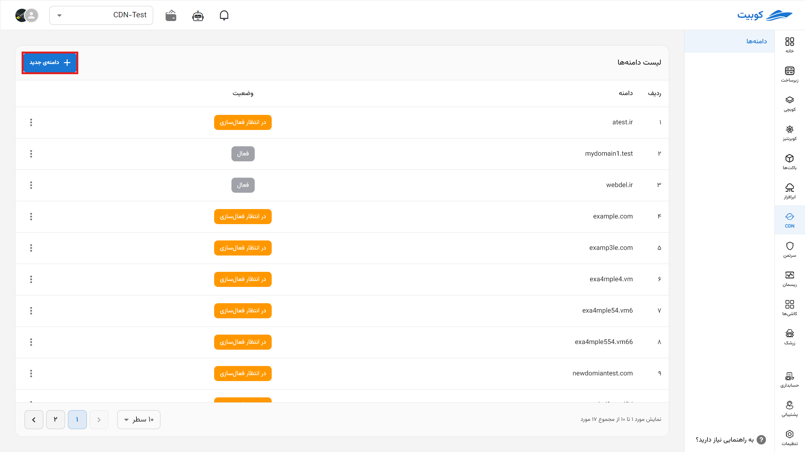
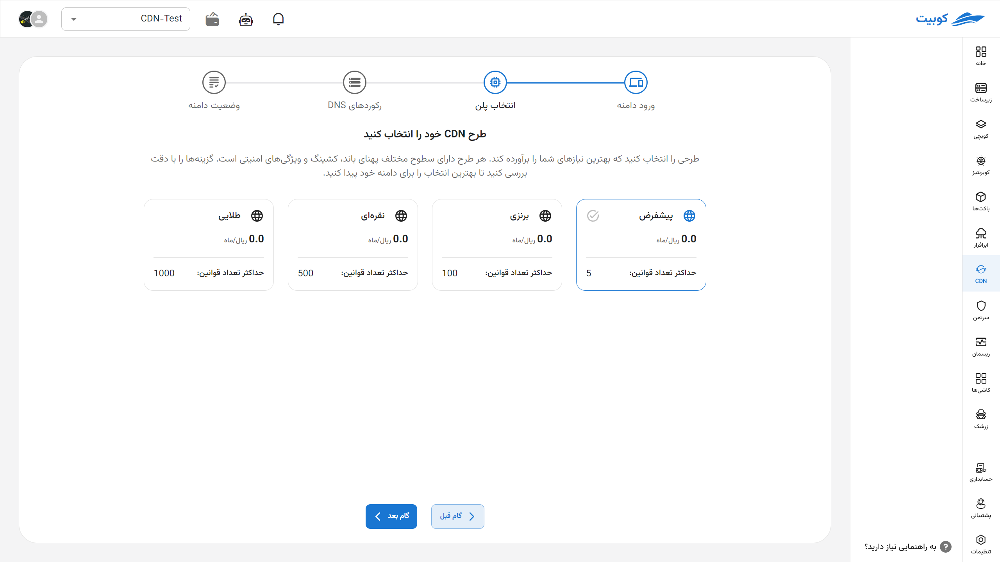
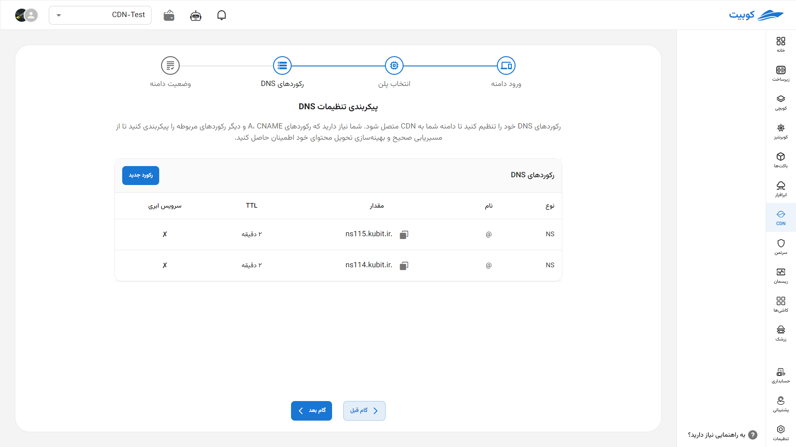
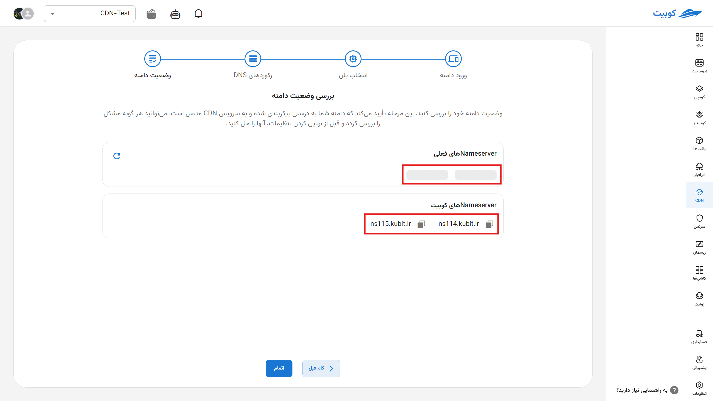
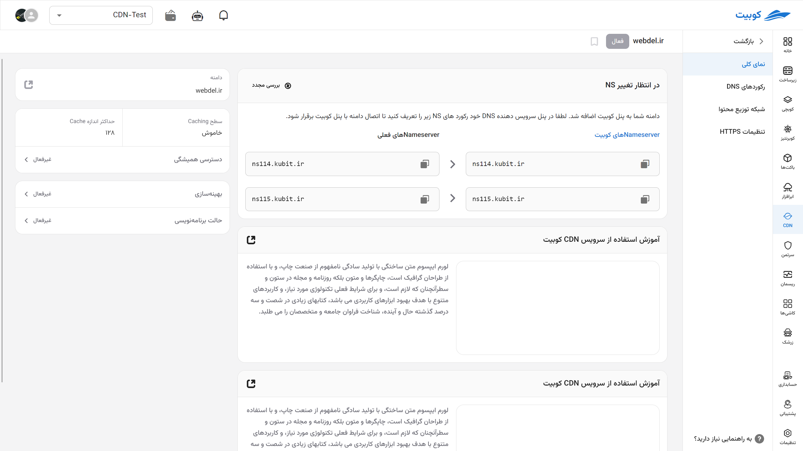
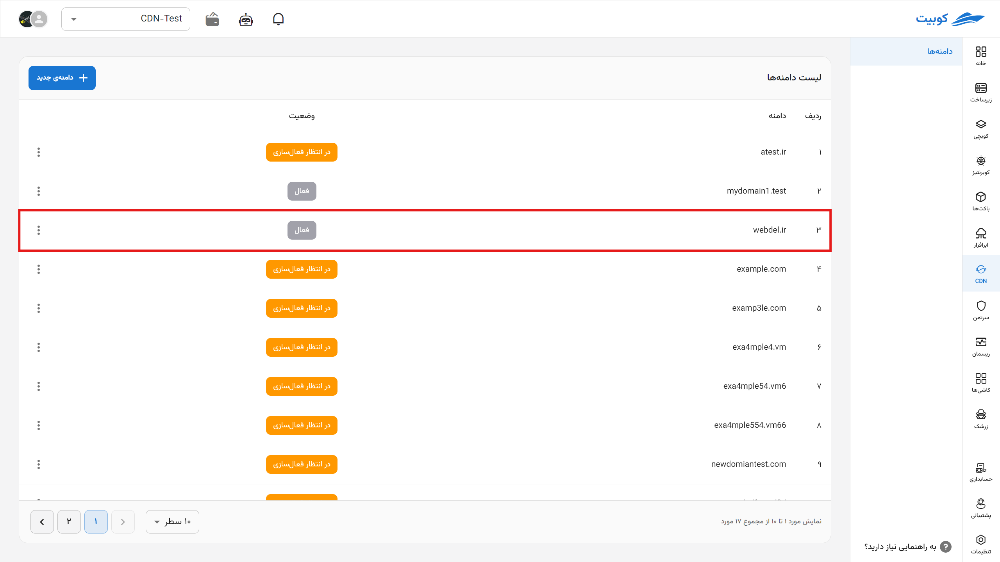
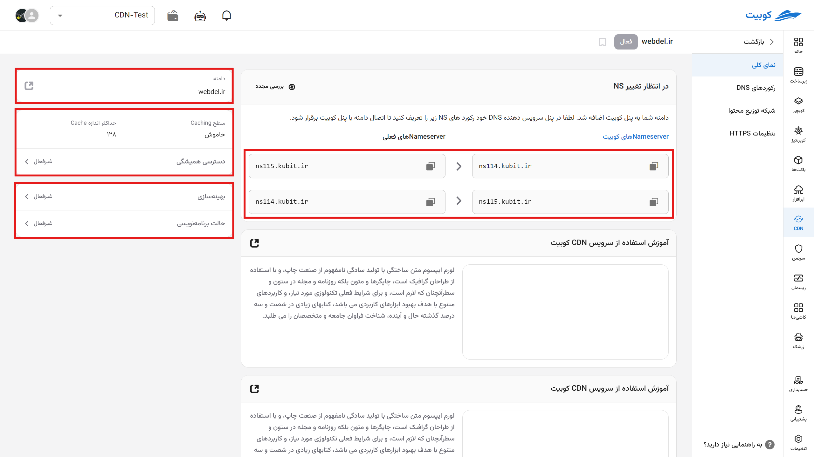

# Getting Started (Step Zero)

Log into your panel and click on **Add New Domain**.

## Domain Registration

To start using the service, you first need to register your own domain.

In the next step, select your plan.

In the DNS settings configuration section, set up your DNS records to connect your domain to the CDN; if any records already exist for the domain, they will be automatically detected and displayed. You then need to configure the A, CNAME, and other relevant records if they are not already set up to ensure proper routing and optimized content delivery. You can complete the remaining settings for this section later.

Register the NameServers (NS) provided by Kubit in your domain provider's panel. Then, check the status of your domain. This step confirms that your domain is correctly configured and connected to the CDN service.

You have now entered the domain settings overview section.

## Domain Overview

After selecting or creating a new domain,

In the domain overview section, you can:

1. View the status of your NameServers.
2. View your domain.
3. Cache information, including:
   - Cache level
   - Maximum cache size
4. Fine-tune optimization settings:
   - Optimization: Includes general settings applied to all subdomains
   - Programming mode: In this section, specify advanced optimization details
     

From this section, you can navigate to different tabs to:

- Configure [DNS records](dns) and register your subdomains.
- Specify [CDN settings](cdndns/cdn/index.md) to make access to your site faster and easier.
- Register an [HTTPS certificate](https) to establish a secure connection to your website and cache nodes.
