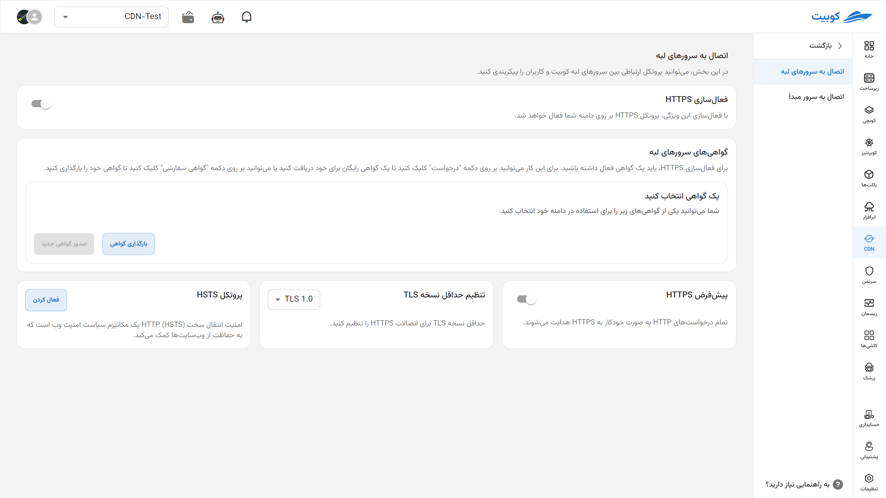

# HTTPS Settings

In this section, you can configure the communication protocols between the User Client, Edge Node, and Original Server to enhance the security of your users.

## Connection to Edge Servers

In this section, you can configure and set up the connection between end users and Kubit's edge servers.

### Enable HTTPS

By enabling this option, the connection between users and your domain will be established via the secure HTTPS protocol.

Unprotected connection mode (http):

Protected connection mode (https):

### Edge Server Security Certificates

To set up HTTPS, you need a valid certificate. You can click the "Request" button to obtain a free certificate or upload your own certificate using the "Custom Certificate" button.

### Certificate Selection

Choose one of the available certificates to enable HTTPS on your domain.

### Default Redirect to HTTPS

By enabling this feature, all HTTP requests will automatically be redirected to the secure HTTPS version.

### Set Minimum TLS Version

In this section, you can specify the minimum TLS version allowed for HTTPS communications.

### Enable HSTS

HSTS (HTTP Strict Transport Security) is a security policy that requires browsers to always use HTTPS to access the website. This feature plays a significant role in enhancing communication security.

## Connection to Origin Server

In this section, you can configure the communication protocol between Kubit's edge servers and your origin server.

### Communication Protocol Between Edge Servers and Origin Server

By enabling this option, you can determine the communication method between Kubit's edge servers and your origin server. This connection can be set to automatic, HTTP only, or HTTPS only. In automatic mode, the protocol used to communicate with the origin server is selected based on the protocol the user used when sending the request to Kubit's servers. This setting manages the default and overall behavior of communication between servers.

Unprotected connection mode (http):

Protected connection mode (https):

