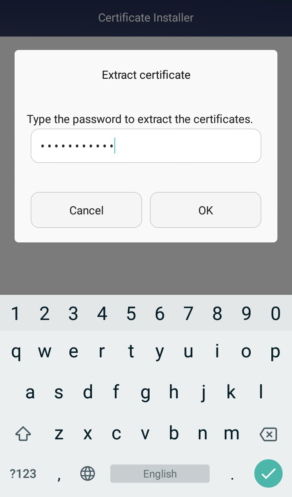
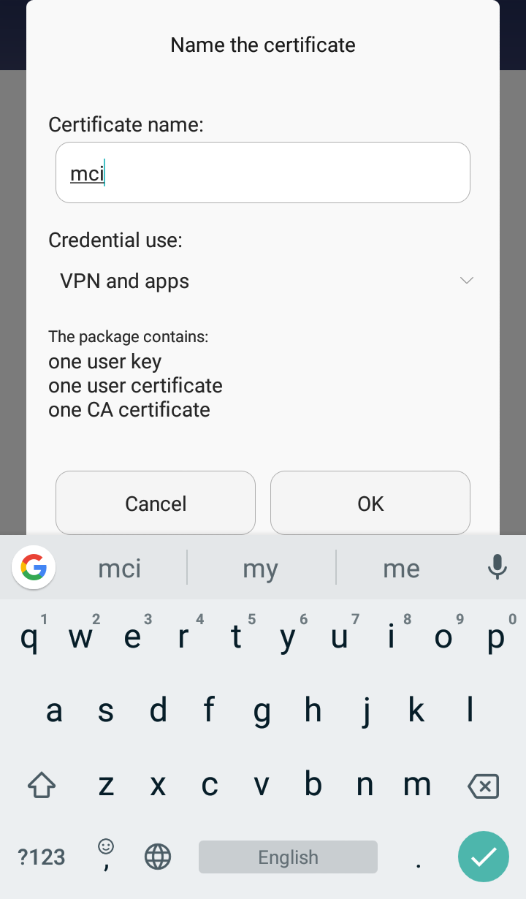
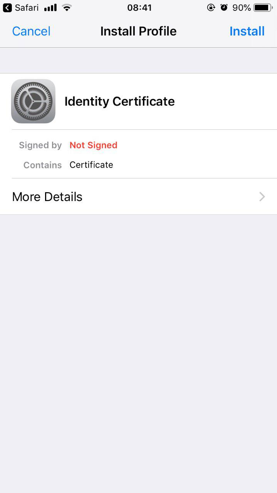
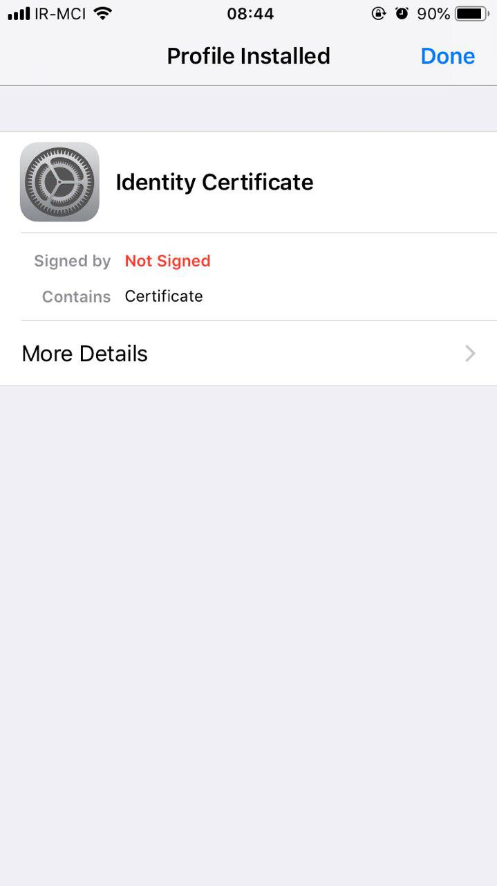

# Certificate Installation

The guide for installing on [browser](#install), [Android](#android), and [iOS](#iphone) is described in this section.

## Installing the Certificate on the Browser {#install}

To install the certificate on your browser, after obtaining it from the Certman system, go to the relevant section based on your browser type and follow the instructions. Note that the password for the client certificate is your registered phone number in the system.

:::caution[Note]
You are fully responsible for the use of the Certificate file and its password. Therefore, never share it with others.
:::

:::tip[Tip]
The certificate password is your registered phone number.
:::

### Installing the Certificate on Chrome {#chrome}

To install the certificate on Chrome, follow these steps:

- Go to the browser settings.
- From the left menu, select _Privacy and security_.
- As shown below, go to the _Security_ section.

- At the bottom of this section, select _Manage certificates_.
- In the _Your certificates_ tab, use the _Import_ button to select the certificate file obtained from Certman, and after entering the password, the certificate installation on Chrome will be complete.

### Installing the Certificate on Firefox {#firefox}

To install the certificate on Firefox, follow these steps:

- Go to the browser settings.
- From the left menu, select _Privacy & Security_.
- As shown in the image below, at the bottom of this section, click the _View Certificates_ button under the _Security_ title.

- In the opened dialog, use the _Import_ button to select the certificate file obtained from Certman, and after entering the password, the certificate installation on Firefox will be complete.

## Installing the Certificate on Android {#android}

### Opening the Certificate File and Entering Its Password

After the download is complete, open the Certificate file. Then, in the opened window, enter your _Password_ and select the confirmation button.

### Setting a Name and Selecting Usage Type

In the next step, enter a name and select _apps_ as the usage type.

#### Restarting the Browser

Then, completely close your browser and reopen it.

### Visiting the Desired Service Address and Selecting the Installed Certificate

Now, go to the desired service address, and in the opened window, select the Certificate and press the _Allow_ button.

### Accessing the Desired Service

The desired address is now accessible to you.

## Installing the Certificate on iPhone {#iphone}

### Opening the Certificate File and Selecting the Allow Option

After the download is complete, open the Certificate file. Then, in the opened window, select the _Allow_ option.

### Selecting the Install Option

In the opened page, select the _Install_ option.

### Entering the Certificate File Password

In the next step, enter your _Password_.

### Selecting the Done Option

By selecting the _Done_ option, the installation process is complete.

### Accessing the Desired Service

The desired address is now accessible to you.
