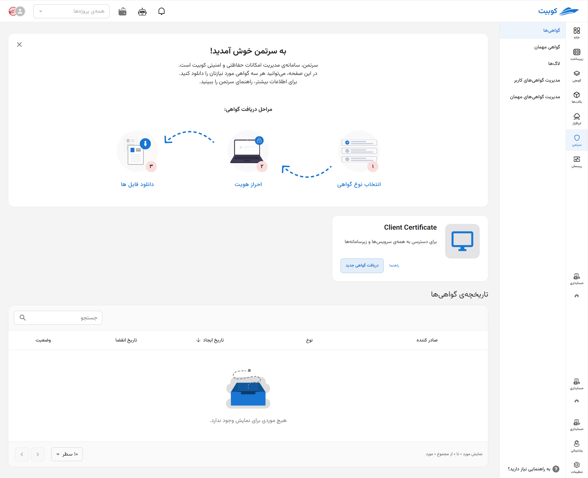
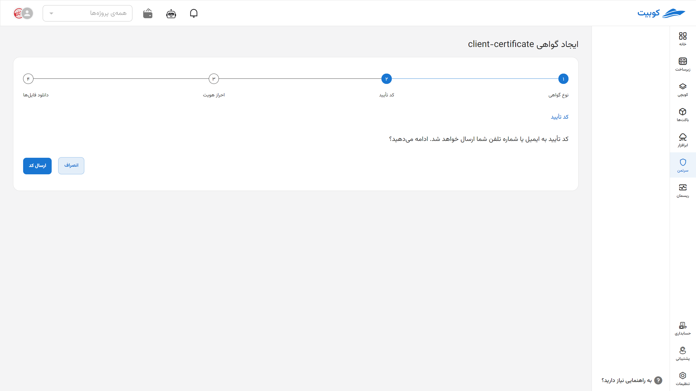
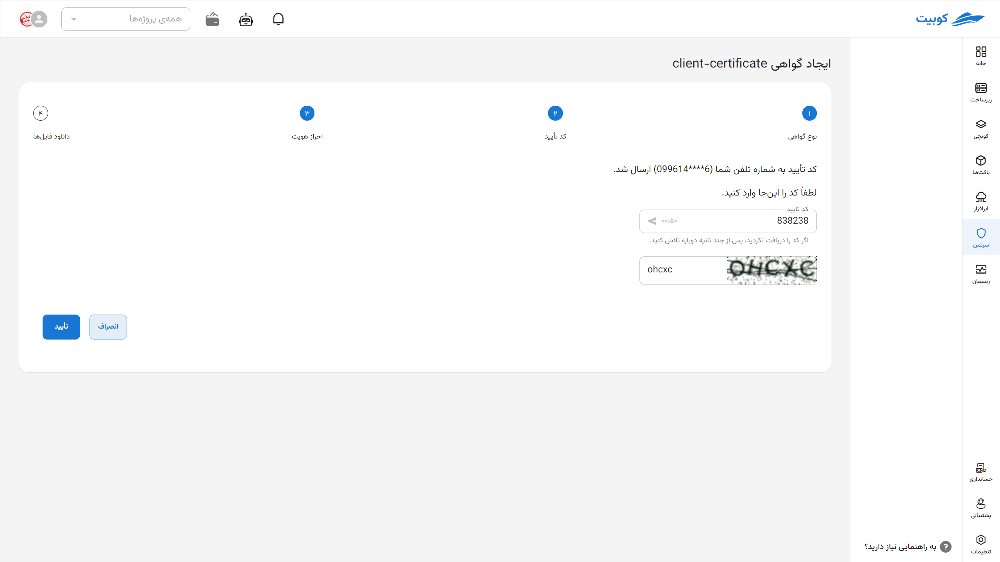
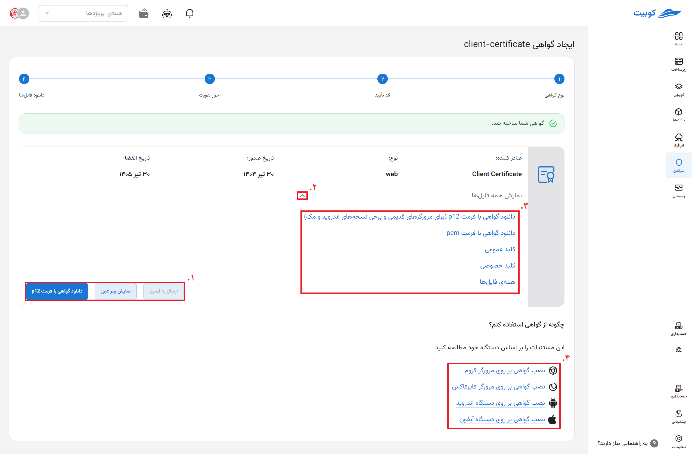
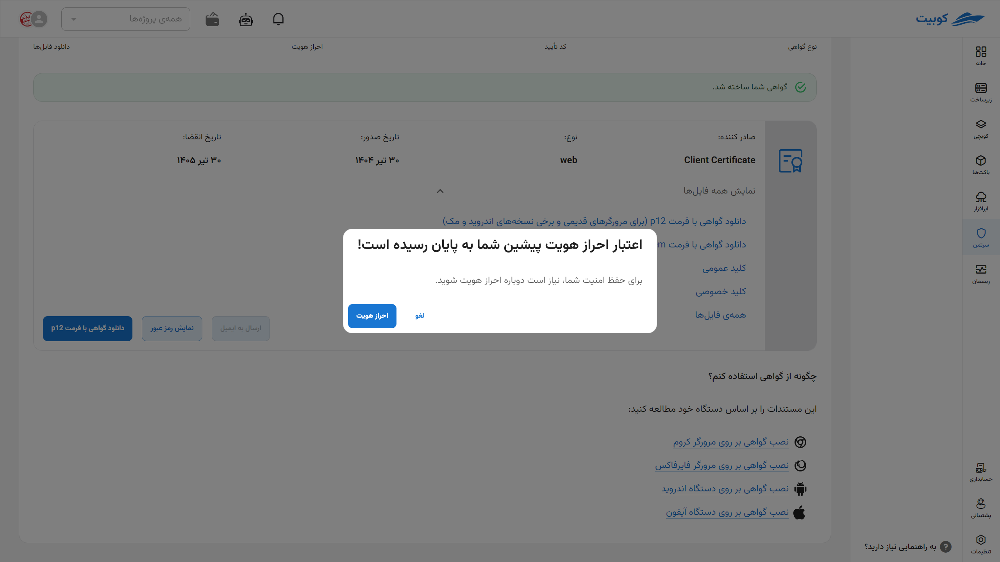
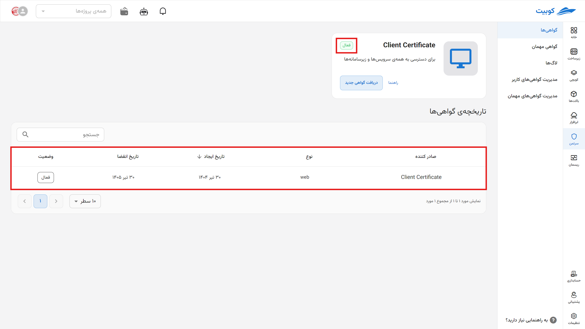
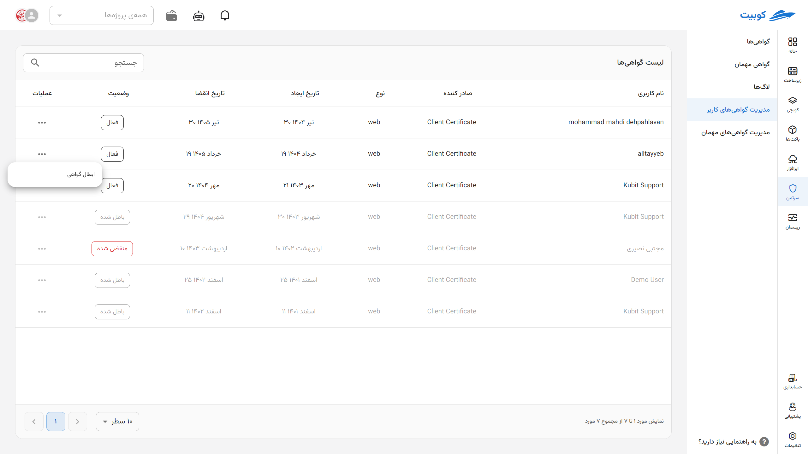

# Certificates

In this section, explanations regarding [various certificates](#certs-intro) and [how to create](#cert-issue) them are provided.

## Types of Certificates in Kubit {#certs-intro}

### Client Certificate {#client-cert}

By default, all Kubit services and subsystems are behind a security layer. To bypass the security layer and access any of the subsystems, the user must install the required certificate on their browser. This certificate is created through the Certman subsystem.

:::caution[Warning]
The Certman subsystem is not behind any security layer.
:::

To obtain a client certificate from Certman, follow these steps:

- Select the “Client Certificate” option from the right-side menu.
- Click on the “New Certificate” button.
- Click on the “Send Verification Code” button.
- Enter the verification code sent via SMS to your registered phone number along with the Certman system password, then click the “Submit” button. (The phone number and password are specified by the user during the [user registration completion](#sso) stage.)
- After completing the previous steps, you will be directed to the certificate details page, where you can download the certificate in p12 format. The downloaded certificate can be installed on the browser as explained in [this section](#install). Also, keep in mind that during certificate installation, the browser will request a password, which is your registered phone number.

:::tip[Tip]
The certificate password is your registered phone number.
:::

Note that at any given time, only one active certificate exists for a user, and creating a new certificate will invalidate all previous certificates.

:::caution[Warning]
Each user can have a maximum of one active certificate (of any type).
:::

On the certificate details page, in addition to the p12 format used for installing the client certificate on the browser, other related certificate files, such as the certificate in pem format and its private and public keys, are provided. These can be used for other purposes, such as curl commands or connecting with stunnel, etc. It’s also worth mentioning that downloading the certificate again requires resending the verification code to your registered phone number.

After installing the client certificate on the browser, you can access subsystems (such as Risman, Cubchi, user management, etc.) and other Kubit services (such as GitLab, Jira, Grafana, etc.).

### Open VPN Certificate {#vpn-cert}

The Certman system administrator can define and add any number of VPN servers through the admin panel. For each server, a menu item is created in the right-side menu of the Certman system, and by clicking on it, the user can create and download the security certificate required to access that server.

To do this, follow these steps:

- Click on the desired VPN name from the right-side menu.
- Click the “New Certificate” button.
- Click the “Send Verification Code” button.
- Enter the verification code sent via SMS to your registered phone number along with the Certman system password, then click the “Submit” button. (The phone number and password are specified by the user during the user registration completion stage.)
- After completing the previous steps, you will see the certificate details page, where the OpenVPN certificate in ovpn format can be downloaded. You can also download the certificate’s public and private keys from this page.

Keep in mind that to use the downloaded OpenVPN certificate, you need a username and password, which are the same as the Certman system’s unified username and password.

:::tip[Tip]
The username and password for the VPN certificate are the same as the Certman system’s username and password.
:::

### Kubeconfig Certificate {#kubeconfig}

After creating a cluster in Kubernetes, the system administrator must configure the necessary settings to add a kubeconfig certificate issuer in the admin panel. For each issuer (corresponding to a Kubernetes cluster), a tab will appear in the right-side menu of Certman.

To access any Kubernetes cluster (via kubectl, etc.), users need a kubeconfig file containing the necessary certificate for connecting to that cluster. This file is created and downloaded through the Certman system.

The steps to create and obtain a kubeconfig certificate are as follows:

- Click on the name of the kubeconfig certificate issuer in the right-side menu.
- Click the “New Certificate” button.
- Click the “Send Verification Code” button.
- Enter the verification code sent via SMS to your registered phone number along with the Certman system password, then click the “Submit” button. (The phone number and password are specified by the user during the user registration completion stage.)
- After completing the previous steps, you will be directed to the certificate details page, where the kubeconfig file can be downloaded. Other related certificate files, such as the certificate in pem format and its private and public keys, are also available on this page.

## Creating a New Certificate {cert-issue}

To create a new certificate, first go to the **Certificates** section and then click on the **Obtain New Certificate** option. Select the type of certificate you need (e.g., `client-cert`, `openvpn`, or `kubeconfig`).

Then, in the **Details Section**, enter the details of the **Certificate Name** (by entering an email as the name, you can automatically send the certificate to the individual) and its **validity period until revocation**.

### Automatic Certificate Sending {#send-cert}

:::success[Automatic Certificate Sending to Email]

If you want the issued certificate to be **sent directly to the individual**, enter their **email address** in the **Name** field. This will cause the certificate file in various formats to be automatically sent to the individual.

:::

In this section, by clicking the **Send Code** button, a verification code will be sent to your phone number or email.

Enter the **Verification Code** sent and the **CAPTCHA** correctly in this section.

Your certificate has been successfully issued. Download and install it like [other certificates](../certs) using the available options [download and install](../cert-install).
On this page, the available options include:

1. Download, view password, and send to email
2. By clicking the (▼) option, you can view download details.
3. Download in various formats and access public and private keys
4. [Installation guides](../cert-install)
   

### Authentication

If you stay on this page for a while, you will need to re-authenticate.

Now, in the Certificates section, an **overview** of all **your certificates** is available. You can view the current status of each certificate (active, expired, or revoked), creation and expiration dates, and the number of days remaining. Additionally, after **issuing a new certificate**, its information is immediately displayed in this list, and you can **download** and **install** it from this section. **By clicking on the name of each certificate, you can access its details (image above)**.

This overview helps you easily manage and track all your security certificates.

## Managing User Certificates

In this tab, the list of **existing certificates** is displayed, including information such as **certificate type**, **creation date**, **expiration date**, **number of days remaining until expiration**, and **active status**.

To **revoke a certificate**, click on the **three-dot icon** next to the desired certificate and select the **Revoke** option.

