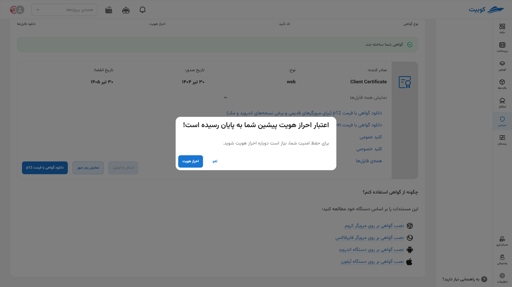

# Guest Certificate

In this section, explanations regarding the [Guest Certificate](#guest-cert-intro) and also [how to create](#guest-cert-issue) it are provided for administrators. These certificates are typically issued temporarily with a specific validity period for guest users to have controlled and limited access to the required services.

## System Administrative Access {#guest-cert-intro}

The Certman system has two levels of access: users and administrators. By logging into the system as an administrator, new sections and features become visible. These features include the ability to view the logs of all users, create guest certificates, manage users, and manage their certificates.

In the user management section, the system administrator can view the list of all active and inactive users of the system and search based on name or mobile number. Additionally, the administrator can deactivate any user’s status to prevent them from logging into the system. Furthermore, deactivating a user will invalidate all certificates associated with that user.

In the certificate management section, the administrator can view, filter, and search all issued certificates and revoke any desired certificate. Additionally, in the user logs section, a list of all user activities is available collectively, with the ability to filter based on user and type of activity, which is part of the administrator's privileges in this section.

### Guest Certificate

One of the features available to the system administrator is the creation of a guest client certificate or temporary certificate. The use of a guest certificate is for cases where an individual outside the organization, who is not a member of the system, needs temporary access to an address that is only accessible without login but with a client certificate. In such cases, the system administrator can create a temporary or guest certificate for them through Certman.

When creating a guest certificate, the administrator can specify its expiration date, and by providing an email, the system will send the created certificate to the specified email address. Additionally, the system administrator can revoke any guest certificate at any time.

By selecting the "Guest Certificate" section in the right-side menu, the administrator can view a list of created guest certificates along with the creator’s name, certificate status, expiration date, and more. It is also possible to filter this list based on the creator’s name.

## Creating a New Guest Certificate {#guest-cert-issue}

To create a new guest certificate, first go to the **Guest Certificate** section and click on **Obtain New Certificate**.

Then, in the **Details Section**, enter the details of the **Certificate Name** (by entering an email as the name, you can automatically send the certificate to the individual) and its **validity period until revocation**.

### Automatic Certificate Sending {#send-cert}

:::success[Automatic Certificate Sending to Email]

If you want the issued certificate to be **sent directly to the individual**, enter their **email address** in the **Name** field. This will cause the certificate file in various formats to be automatically sent to the individual.

:::

In this section, by clicking the **Send Code** button, a verification code will be sent to your phone number or email.

Enter the **Verification Code** sent and the **CAPTCHA** correctly in this section.

Your certificate has been successfully issued. Download and install it like [other certificates](../certs) using the available options [download and install](../cert-install).

## Managing Guest Certificates

In this tab, the list of **existing certificates** is displayed, including information such as **certificate type**, **creation date**, **expiration date**, **number of days remaining until expiration**, and **active status**.  
To **revoke a certificate**, click on the **three-dot icon** next to the desired certificate and select the **Revoke** option.

If you want to [send the certificate](#send-cert), click on **Send to Email**.

To **revoke a certificate**, click on the **three-dot icon** next to the desired certificate and select the **Revoke** option.

