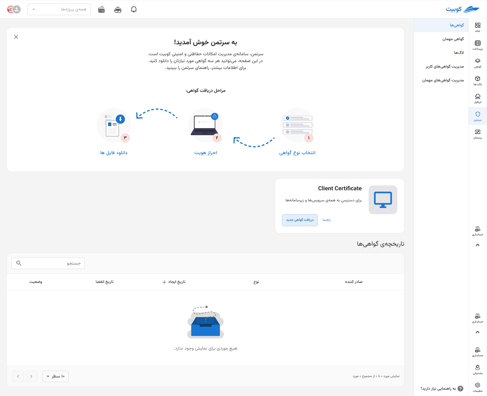

---
subDocuments:
  - certs
  - guest-cert
  - log
  - cert-install
---

# Certman (Cloud Security)

**Certman**, a central subsystem in **Kubit**, manages all users' security and protection needs in a centralized manner. In simple terms, Certman is the hub for issuing and managing **security certificates** to access Kubit's services and infrastructure. This system also supports **[Single Sign-On (SSO)](#sso)**.

Options provided by Certman to [users](#access-levels) include:

**[Certificates Section](certs):** Users and administrators can issue new certificates for themselves and view their current certificates.

**[Guest Certificates Section](geust-certs):** (For administrators only) Allows the issuance of temporary, time-limited certificates for others.

**[Logs](log):** (For administrators only) Displays a detailed history of each user's operations; information about other users is visible only to administrators.

## Certman Overview

[Three types of certificates](certs) can be created in this system:

- **Client Certificate:** For authentication across all services and subsystems.
- **OpenVPN Certificate:** For connecting to the organization's private network.
- **kubeconfig Certificate:** For connecting to Kubernetes clusters.

Additional features of Certman include:

- Recording and displaying the history of certificate issuance.
- Viewing and reviewing user operation logs.

### Access Levels {#access-levels}

This system has **two access levels**:

1. **Users:** Access only to their personal certificates.
2. **Administrators:** Ability to view the history and logs of all users, manage user certificates, and issue guest certificates.

Certman also plays a key role in **completing the registration of LDAP users**. Users defined by the admin in OpenLDAP must activate their accounts through Certman. Password management and recovery are also handled through this system.

---

### Single Sign-On (SSO) Management {#sso}

For secure access to Kubit's services and subsystems, **Single Sign-On (SSO)** authentication is used, meaning users can access all sections with a single username and password. **This process is also managed by Certman**.

#### Steps for Initial Account Activation:

1. The organization admin registers the user's email and username in the system.
2. The user logs into Certman and selects the **Password Recovery** option.
3. After entering the username, a **verification code** is sent to their email.
4. By entering this code in Certman, the user can set their password and complete the registration.

After setting the password, **access to all Kubit services is granted using the same username and password**. In case of forgetting or needing to change the password, the same process is followed again **through Certman**.
